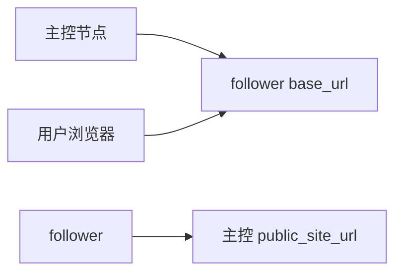
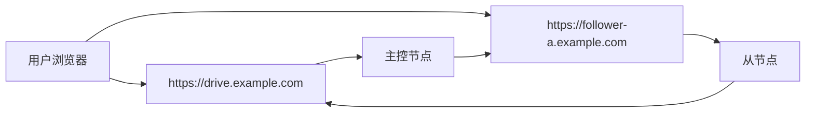
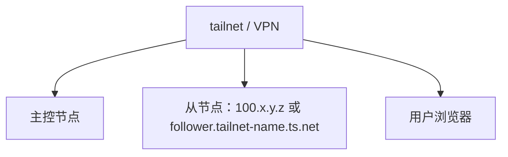

# 从节点网络部署方式

::: tip 这一篇覆盖什么
这一篇只讲从节点的网络拓扑怎么选：什么时候给 follower 公网 HTTPS，什么时候只放进 Tailscale / VPN，什么时候用反向通道，以及 Docker 部署时 DNS 和路由最容易卡在哪里。
:::

如果你还没把从节点接入主控，先看 [远程节点](/guide/remote-nodes)。  
如果你已经接入完成，准备创建 remote 存储策略，看 [远程节点存储策略教程](/storage/remote-follower)。

## 先记住一条规则

远程 `presigned` 上传或下载时，主控节点只负责校验权限并生成短时效地址，真正传输文件的是**浏览器直连 follower**。

所以不要只问“主控能不能访问 follower”。要同时看三条链路：



这三条链路各自负责的事不同：

| 链路 | 什么时候需要 | 不通时会怎样 |
| --- | --- | --- |
| 主控节点 -> follower `base_url` | 直连测试、下发接收落点、`relay_stream` 转发、生成远程签名 | 主控测试连接失败，远程策略不可用 |
| 用户浏览器 -> follower `base_url` | 远程 `presigned` 上传/下载 | `relay_stream` 正常，但 `presigned` 在浏览器里失败 |
| follower -> 主控 `public_site_url` | enroll、反向通道、状态回报 | enroll 失败，或反向通道不上线 |

`base_url` 填什么，浏览器在 `presigned` 模式下就会被引导到什么地方。填 Tailscale IP，就只有能访问 Tailscale 的客户端能用；填内网 split DNS 域名，就要求客户端也能解析和路由到这个域名。

## 方式速查

| 方式 | follower 暴露范围 | 可用上传/下载方式 | 适合场景 |
| --- | --- | --- | --- |
| 公网 HTTPS 直连 | 公网可访问 | `relay_stream`、`presigned` | 公网用户也要访问 follower 上的文件 |
| Tailscale / VPN 直连 | 只在私网可访问 | 私网用户可用 `relay_stream`、`presigned`；公网用户只能用 `relay_stream` | 自用、团队成员都在同一 tailnet / VPN |
| Docker 内网直连 | 只在 Docker 网络可访问 | 通常只适合主控到 follower；浏览器 `presigned` 需要另一个可访问地址 | 主控和 follower 在同一 Compose / Docker network |
| 反向通道 | follower 不需要被主控回连 | 当前适合 `relay_stream` | follower 在 NAT / CGNAT / 内网后方，不想暴露入口 |
| 主控统一中继 | 浏览器只访问主控 | `relay_stream` | 想让所有公网访问都收敛到主控节点 |

第一次接入建议先用 `relay_stream`。等主控、follower、接收落点和真实上传下载都跑通，再决定是否切到 `presigned`。

## 方式一：公网 HTTPS 直连

这是最直接的生产形态：



适合：

- 公网用户需要上传或下载 follower 上的文件
- 想用远程 `presigned` 减轻主控节点带宽压力
- 能给 follower 准备独立域名、HTTPS 证书和反向代理

需要确认：

- follower `base_url` 使用公网可达的 `https://` 地址
- 主控节点和用户浏览器都能访问这个 `base_url`
- follower 前面的 nginx、Caddy、Traefik 或 CDN 没有拦截内部存储 API
- CORS 允许 `content-type` / `range`
- 响应暴露 `ETag`、`Accept-Ranges`、`Content-Range`、`Content-Length`

这种方式可以使用远程 `presigned` 上传/下载。代价是 follower 本身也变成了公网入口，需要和主控一样认真处理 HTTPS、反向代理、日志和限流。

## 方式二：Tailscale / VPN 私网直连

这种方式不要求 follower 有公网地址，只要求主控、follower 和实际使用者在同一个私网里：



适合：

- 个人 NAS
- 小团队内网
- 所有实际用户都能接入同一个 Tailscale、WireGuard、ZeroTier 或企业 VPN
- 不想把 follower 暴露到公网

可以填的 `base_url` 示例：

```text
http://100.x.y.z:3000
https://follower.tailnet-name.ts.net
https://follower.internal.example.com
```

这里要接受一个边界：如果 `base_url` 只在 tailnet / VPN 内可达，远程 `presigned` 也只服务 tailnet / VPN 内用户。公网用户即使能打开主控站点，也会在浏览器跳转到 follower 短时效地址时失败。

如果公网用户也要访问这些文件，有两个选择：

- 给 follower 额外准备公网可达的 HTTPS 地址
- remote 策略上传/下载方式使用 `relay_stream`，让主控节点代转流量

## 方式三：Docker 主控访问 Tailscale / split DNS follower

这就是最容易误判的地方。宿主机能访问 Tailscale 或 split DNS，不代表 Docker 容器里的 AsterDrive 也能访问。

常见现象：

```text
宿主机 curl https://follower.internal.example.com 成功
asterdrive 容器内测试连接失败
```

原因通常是：

- 容器用的是 Docker DNS，不走宿主机的 Tailscale MagicDNS
- 容器没有 tailnet 路由
- split DNS 只配置在宿主机或局域网 DNS 上
- 反向代理只监听宿主机网络，没有暴露给容器网络

可选做法：

| 做法 | 优点 | 代价 |
| --- | --- | --- |
| 直接在 `base_url` 填 Tailscale IP + 端口 | 最简单，少一层 DNS | 地址不友好，HTTPS 可能要额外处理 |
| 给容器配置能解析内网域名的 DNS | 可以保留友好域名 | 要维护 Docker DNS 配置 |
| 让 AsterDrive 容器加入 tailnet | 容器内路由和 DNS 更接近真实客户端 | Compose 更复杂，可能需要 sidecar |
| 主控改用 systemd 部署 | 直接复用宿主机网络和 DNS | 放弃容器隔离和 Compose 管理 |
| 改用 `relay_stream` / 反向通道 | 不要求浏览器直连 follower | 主控承接上传下载带宽 |

排查时不要只在宿主机上测。至少进到主控容器里测试：

```bash
docker exec -it asterdrive sh
curl -v https://follower.internal.example.com/health
```

如果容器里解析不了域名，先修 DNS 或直接改用容器能访问的地址。

## 方式四：Docker 网络内直连

如果主控和 follower 在同一个 Compose 或 Docker network 里，主控可以用服务名访问 follower：

```text
http://asterdrive-follower:3000
```

这只解决了“主控 -> follower”。它不自动解决“用户浏览器 -> follower”。

如果 remote 策略用 `relay_stream`，浏览器只访问主控，这种内部地址可以工作。  
如果 remote 策略用 `presigned`，浏览器会拿到这个地址，而用户电脑通常解析不了 `asterdrive-follower` 这个 Docker 服务名，所以会失败。

要用 Docker 内部地址配合 `presigned`，必须额外给浏览器准备可访问的 follower 地址。否则就用 `relay_stream`。

## 方式五：反向通道

反向通道适合 follower 在 NAT、CGNAT、家庭宽带或严格内网后方，主控无法主动连接 follower，但 follower 可以访问主控：

```text
follower -> 主控 public_site_url
```

这种方式下，远程节点记录可以不填 `base_url`，或使用 `auto + 空 base_url`。follower 重启后会主动连接主控，主控通过这条通道访问 follower。

当前边界：

- 适合 `relay_stream` 上传/下载
- 反向通道仍处于测试阶段
- 不适合远程 `presigned`

原因很简单：`presigned` 要把一个浏览器能访问的 follower 地址交给客户端。反向通道解决的是主控怎么通过 follower 主动建立的连接访问它，并不会凭空给浏览器生成一个可直连的 follower URL。

## 怎么选

| 你的需求 | 建议 |
| --- | --- |
| 只是内网 / tailnet 用户使用 | Tailscale / VPN 直连，先 `relay_stream`，需要省主控带宽再切 `presigned` |
| 公网用户也要下载 follower 文件 | 公网 HTTPS 直连，或继续用 `relay_stream` |
| follower 绝不暴露入口 | 反向通道 + `relay_stream` |
| 主控是 Docker，follower 是 tailnet 内 NAS | 先确认容器内 DNS 和路由；不想折腾就填 Tailscale IP 或改 `relay_stream` |
| 不确定网络拓扑是否正确 | 用 `relay_stream` 验证接收落点，再单独测试浏览器访问 follower `base_url` |

最容易踩的坑是：主控测试连接通过，只代表“主控能访问 follower”。这不代表浏览器也能访问 follower。远程 `presigned` 失败但 `relay_stream` 正常时，优先查浏览器到 follower `base_url` 的 DNS、证书、路由、CORS 和代理响应头。
