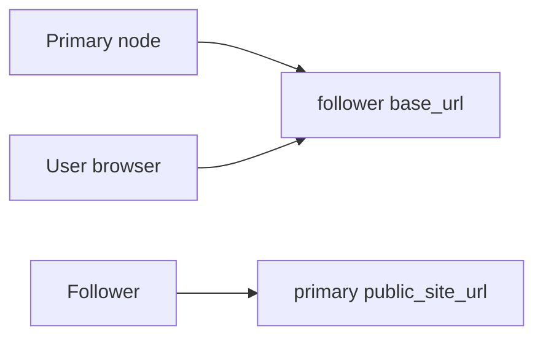
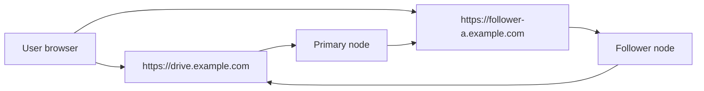
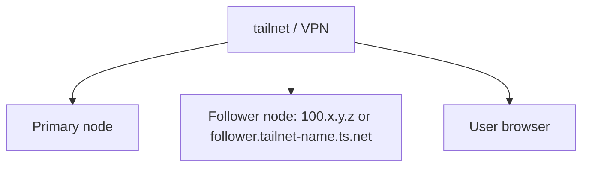

# Follower Node Network Topologies

::: tip What this page covers
This page only covers follower-node network topology choices: when to give a follower public HTTPS, when to keep it inside Tailscale / VPN, when to use reverse tunnel, and where Docker DNS and routing most often break.
:::

If you have not connected the follower to the primary yet, start with [Follower Nodes](/en/guide/remote-nodes).  
If the follower is already connected and you are ready to create a remote storage policy, see [Follower Node Storage Policy Tutorial](/en/storage/remote-follower).

## Remember One Rule First

With remote `presigned` upload or download, the primary only validates permissions and generates a short-lived URL. The actual file transfer is done by the **browser connecting directly to the follower**.

So do not only ask whether the primary can reach the follower. Check all three paths:



Each path serves a different purpose:

| Path | When it is needed | What happens if it fails |
| --- | --- | --- |
| Primary node -> follower `base_url` | Direct connection tests, pushing remote storage targets, `relay_stream` relay, generating remote signatures | Primary connection test fails; remote policy is unusable |
| User browser -> follower `base_url` | Remote `presigned` upload/download | `relay_stream` works, but `presigned` fails in the browser |
| Follower -> primary `public_site_url` | Enrollment, reverse tunnel, status reporting | Enrollment fails, or the reverse tunnel never comes online |

Whatever you put in `base_url` is what browsers receive in `presigned` mode. Use a Tailscale IP, and only clients that can access Tailscale can use it. Use an internal split-DNS name, and clients must also be able to resolve and route to that name.

## Quick Choice Table

| Mode | Follower exposure | Available upload/download modes | Best for |
| --- | --- | --- | --- |
| Public HTTPS direct | Publicly reachable | `relay_stream`, `presigned` | Public users also need files stored on the follower |
| Tailscale / VPN direct | Private network only | Private users can use `relay_stream` and `presigned`; public users need `relay_stream` | Personal use, teams where everyone is in the same tailnet / VPN |
| Docker-network direct | Docker network only | Usually only solves primary-to-follower; browser `presigned` needs another reachable address | Primary and follower in the same Compose / Docker network |
| Reverse tunnel | The follower does not need inbound reachability from the primary | Currently suitable for `relay_stream` | The follower is behind NAT / CGNAT / private networks and should not expose an inbound endpoint |
| Primary-only relay | Browsers only access the primary | `relay_stream` | You want all public access to converge on the primary node |

For a first setup, use `relay_stream`. After the primary, follower, remote storage target, and real upload/download flow work, decide whether switching to `presigned` is worth it.

## Mode 1: Public HTTPS Direct

This is the most direct production shape:



Use this when:

- public users need to upload or download files stored on the follower
- you want remote `presigned` to reduce primary-node bandwidth pressure
- you can give the follower its own domain, HTTPS certificate, and reverse proxy

Confirm:

- the follower `base_url` is a publicly reachable `https://` address
- both the primary node and user browsers can reach that `base_url`
- nginx, Caddy, Traefik, or CDN in front of the follower does not block internal storage APIs
- CORS allows `content-type` / `range`
- responses expose `ETag`, `Accept-Ranges`, `Content-Range`, and `Content-Length`

This mode can use remote `presigned` upload/download. The cost is that the follower itself becomes a public entry point, so HTTPS, reverse proxy, logs, and rate limiting need the same attention as the primary.

## Mode 2: Tailscale / VPN Private Direct

This mode does not require a public follower address. It only requires the primary, follower, and actual users to share the same private network:



Use this for:

- personal NAS deployments
- small-team intranets
- environments where all real users can join the same Tailscale, WireGuard, ZeroTier, or corporate VPN
- keeping the follower off the public internet

Example `base_url` values:

```text
http://100.x.y.z:3000
https://follower.tailnet-name.ts.net
https://follower.internal.example.com
```

Accept this boundary: if `base_url` is reachable only inside the tailnet / VPN, remote `presigned` also only serves tailnet / VPN users. Public users may still open the primary site, but they fail when the browser is redirected to the short-lived follower URL.

If public users also need these files, choose one of:

- give the follower an additional public HTTPS address
- set the remote policy upload/download mode to `relay_stream` so the primary relays traffic

## Mode 3: Docker Primary Accessing a Tailscale / split-DNS Follower

This is the easiest place to misdiagnose. The host being able to access Tailscale or split DNS does not mean the AsterDrive container can.

Common symptom:

```text
curl https://follower.internal.example.com works on the host
the asterdrive container connection test fails
```

Common causes:

- the container uses Docker DNS instead of the host's Tailscale MagicDNS
- the container does not have tailnet routes
- split DNS is configured only on the host or LAN DNS
- the reverse proxy only listens on the host network and is not reachable from the container network

Options:

| Approach | Advantage | Cost |
| --- | --- | --- |
| Put Tailscale IP + port directly in `base_url` | Simplest; avoids DNS | Unfriendly address; HTTPS may need extra work |
| Configure container DNS to resolve internal names | Keeps friendly names | You must maintain Docker DNS settings |
| Join the AsterDrive container to the tailnet | Container routing and DNS are closer to real clients | Compose becomes more complex; may need a sidecar |
| Run the primary with systemd | Reuses host networking and DNS directly | Gives up container isolation and Compose management |
| Use `relay_stream` / reverse tunnel | Does not require browsers to reach the follower directly | Primary carries upload/download bandwidth |

When troubleshooting, do not test only on the host. Test from inside the primary container too:

```bash
docker exec -it asterdrive sh
curl -v https://follower.internal.example.com/health
```

If the container cannot resolve the name, fix DNS first or use an address the container can actually reach.

## Mode 4: Docker-Network Direct

If the primary and follower are in the same Compose or Docker network, the primary can use the service name:

```text
http://asterdrive-follower:3000
```

This only solves `Primary -> follower`. It does not automatically solve `User browser -> follower`.

If the remote policy uses `relay_stream`, browsers only access the primary, so this internal address can work.  
If the remote policy uses `presigned`, browsers receive this address, and user machines usually cannot resolve the Docker service name `asterdrive-follower`.

To combine Docker internal addresses with `presigned`, you must also provide a follower address reachable from browsers. Otherwise, use `relay_stream`.

## Mode 5: Reverse Tunnel

Reverse tunnel fits followers behind NAT, CGNAT, home broadband, or strict private networks where the primary cannot connect to the follower, but the follower can reach the primary:

```text
follower -> primary public_site_url
```

In this mode, the remote node record may leave `base_url` empty, or use `auto` with an empty `base_url`. After restart, the follower actively connects to the primary, and the primary reaches the follower through that channel.

Current boundaries:

- suitable for `relay_stream` upload/download
- reverse tunnel is still under test
- not suitable for remote `presigned`

The reason is simple: `presigned` must hand the browser a follower address it can access. Reverse tunnel solves how the primary reaches the follower through a follower-initiated connection. It does not create a browser-reachable follower URL.

## How to Choose

| Need | Recommendation |
| --- | --- |
| Only intranet / tailnet users use it | Tailscale / VPN direct; start with `relay_stream`, then switch to `presigned` if reducing primary bandwidth matters |
| Public users also need follower files | Public HTTPS direct, or keep using `relay_stream` |
| The follower must expose no inbound endpoint | Reverse tunnel + `relay_stream` |
| The primary is Docker, and the follower is a NAS inside tailnet | First confirm DNS and routing inside the container; if you do not want that complexity, use Tailscale IP directly or choose `relay_stream` |
| You are not sure whether the topology is correct | Validate the remote storage target with `relay_stream`, then separately test browser access to follower `base_url` |

The easiest trap is assuming a successful primary connection test means everything is ready. It only proves that the primary can reach the follower. It does not prove browsers can reach the follower. When remote `presigned` fails but `relay_stream` works, check browser-to-follower DNS, certificate, routing, CORS, and proxy response headers first.
