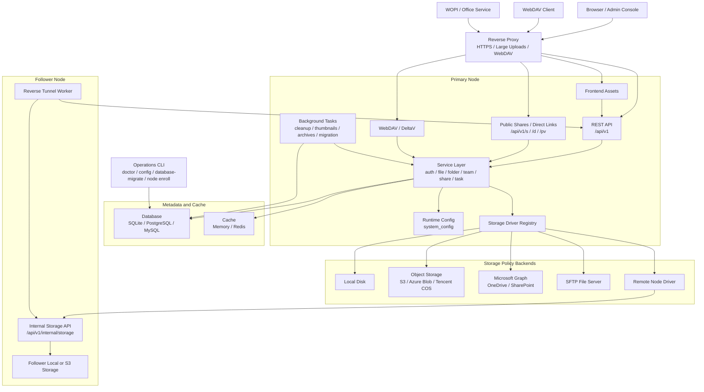
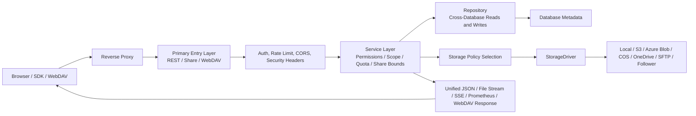
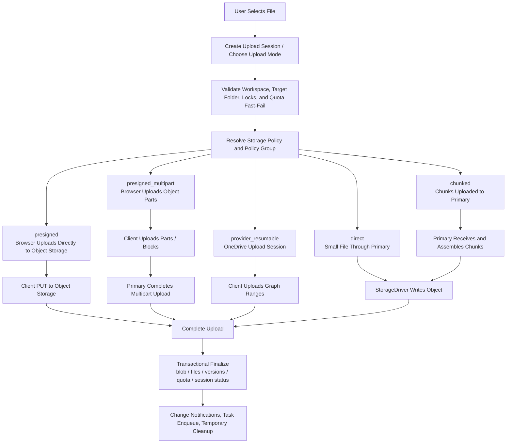
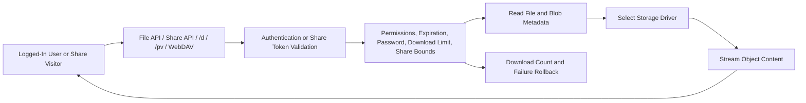
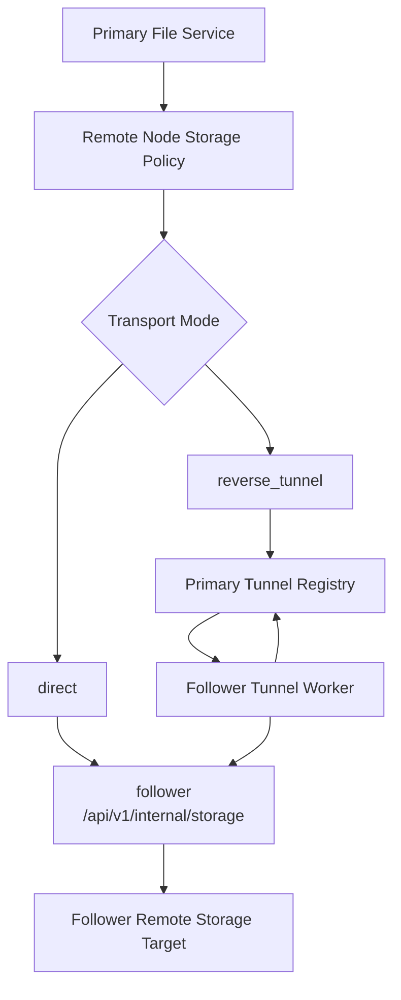

# Architecture Overview

This page explains how AsterDrive components work together after the service is running. It is written for deployers, administrators, and new contributors, with an emphasis on system boundaries, data flows, and troubleshooting entry points.

For deeper source-level design notes, see `developer-docs/en/architecture.md` and `developer-docs/en/module-designs.md` in the repository. Those documents are better suited for reading before code changes.

## 60-Second Version

- AsterDrive is a self-hosted cloud drive with a Rust backend and a React frontend. In production builds, the backend serves the frontend assets directly.
- The same binary supports two node modes: `primary` serves user APIs, frontend pages, WebDAV, sharing, runtime configuration, and background tasks; `follower` exposes only health checks and the internal object storage protocol.
- Metadata mainly lives in the database, while file content mainly lives behind storage drivers. The database records ownership, versions, quota accounting, sharing state, and runtime settings; storage drivers keep the actual object bytes.
- Personal spaces and team spaces share the same file pipeline, with different workspace scopes for permissions, quota ownership, and policy selection.
- Configuration has two layers: startup configuration from `config.toml` / `ASTER__...` environment variables, and database-backed runtime configuration that administrators can update without editing the startup file.
- Large uploads may go through backend relay, chunked upload, object-storage presigned upload, or multipart upload. All successful paths still return to the database to finalize file records, Blob references, and quota accounting.

## Component Relationships

Three boundaries matter most in this diagram:

- **The primary is the user entry point**: normal user APIs, the admin console, public shares, WebDAV, and the frontend fallback all live on the primary.
- **The follower is a managed storage node**: it does not serve normal user APIs, frontend pages, or user authentication flows.
- **The database and object storage are separate**: the database is not the file-content store, and storage drivers do not own business permissions.

## Runtime Modes

### Primary

The primary is the user-facing node. It is responsible for:

- serving the React frontend and static assets
- registering the `/api/v1/*` REST API
- handling public share APIs, direct download links, and preview links
- mounting WebDAV / DeltaV
- loading and updating runtime configuration
- managing storage policies, policy groups, follower nodes, and background tasks
- running cleanup, thumbnail, archive, storage migration, and health-check tasks

In production, most deployments need one primary node. Configure the reverse proxy, HTTPS, upload body limits, WebDAV headers, and WOPI callbacks around the primary first.

### Follower

A follower is a remote storage node. It is responsible for:

- exposing `/health*` health checks
- exposing the `/api/v1/internal/storage/*` internal object storage protocol
- accepting object writes, reads, assembly, listing, and remote storage target management according to its primary binding
- actively connecting back to the primary in `reverse_tunnel` mode to pull internal storage requests

A follower does not handle normal login, share pages, WebDAV, or the admin console. When debugging follower-node issues, do not start from normal file routes. Check the primary remote-node configuration, binding state, network topology, and the follower internal storage protocol first.

## Ordinary Request Data Flow

The ordinary REST path is roughly:

1. The reverse proxy forwards the request to the primary.
2. The primary entry layer matches a REST, public share, or WebDAV endpoint.
3. Middleware and route-level logic handle request IDs, CORS, security headers, authentication, admin checks, and rate limiting.
4. The service layer applies business rules such as workspace permissions, share bounds, quota, locks, versions, and trash state.
5. The repository layer reads and writes database metadata. When file content is involved, the service layer selects a concrete storage driver through the storage policy.
6. The response may be unified JSON, a file stream, SSE, Prometheus text, or a WebDAV response.

Remember the exceptions: downloads, thumbnails, public direct links, WebDAV, and `/health/metrics` do not use the normal JSON wrapper.

## Upload Data Flow

An upload is not finished just because object bytes were written. A successful upload means:

- the stored object is readable
- the database has correct file, Blob, version, and upload-session state
- quota has been charged to the correct personal or team space
- filename conflicts, overwrites, locks, trash state, and policy limits have been handled
- recoverable local temporary state or object-storage multipart state has been finalized

That is why upload troubleshooting needs three signals at once: the browser upload task, primary logs, and upload-session / background-task state in the database. Object-storage direct uploads also require checking object-storage CORS, presigned URLs, multipart limits, and whether the reverse proxy incorrectly intercepted callbacks.

## Download and Share Data Flow

Public share access does not blindly trust that the original resource is still valid. The service rechecks expiration, password state, download limits, target file or folder existence, and whether child resources are still inside the shared folder tree.

For operations, download failures usually fall into separate categories:

- **Permission failure**: login state, team role, share password, expiration, or download limit.
- **Metadata failure**: deleted file record, broken Blob relation, version mismatch, or trash state.
- **Object failure**: missing local file, invalid object-storage / OneDrive / SFTP credentials or target configuration, or an unreachable follower.
- **Network failure**: reverse-proxy buffering, timeout, Range requests, or WebDAV client compatibility.

## Follower Node Data Flow

Remote followers have two transport modes:

- `direct`: the primary directly calls the follower internal object storage API.
- `reverse_tunnel`: the follower actively connects back to the primary, polls or uses WebSocket to pull internal storage requests, and returns results to the primary.

Choose between direct and reverse tunnel according to network topology. If the primary can reach the follower directly, direct mode is simpler. If the follower is behind a private network or NAT, reverse tunnel is usually easier to connect reliably.

## Configuration Boundaries

AsterDrive has two configuration layers. Do not mix them up:

| Layer | Location | Good for | Effective time |
| --- | --- | --- | --- |
| Static configuration | `data/config.toml` and `ASTER__...` environment variables | Listen address, port, database, logging, cache, node mode, WebDAV prefix | Usually after restart |
| Runtime configuration | Database `system_config` | Public site URL, registration, cookies, security policy, mail, background task intervals, trash, versions, WOPI, audit | Updated through admin console or API |

Storage policies and policy groups are also managed in the database. They decide which storage policy backend receives file content, and they affect upload modes, size limits, and migration behavior.

## Background Tasks and Operations Entry Points

The primary runs two kinds of background work:

- User-visible tasks: thumbnails, media metadata, archive previews, compression / extraction, storage migration, Blob maintenance, and similar jobs.
- System maintenance tasks: upload-session cleanup, trash cleanup, lock cleanup, audit-log cleanup, health checks, mail dispatch, and similar jobs.

The operations CLI and the HTTP service use the same binary. Common entry points are:

- `doctor`: check database state, migrations, runtime configuration, storage policies, and consistency.
- `config`: read, update, import, and export runtime configuration offline.
- `database-migrate`: migrate data across SQLite / PostgreSQL / MySQL.
- `node enroll`: connect a follower to a primary.

## Where to Start Troubleshooting

| Symptom | Check first |
| --- | --- |
| Page cannot open | Reverse proxy, primary listen address, frontend assets, HTTPS, browser console |
| Login fails | Auth config, Cookie secure / site URL, external-auth callback, database user state |
| Upload fails | Upload mode, reverse-proxy body limit, S3 CORS / presigned URL, upload session, quota, temporary directory |
| Download fails | Share state, permissions, Blob metadata, object readability on the current storage policy backend, Range requests |
| WebDAV behaves incorrectly | WebDAV switch, prefix, Basic / Bearer auth, reverse-proxy headers, client compatibility |
| Follower node fails | Node binding, direct / reverse tunnel mode, follower health check, internal storage API |
| Background tasks pile up | `background_tasks` status, dispatcher interval, concurrency config, task error logs |

If you do not know where to start, run `doctor` from [Operations CLI](/en/deployment/ops-cli), then compare the specific symptom with [Troubleshooting](/en/deployment/troubleshooting).
