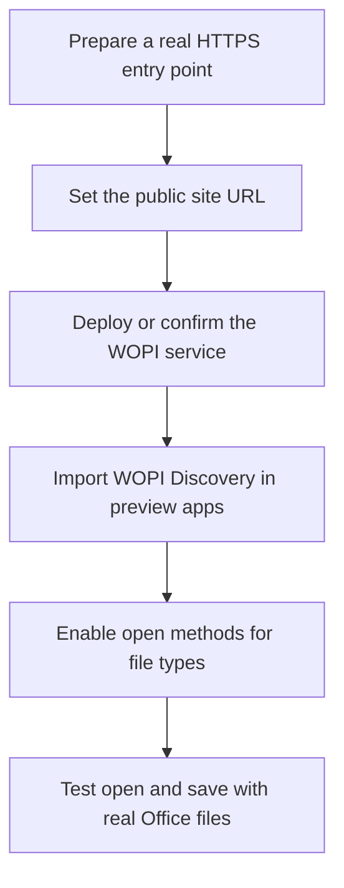

# Online Preview and WOPI

::: tip What this page covers
This page explains how to add extra open methods for files, especially how to hand Office files to OnlyOffice, Collabora, or other WOPI-compatible services. For regular text editing, see [File Editing](/en/guide/editing).
:::

## Separate the Three Open Method Types First

| Type | Best for | Key requirement |
| --- | --- | --- |
| Built-in previewer | Images, PDFs, text, videos, archive listings, and other types covered by built-in capabilities | Provided by AsterDrive itself; some capabilities are also limited by system setting switches |
| URL template previewer | Handing a file preview link to an external web page | The external web page can access the preview link generated by AsterDrive |
| WOPI open method | Online preview or editing for Office files | The WOPI service can call back to AsterDrive's WOPI API |

The most common use of WOPI is opening files such as `docx`, `xlsx`, and `pptx` in OnlyOffice or Collabora. AsterDrive handles file access, sessions, tokens, and locks; the real Office editing interface is provided by the external WOPI service.

## Recommended Integration Order



## Where to Configure It

Administrator entry:

```text
Admin -> System Settings -> Site Configuration -> Preview Apps
```

Related configuration:

```text
Admin -> System Settings -> Site Configuration -> Public site URL
Admin -> System Settings -> Network Access
```

Reverse-proxy notes are in [Reverse Proxy](/en/deployment/reverse-proxy#extra-requirements-for-wopi--office-callbacks).

## Why `Public site URL` Is the Most Important Setting

When a WOPI service opens a file, the browser does not read the local file directly. The service uses the WOPI URL given by AsterDrive to call back to AsterDrive and read file information and file content.

So `Public site URL` must:

- Be a real HTTP(S) origin
- Use HTTPS in production if possible
- Be reachable from the WOPI service environment
- Be added one by one for each real entry point in multi-domain deployments

For example:

```text
https://drive.example.com
https://office-drive.example.com
```

Each item should include only the origin, without a path:

```text
https://drive.example.com
```

Do not write:

```text
https://drive.example.com/api
```

## Common Docker Network Setups

If AsterDrive and OnlyOffice / Collabora both run in Docker, there are two common routes:

| Route | Public site URL | Best for |
| --- | --- | --- |
| Both use the public domain | `https://drive.example.com` | Reverse proxy and certificates are ready |
| Internal domain callback | `https://drive.internal.example.com` | The WOPI service is on the intranet and can resolve the internal domain |

Do not set `Public site URL` directly to `http://localhost:3000`.  
For a WOPI service, `localhost` usually means its own container or host, not AsterDrive.

## Import Through WOPI Discovery

If your WOPI service provides a discovery address, importing is the recommended way to create open methods.

The common shape looks like:

```text
https://office.example.com/hosting/discovery
```

After import, AsterDrive generates corresponding open methods from the application information returned by discovery. You still need to confirm:

- The corresponding file extensions are enabled
- Open method ordering is as expected
- The open method is preview or edit
- Dialog or new-tab opening behavior fits your site's usage

If the WOPI service updates its discovery content, you may need to re-import or wait for the discovery cache to expire. Cache duration is in the WOPI-related system settings.

## When to Use URL Template Previewers

URL template previewers are for "handing an accessible file preview link to an external web page".

They differ from WOPI in these ways:

- URL templates usually do not save back
- External services usually receive only one file URL
- The external service must be able to access that URL
- Intranet addresses, `localhost`, and plain HTTP links often fail

The built-in Microsoft / Google previewers usually follow this approach. They fit publicly accessible file preview scenarios better than general editing in a private deployment.

## Read-Only Archive Preview

AsterDrive includes archive preview, but it is disabled by default. Administrators need to confirm both:

```text
Admin -> System Settings -> File Processing -> Archive Preview
Admin -> System Settings -> Site Configuration -> Preview Apps
```

It provides a **read-only listing preview**:

- ZIP
- Reads archive metadata and shows folders, files, sizes, and modification times
- Does not extract the archive into the user's folder
- Does not provide downloads for individual files inside the archive
- Does not replace "online extraction"

When opening an archive for the first time, if the listing is not cached yet, the backend creates an `archive_preview_generate` background task. The frontend shows generation in progress and retries later automatically; after completion, later opens use the cache directly.

If filenames inside a ZIP look garbled, switch `Filename encoding` in the preview toolbar. This option only affects ZIP entry name decoding. Common options include:

- `Auto`
- `UTF-8`
- `GB18030`
- `CP437`
- `CP850`
- `Shift_JIS`
- `Big5`
- `EUC-KR`
- `Windows-1252`

Switching encoding regenerates or reads a listing cache for that encoding. This setting only affects filename display in the ZIP listing. It does not modify the archive itself and does not affect online extraction results.
If the UI says the current encoding cannot parse this ZIP, switch to an encoding commonly used by the system that produced the archive, such as `GB18030` for Chinese Windows environments or `CP437` for older English ZIPs.

Administrators can control separately:

- Whether the global archive preview switch is enabled
- Whether logged-in users can preview in personal spaces and team spaces
- Whether public share pages can preview
- Source archive size, entry count, manifest size, and scan duration limits

::: warning Enable share-side preview carefully
Share-page archive preview exposes internal paths, filenames, sizes, and modification times to visitors. Visitors can see this metadata even before downloading the whole archive. Enable share-side preview only when you accept this behavior.
:::

If an archive cannot open, check first:

- Whether the global archive preview switch is enabled
- Whether the current entry is user-side or share-side, and whether the corresponding switch is enabled
- Whether the file is a supported ZIP, not `rar`, `7z`, or another format
- Whether the source archive exceeds the size limit
- Whether `archive preview generation` failed in `Admin -> Tasks`

## Audio and Video Preview

For logged-in users, audio and video previews read files according to the current storage policy and support browser Range requests. On public share pages, audio and video first create a short-lived streaming session, then point the player to that temporary URL.

This session is valid for `3` hours by default. Administrators can adjust it here:

```text
Admin -> System Settings -> Runtime -> Share streaming session TTL
```

It is not the expiration time of the share link itself. The share link's password, expiration time, and maximum download count are still checked normally. The streaming session is only a temporary Range URL for the browser player.

## Save, Version History, and Locks

When WOPI saves back to AsterDrive, it is treated as an overwrite write:

- A new version is created after a successful save
- A lock appears while the file is being edited
- Other clients cannot freely overwrite, move, or delete a locked file
- If a lock remains abnormally, an administrator can clean it from `Admin -> Locks`

Whether WOPI supports multi-user collaboration depends on the external service you connect. AsterDrive provides files, tokens, sessions, and locks according to the WOPI protocol. It does not implement the collaborative editing interface for the external Office service.

## When CORS Needs Changes

Most WOPI callback problems are not CORS. They are usually that the WOPI service cannot access `Public site URL`.

Only adjust this setting when the browser console clearly reports an AsterDrive API cross-origin error:

```text
Admin -> System Settings -> Network Access -> Allowed CORS origins
```

If only the OnlyOffice / Collabora backend request to AsterDrive fails, check network, domain name, certificate, and reverse proxy first.

## Pre-Launch Validation

Test with real Office files:

1. `docx` opens
2. `xlsx` opens
3. `pptx` opens
4. After saving, the file content in AsterDrive updates
5. Version history shows the new version
6. Lock is released after closing the editor
7. Similar files on share pages or team spaces behave as expected

If you only plan to provide preview, not editing, also confirm the button copy and behavior in the UI match expectations so users do not think they can save.

## Common Problems

### Open Method Does Not Appear

Check first:

- Whether the preview app is enabled
- Whether the file extension is covered by this app
- Whether the current user has permission to read the file
- Whether another open method takes precedence in preview app ordering

### Blank Screen After Opening

The most common cause is that the WOPI service cannot call back to AsterDrive. Check:

- Whether `Public site URL` is truly reachable
- Whether the WOPI service container or host can resolve the domain
- Whether the TLS certificate is trusted by the WOPI service
- Whether the reverse proxy passes `/api/v1/wopi/`

### Opens but Cannot Save

Check first:

- Whether the file still exists
- Whether the user still has write permission
- Whether the WOPI access token has expired
- Whether system time is correct on both the WOPI service and AsterDrive
- Whether `Admin -> Locks` has abnormal locks

### Built-in Microsoft / Google Previewer Cannot Open

They usually require external services to access the file preview link. Private intranets, `localhost`, untrusted certificates, or plain HTTP deployments can all fail. For private deployments that need online editing, connecting your own WOPI service is recommended.
