# Follower Nodes

::: tip What this page covers
This page only explains how to connect another AsterDrive instance as a **follower node**, and how the primary node registers the remote node, generates an enroll command, and verifies connectivity.

If your primary instance is not running yet, start with [Deployment Overview](/en/deployment/).
:::

::: tip If the follower uses Docker
Docker followers can now read bootstrap ENV at container startup and enroll automatically.
If you do not want to enter the container manually to run `aster_drive node enroll`, go directly to [Docker Follower Deployment](/en/deployment/docker-follower).
:::

## Concepts First

AsterDrive's remote-node capability essentially lets **another AsterDrive instance** act as a storage backend.

- **Primary node**: handles login, frontend, admin console, shares, WebDAV, storage policies, and remote-node management
- **Follower node**: only provides `/health`, `/health/ready`, and the internal remote storage protocol; it accepts object requests signed by the primary node, then writes objects to a follower local directory or S3 according to the **ingress target** pushed by the primary

The current internal remote storage protocol version is `v4`, and the current primary requires the follower to support `v4` as well. When the primary tests connectivity and binds remote policies, it reads capability information exposed by the follower, including protocol version range, server version, object read/write capabilities, Range capabilities, compose capabilities, metadata capabilities, and the CORS contract required for browser direct upload.

By default, AsterDrive runs in `primary` mode.
It becomes a follower node only after `[server].start_mode` is changed to `follower`.

::: warning This is not a multi-primary cluster
A follower node is not a second login site or a second admin console.

It has only one goal: **provide a remote object storage target for the primary node**.
If you need multi-primary hot standby, automatic failover, or cross-region strong-consistency replication, the current capability does not cover those scenarios.
:::

## Enrollment Flow

```mermaid
flowchart LR
  Ready["Primary node is already available"] --> PublicUrl["Set the public site URL"]
  PublicUrl --> CreateNode["Admin -> Follower Nodes: create node record"]
  CreateNode --> Transport["Choose transport mode"]
  Transport --> EnrollCommand["Generate enroll command"]
  EnrollCommand --> Enroll["Follower runs node enroll"]
  Enroll --> Restart["Restart follower"]
  Restart --> Connectivity["Test connectivity from primary"]
  Connectivity --> Ingress["Create default ingress target"]
  Ingress --> Policy["Create remote storage policy"]
  Policy --> Assign["Assign to users or teams"]
```



::: tip The easiest step to miss
Successful enroll does not mean uploads are ready. Before the follower can really handle remote storage, you still need to create a default ingress target for it from the primary node.
:::

## Confirm These Before Enrollment

### Primary and Follower Must Be Independent

They may communicate with each other, but they **must not share the same `data/`, database, upload directory, or temporary directory**.

At minimum, these must be independent:

- `data/config.toml`
- Database file or external database connection
- Local upload directory
- Temporary directory

### `public_site_url` Is Required Before enroll

When the primary node generates an enroll command, it reads directly from:

```text
Admin -> System Settings -> Site Configuration -> Public site URL
```

If this is not set to a real reachable HTTP(S) origin, the admin console cannot sign the command. With multiple origins, the enroll command uses the first line as the primary address, so place the primary address reachable by the follower on the first line.

### Choose Transport Before Deciding `base_url`

When creating a remote node record, choose one of three transport modes:

| Transport | How to fill `base_url` | Best for |
| --- | --- | --- |
| Direct | Required; an HTTP(S) follower address reachable by the primary | Same datacenter, same private network, VPN, existing reverse proxy |
| Reverse tunnel | Can stay empty | The follower can reach the primary, but the primary cannot connect back to the follower |
| Auto | Uses direct when `base_url` is set; uses reverse tunnel when it is empty | Let the presence of an address decide the route |

`auto` does not fail over to the reverse tunnel after a direct connection fails. It only checks whether `base_url` is empty.

If a remote policy needs `presigned` upload or download, use direct transport and make sure browsers can also reach the follower `base_url`. Reverse tunnel is suitable for `relay_stream`; it currently cannot generate presigned URLs that browsers use to connect directly to the follower.

If your follower will sit behind public HTTPS, Tailscale / VPN, a Docker network, or reverse tunnel, read [Follower Node Network Topologies](/en/deployment/follower-network-topologies) first. That page explains what `base_url` means to the primary and to browsers separately.

::: warning Reverse tunnel is still under test
Reverse tunnel lets the follower actively connect to the primary and does not require the primary to connect back to the follower. It still depends on the follower being able to reach the primary `public_site_url`, and proxies or firewalls in between must not block WebSocket or long-lived connections.

If your network can already make the follower reliably reachable from the primary, direct transport is still easier to operate in production.
:::

### Use a Local Ingress Target First

In the current version, where a follower receives objects is created by the primary node in `Admin -> Follower Nodes`. The name is **ingress target**.
For the first follower, create a `local` ingress target first and use a simple relative path, for example:

```text
default
```

This path is restricted by the follower under its own `server.follower.remote_storage_target_local_root`, so the primary cannot write arbitrary host paths.
The reason is not that "S3 cannot be used"; it is that **getting the primary-follower path working first, then switching to a more complex target, lowers diagnosis cost**.

## 1. Configure the Primary Node First

The primary node is a normal `primary` deployment.

Before connecting a follower, confirm:

- The primary admin console opens normally
- `Public site URL` is set
- You have decided the follower name and transport mode

The name does not need to be complex. For a first test, name it by environment, region, or tenant, for example:

- `home-storage`
- `hangzhou-a`
- `tenant-a`

## 2. Prepare the Follower Instance

The follower uses the same `aster_drive` binary as the primary. Only the runtime mode is different.

At minimum, confirm:

- It has its own working directory and data volume
- Its `[server].start_mode` is `follower`
- If you use primary-managed local ingress targets, `[server.follower].remote_storage_target_local_root` points to a directory with enough capacity

The most direct approach is editing `config.toml`:

```toml
[server]
start_mode = "follower"

[server.follower]
remote_storage_target_local_root = "remote-storage-targets"
```

If you deploy with Docker, you can also override with environment variables:

```bash
ASTER__SERVER__START_MODE=follower
ASTER__SERVER__FOLLOWER__REMOTE_STORAGE_TARGET_LOCAL_ROOT=/data/remote-storage-targets
ASTER__DATABASE__URL=sqlite:///data/asterdrive.db?mode=rwc
```

These `ASTER__...` environment variables use the same startup configuration as `config.toml`, but with higher priority.

If you want a Docker follower to enroll automatically during its first startup, you also need an additional one-time bootstrap ENV set. See [Docker Follower Deployment](/en/deployment/docker-follower) for the complete form.

::: details What if the current directory does not have `config.toml` yet?
When there is no configuration file in the current directory, `aster_drive node enroll` generates a default `data/config.toml` in follower mode and initializes database state at the same time.

But you must decide at least:

- Whether this directory is the real working directory the service will use later
- Whether the `data/` under this directory will be persisted

Avoid completing enroll in a temporary directory, then letting systemd or Docker use another data volume in actual service.
:::

## 3. Register the Remote Node on the Primary

Entry:

```text
Admin -> Follower Nodes
```

The three most important fields when creating the record:

- **Name**: human-readable, for recognizing it in the admin console and policies
- **Transport mode**: direct, reverse tunnel, or auto
- **`base_url`**: required for direct; optional for reverse tunnel; in auto mode, empty means reverse tunnel and non-empty means direct

After saving, the admin console generates a one-time command, roughly like:

```bash
aster_drive node enroll --master-url https://drive.example.com --token enr_xxxxx
```

This token expires after **30 minutes** by default. If it expires, go back to the primary node and generate a new one.

## 4. Run enroll on the Follower

Enter the follower's own working directory and run the command generated earlier.

If you need to specify the database explicitly, add the parameter like this:

```bash
aster_drive node enroll \
  --master-url https://drive.example.com \
  --token enr_xxxxx \
  --database-url sqlite:///data/asterdrive.db?mode=rwc
```

This command does several things:

- Exchanges the token with the primary node for one-time bootstrap configuration
- Writes the primary binding locally on the follower; the object isolation prefix is generated automatically by the follower
- Writes the enroll receipt back to the primary node so the primary knows this enrollment has completed

Note that this step **does not automatically create an ingress target**.
Ingress targets are now pushed from the primary node in remote node details. The reason is simple: administrators need to see, change, and test them in one place later, and it avoids having to reconstruct old CLI parameters on the follower machine.

If the current configuration is still `primary` mode, the CLI errors directly and asks you to change `start_mode` to `follower` first.
This is expected protection to avoid accidentally enrolling a normal primary instance as a follower.

## 5. Restart the Follower Service, Then Test from the Primary

In the current version, after enroll writes the primary binding into the database, the **running follower service does not hot-reload** it.
So the flow must be:

1. Run `node enroll`
2. Restart the follower service
3. Return to the primary node and click "Test connection"

The connection test uses the node's current transport mode: direct nodes access `base_url`; reverse-tunnel nodes use the outbound channel maintained by the follower. For reverse tunnel, wait a few dozen seconds after restart and test after the tunnel status becomes online.

One easy-to-misread detail:

| Endpoint | Before enroll | After enroll |
| --- | --- | --- |
| `/health` | Returns `200`, meaning the process is alive | Should still return `200` |
| `/health/ready` | Returning `503` is normal because there is no active primary binding yet | After restart and successful enrollment, should return `200` |

Before enroll, `/health/ready` returning `503` does not mean the service is broken.
It is not ready before enrollment by design.

After the connectivity test passes, the primary shows a capability summary in remote node details. At minimum, the protocol version must be compatible with the current primary before you continue creating a remote storage policy. The current primary requires followers to support internal protocol `v4`; `v2` / `v3` followers must be upgraded first.

## 6. Create an Ingress Target on the Primary

Return to:

```text
Admin -> Follower Nodes
```

Open the follower you just connected and find **primary-managed ingress targets**. This decides where objects written by the primary to the follower finally land.

Two ingress target types are currently supported:

- `local`: write to the follower's local directory
- `s3`: write to S3 / MinIO / R2 or similar object storage reachable by the follower

For the first attempt, create `local`:

- Use an easy-to-recognize name, such as `default-local`
- Use a relative base path, such as `default`
- Check "Set as default ingress target"

The local path here **can only be relative** and is always restricted under the follower's:

```toml
[server.follower]
remote_storage_target_local_root = "remote-storage-targets"
```

That means `base_path = "default"` ultimately lands under a directory such as `data/remote-storage-targets/default` on the follower.
If you want the follower to write objects directly to S3, create an `s3` ingress target here and fill endpoint, bucket, credentials, and optional prefix.

::: warning Remote writes are rejected without a default ingress target
Successful enroll only means the primary-follower identity binding succeeded.
Before actually receiving objects, the follower still needs an applied default ingress target. Otherwise, remote policy uploads return "no default ingress target yet".
:::

Ingress targets are pushed by the primary through the follower API, so there are a few more prerequisites:

- Direct nodes must have a `base_url` reachable by the primary
- Reverse tunnel nodes, and `auto` nodes with empty `base_url`, must show the tunnel as online
- The current follower can only bind to one primary; multiple primary bindings reject this managed ingress target mode

## 7. Create a Remote Storage Policy on the Primary

After the follower is connected, return to the primary:

```text
Admin -> Storage Policies
```

Create a `Follower Node` type storage policy there. The complete policy group routing, test user binding, and launch validation steps are in [Remote Follower Storage Policy Tutorial](/en/storage/remote-follower).

Its biggest differences from local / S3 policies are:

- The real network transfer, access key, and signature are all handled by the "remote node" record
- The policy itself only controls remote path prefix, upload limits, and whether it is the default
- A remote storage policy should bind to a remote node that is **enrolled, enabled, and reachable through its current transport mode**
- Where the follower actually writes is decided by the default ingress target from the previous step

In other words, **remote storage policies no longer configure endpoint, access key, or secret key**. That layer is already managed by the remote node record.

After creating the policy, put it into a policy group or set it as the default route. From then on, it behaves like local / S3 routes.

## Protocol Capabilities and Extra Requirements for `presigned`

Remote policies check more than whether the current transport can connect. The primary validates follower capabilities according to the upload/download mode of the current policy:

- Basic reads/writes require object `GET`, `HEAD`, `PUT`, and `DELETE`
- Folder and object maintenance require `list`, `compose`, and `metadata`
- Preview, resume, and streaming reads require `range_get` and `accept_ranges_header`
- Remote `presigned` upload or download also requires `browser_presigned_cors`, and the remote node must not be using reverse tunnel

If you choose remote `presigned`, the browser accesses the follower directly. Use direct transport, make sure browsers can reach the follower `base_url`, and make sure the follower's reverse proxy passes the CORS headers of the internal storage API.

Upload `presigned` requires at least:

- Allowed request header: `content-type`
- Exposed response header: `ETag`

Download `presigned` requires at least:

- Allowed request header: `range`
- Exposed response headers: `Accept-Ranges`, `Content-Range`, `Content-Length`

The browser CORS contract declared by the default follower currently covers `content-type, range`, and exposes GET-required `Accept-Ranges`, `Cache-Control`, `Content-Disposition`, `Content-Length`, `Content-Range`, `Content-Type`, `ETag`, plus PUT-required `ETag`. If you put a reverse proxy in front of the follower, do not swallow these headers.

## Common Judgment Questions

### Can `base_url` Be Empty and Still enroll?

Yes, but it depends on the transport mode:

- `direct`: you can only save the record and complete enrollment. Without `base_url`, the primary cannot test connectivity or send remote storage traffic.
- `reverse_tunnel`: after the follower restarts, it actively connects to the primary. Once the tunnel is online, you can test connectivity, push ingress targets, and use `relay_stream` remote policies.
- `auto`: empty `base_url` behaves like reverse tunnel; a non-empty `base_url` behaves like direct.

For any mode, remote `presigned` upload/download requires direct transport and a follower `base_url` reachable from the browser.

### Can the Follower Node Be Opened for Regular User Login?

No. In the current design, follower nodes are not regular user login entries.

`follower` mode only exposes:

- `/health`
- `/health/ready`
- Internal remote storage API

### Can an Ingress Target Use Another remote Policy?

No.
When a follower receives inbound objects, the target must be directly writable on the follower side, such as `local` or `s3`; it cannot wrap another `remote` layer.

### Why Restart After enroll Succeeds?

Because the current version only writes the binding into the database and does not hot-refresh the running follower process.
**Write succeeded does not mean it has taken effect**. It starts receiving traffic only after restart.

### What Happens When a Remote Node Is Disabled?

Remote policies on the primary stop using it, and the follower also rejects corresponding signed inbound requests.
Disabling actually stops the link; it does not merely hide the admin record.
