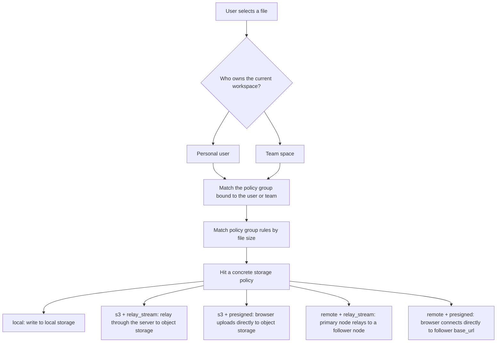

# Uploads and Large Files

This page explains what you may encounter during uploads. Regular users only need the first half; administrators should also read the second half.

## What Regular Users Should Remember

- Small files usually finish quickly
- Large files are automatically split into multiple parts
- After an upload is interrupted, AsterDrive resumes when it can
- To resume, select the same file again
- Resumable uploads expire: regular chunked sessions are usually valid for 24 hours, and direct-to-object-storage sessions are usually shorter

In daily use, you do not need to distinguish between regular upload, chunked upload, and direct-to-object-storage upload.

## How the Upload Path Is Decided

::: tip Start with policy groups when diagnosing upload failures
Many upload problems look like "the file cannot upload", but the real issue is the policy group matched by the current user or team. Confirm the workspace first, then the policy group, then the concrete storage policy.
:::

## What Administrators Should Prepare Before Deployment

If you are responsible for deployment, confirm these items first:

- Which policy group is bound to the current user or team
- Which storage policy the policy group routes files to
- Whether the policy's single-file size limit and chunk size are appropriate
- Whether the service's local temporary directory has enough space
- Whether the reverse proxy upload size and timeouts are sufficient
- If you use direct-to-object-storage upload, whether the required browser-upload CORS rules are configured
- If you use follower nodes, whether the follower already has a default ingress target
- If you use remote `presigned`, whether the remote node uses direct transport, whether the browser can reach the follower `base_url`, and whether the follower exposes the required CORS response headers

## Which Uploads Use Local Disk Heavily

Not every upload lands on local disk first. The most common cases that noticeably consume temporary directory space are:

- Local storage, especially while assembling large chunked uploads
- Upload paths that require server-side processing

Watch the capacity of these directories:

- `data/.tmp`
- `data/.uploads`

## The Two Common Object Storage Paths

### Server Relay

The browser uploads the file to AsterDrive first, then the server forwards it to S3 / MinIO.  
This path does not rely on the local temporary directory and does not perform content deduplication.

### Direct-to-Object-Storage Upload

The browser uploads the file directly to S3 / MinIO. Large files are automatically split into multiple parts.  
This saves the most server bandwidth, but the object storage must first allow the CORS rules required for browser uploads.

If you use this path, confirm at least:

- Browser-initiated `PUT` is allowed
- The upload site's origin is allowed
- `ExposeHeaders` includes `ETag`

## When Uploads Fail, Check in This Order

1. Whether the current workspace is correct
2. Which policy group is bound to the current user or team
3. Whether the matched storage policy's single-file size limit is sufficient
4. Whether the reverse proxy request body size and timeout are sufficient
5. If direct-to-object-storage upload is used, whether CORS is correct
6. If a follower node is used, whether the node is enabled, the current transport mode passes connection testing, protocol capabilities are compatible, and the default ingress target has been applied
7. Whether the user or team quota is already full

## When to Change Configuration

If users often upload large files, you usually only need to check these places:

- Single-file size limit and chunk size in `Admin -> Storage Policies`
- File-size routing rules in `Admin -> Policy Groups`
- Available space in the server's local temporary directory
- Reverse proxy upload size and timeout
- Browser direct-upload allow rules on object storage
- Follower node transport mode, protocol capabilities, default ingress target, and network reachability; if remote `presigned` is used, also confirm browsers can reach the follower `base_url`
