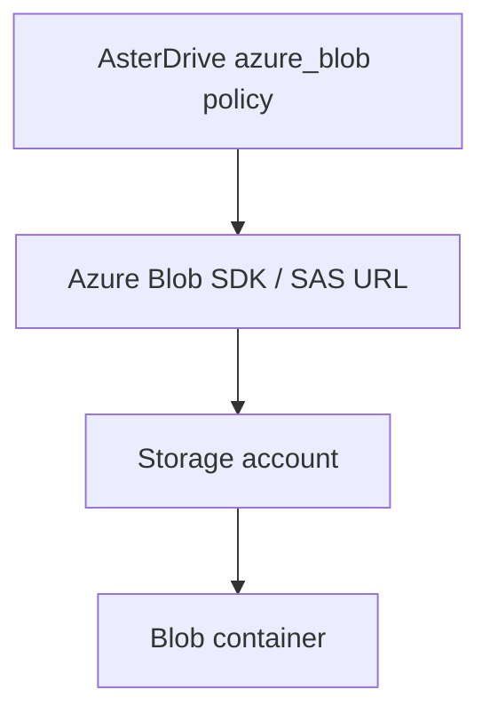
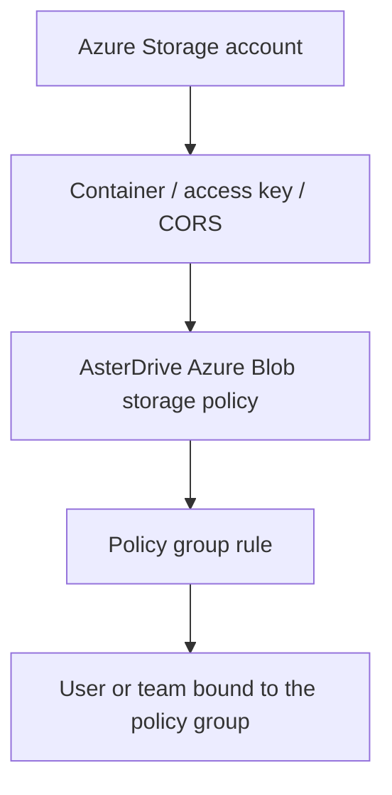
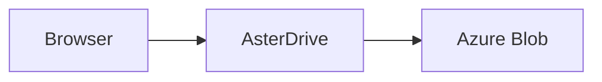
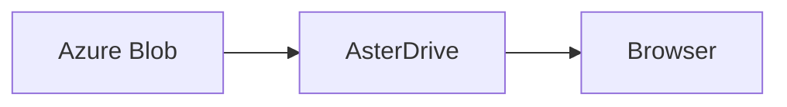
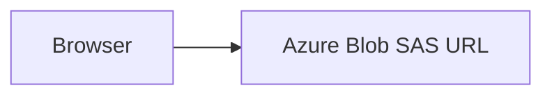

# Azure Blob Storage Policy Tutorial

::: tip What this page covers
This page walks through the complete flow for writing AsterDrive files to Azure Blob Storage: prepare a storage account and container, create an `azure_blob` storage policy, configure policy group rules, bind users or teams, verify uploads and downloads, and understand `presigned` direct upload, CORS, and SAS boundaries.
:::

## When to Use It

Azure Blob Storage is suitable when:

- You already use Azure Storage accounts and Blob containers
- You want Azure to carry file capacity, object persistence, and download bandwidth
- You want AsterDrive to use the Azure Blob SDK instead of treating Azure as S3-compatible storage
- Your administrators already manage Azure network rules, access keys, billing, and lifecycle policies

If you use S3, MinIO, R2, or another S3-compatible service, see [S3 / MinIO / R2 Storage Policy Tutorial](/en/storage/s3-minio-r2). If you use Tencent COS and need COS CI capabilities, see [Tencent COS Storage Policy Tutorial](/en/storage/tencent-cos).

## Azure Blob Is Not S3-Compatible Storage

In AsterDrive, `azure_blob` is an independent storage backend. It does not use the S3-compatible API.



Keep these names separate:

| AsterDrive field | Azure concept | Notes |
| --- | --- | --- |
| Endpoint | Blob service endpoint | For example `https://<account>.blob.core.windows.net` |
| Bucket / Container | Container | Azure calls this a container, not a bucket |
| Access Key / Storage account name | Storage account name | This is not an Access Key ID |
| Secret Key / Storage account key | Storage account key | Used by the server to sign SAS URLs |
| Base path | Blob name prefix | Optional prefix under the container |

## First, Separate the Layers



Creating only an Azure Blob storage policy is not enough. When users or teams upload files, they first match a policy group, and then a policy group rule assigns the upload to a storage policy.

## Entries Used in This Page

| What you want to do | Entry |
| --- | --- |
| Create an Azure Blob policy | `Admin -> Storage Policies -> New Policy` |
| Test the Azure Blob connection | `Admin -> Storage Policies -> Test Connection` |
| Create routing rules | `Admin -> Policy Groups` |
| Bind a policy group to a user | `Admin -> Users -> User Details` |
| Bind a policy group to a team | `Admin -> Teams -> Team Details` |
| Adjust the public site URL | `Admin -> System Settings -> Site Configuration -> Public Site URL` |

## 1. Prepare the Storage Account and Container

Create or choose an Azure Storage account, for example:

```text
asterdriveprod
```

Then create a dedicated container, for example:

```text
asterdrive-prod
```

It is recommended to allocate a dedicated prefix for AsterDrive:

```text
prod/
```

Objects are then expanded under that prefix using AsterDrive's content-addressed paths. Do not let multiple AsterDrive instances write to the same prefix unless you clearly know that they will not overwrite each other or clean up each other's objects.

::: warning Do not manually move blobs in the container
The AsterDrive database records object paths. Manually moving, renaming, or deleting Azure blobs will make database file records inconsistent with the real objects.
:::

## 2. Prepare Access Credentials

AsterDrive currently uses the storage account name and account key to access Azure Blob.

In the Azure Portal, find:

```text
Storage account -> Security + networking -> Access keys
```

Prepare these values:

| Value | AsterDrive field |
| --- | --- |
| Storage account name | `Access Key / Storage account name` |
| key1 or key2 | `Secret Key / Storage account key` |
| Blob service endpoint | `Endpoint` |
| Container name | `Bucket / Container` |

If your organization uses a stricter key rotation process, you can configure a new policy with `key2`, validate it, and then move policy groups over. Do not directly change the endpoint, container, or base path of a policy that already has active uploads or existing files.

## 3. Choose Upload and Download Modes First

For the first connection, start with the conservative route:

| Direction | Initial recommendation | Reason |
| --- | --- | --- |
| Upload mode | `relay_stream` | The browser does not need to reach Azure Blob directly, so CORS is less likely to block you |
| Download mode | `relay_stream` | Downloads also go through AsterDrive first, making troubleshooting easier |

After basic reads and writes work, you can consider switching to:

- upload `presigned`
- download `presigned`

### How `relay_stream` Works

Upload path:



Download path:



This keeps the entry point centralized and easy to debug. The tradeoff is that the application node carries upload and download bandwidth.

### How `presigned` Works

For Azure Blob, `presigned` uses Azure SAS URLs. It is not an S3 presigned URL.

Upload path:



Download path:


This reduces bandwidth load on the AsterDrive node. It requires the browser to reach the Azure Blob endpoint, and the container CORS settings must allow the browser origin.

::: tip Azure single direct upload does not require the browser to read ETag
Azure Blob single `presigned` PUT requires the request header `x-ms-blob-type: BlockBlob`. AsterDrive returns this header to the frontend during upload initialization.

S3 / COS direct upload usually requires the browser to read `ETag` from the response. Azure Blob single direct upload is explicitly marked by the backend as not requiring `ETag`. Multipart direct upload still uses Azure block IDs as the part markers required for completion.
:::

## 4. Create the Azure Blob Storage Policy in AsterDrive

Open:

```text
Admin -> Storage Policies -> New Policy
```

Choose the driver type:

```text
Azure Blob
```

Fill in:

| Field | Example | Notes |
| --- | --- | --- |
| Endpoint | `https://asterdriveprod.blob.core.windows.net` | Blob service endpoint; a trailing `/` is normalized |
| Bucket / Container | `asterdrive-prod` | Azure container name |
| Access Key / Storage account name | `asterdriveprod` | Storage account name; AsterDrive trims leading/trailing spaces before saving |
| Secret Key / Storage account key | `...` | Storage account key; AsterDrive trims leading/trailing spaces before saving |
| Base path | `prod/` | Optional blob name prefix |
| Upload mode | Start with `relay_stream` | Switch to `presigned` after validation |
| Download mode | Start with `relay_stream` | Switch to `presigned` after validation |

::: warning Use the Blob service endpoint
Do not paste the Azure Portal URL, container URL, or a SAS URL into Endpoint. Endpoint should look like `https://<account>.blob.core.windows.net`. The container is entered separately in the Bucket / Container field.
:::

## 5. Test the Connection Before Saving Production Routing

Before or after saving, use the admin-console connection test to confirm:

- AsterDrive can reach the endpoint
- the container exists
- the account name and key can sign and perform object operations
- the base path is correct
- if you use `presigned`, browsers can also reach the endpoint

When editing an existing policy, leaving the storage account name or account key fields blank lets the draft connection test reuse the credentials already saved for that policy. This lets you test endpoint, container, base path, or upload-mode changes without pasting the account key every time. New policies have no saved credentials to reuse, so required credentials still need to be filled in.

When a connection test fails, the admin console prefers the backend diagnostic. Scripts and API clients can read `error.diagnostic.message` from the standard error response. It keeps useful Azure context where possible while redacting SAS values, account keys, and similar credentials.

If the connection test fails, do not move users to this policy yet. Check in this order:

1. Endpoint includes `http://` or `https://`
2. Endpoint is the Blob service endpoint
3. Container name is correct
4. Storage account name is correct
5. Storage account key was copied completely
6. The AsterDrive server clock is accurate
7. The server network can reach the Azure Blob endpoint
8. If private networking, dedicated links, or firewalls are involved, the AsterDrive server network is allowed

## 6. Configure CORS

If you only use `relay_stream`, the browser does not request Azure Blob directly, so CORS is not the first blocker.

If you use `presigned` upload or download, configure Blob service CORS on the Azure Storage account to allow the AsterDrive site origin.

At minimum, check:

| Item | Recommendation |
| --- | --- |
| Allowed origins | The public AsterDrive site origin, for example `https://drive.example.com` |
| Allowed methods | Include at least `PUT`, `GET`, and `HEAD` |
| Allowed headers | Include at least `Content-Type`, `x-ms-blob-type`, `x-ms-version`, and `Range`; use `*` first if you are validating |
| Exposed headers | Include `ETag`, `Content-Length`, `Content-Range`, `Content-Disposition`, `Accept-Ranges`, and `x-ms-request-id` |
| Max age | Follow your security policy, for example `600` |

`Allowed origins` should be the browser origin used to open AsterDrive. It usually comes from:

```text
Admin -> System Settings -> Site Configuration -> Public Site URL
```

Do not put the server-to-Azure private address here. CORS checks the browser page origin.

## 7. Create a Test Policy Group

Do not directly change the default policy group at the start. Create a test policy group first.

Open:

```text
Admin -> Policy Groups
```

Create a policy group, for example:

```text
Azure Blob Test Group
```

Add a rule:

| Field | Recommendation |
| --- | --- |
| Storage policy | The Azure Blob policy you just created |
| Priority | Keep the default or make it the first match |
| File size range | Cover all sizes first, so validation is straightforward |

## 8. Bind a Test User or Test Team

### Bind a User

Open:

```text
Admin -> Users -> User Details
```

Change the test user's policy group to `Azure Blob Test Group`.

### Bind a Team

Open:

```text
Admin -> Teams -> Team Details
```

Change the test team's policy group to `Azure Blob Test Group`.

Team workspace uploads use the team policy group, not the personal user's policy group.

## 9. Run Real Validation

Use a real account bound to the test policy group:

1. Upload a small file
2. Upload a large file that exceeds the chunk threshold
3. Download the files
4. Share a file and open the share link
5. Delete a file, then restore it from trash
6. Delete again and clear trash, then confirm Azure objects are cleaned up as expected

If you plan to enable `presigned`, test these as well:

1. Change upload mode to `presigned`
2. Upload small and large files
3. In browser developer tools, confirm requests go directly to the Azure Blob endpoint
4. Confirm the upload request includes `x-ms-blob-type: BlockBlob`
5. If using `presigned` downloads, confirm the download link is reachable from the browser

## FAQ

### Why Does the Admin Console Still Show a Bucket Field?

AsterDrive reuses part of the object-storage policy model internally, so the form and API may still show `bucket`. For Azure Blob, it means **container**. The create wizard and validation messages try to use "container" where possible.

### Why Does `presigned` Fail While `relay_stream` Works?

`relay_stream` only requires the AsterDrive server to reach Azure Blob. `presigned` also requires the browser to reach the Azure Blob endpoint, and CORS must allow the browser origin to send `PUT` / `GET`.

Check first:

1. Can the browser reach the endpoint?
2. Do Storage account firewall rules allow the client network?
3. Does Blob service CORS include the public AsterDrive site origin?
4. Do allowed headers include `x-ms-blob-type`?
5. Is the SAS URL still within its validity window?

### Why Do Production SAS URLs Allow Only HTTPS?

Production endpoints default to HTTPS-only SAS protocol so signed URLs cannot be used over HTTP. Production deployments should use HTTPS Blob service endpoints.

### Can I Directly Edit an Azure Policy Already in Use?

Do not directly change endpoint, container, or base path. Those fields determine where old files are located. A safer approach:

1. Create a new Azure Blob policy
2. Create a test policy group and validate it
3. If existing data must move, use `Admin -> Storage Policies -> Migrate Data`
4. After migration, switch users or teams to the new policy group

## Launch Checklist

- Storage account and container are ready
- Account name and key are correct, and the connection test passes
- Base path is planned and not shared with another instance
- Upload / download modes match your network conditions
- If using `presigned`, Blob service CORS is configured
- A test user can upload, download, share, delete, and restore files
- Large-file multipart upload works
- Production uses an HTTPS endpoint
- Azure storage capacity, request count, and egress cost boundaries are understood
