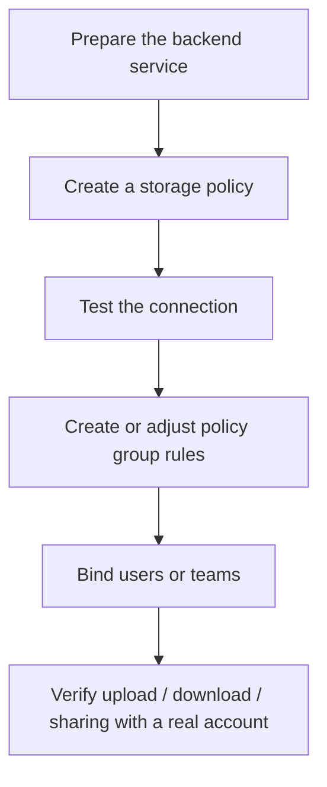

# Storage Policy Backends

::: tip What this documentation category covers
These tutorials are organized by backend type: how to prepare the external service, create a storage policy, configure policy group rules, move users or teams over, and verify everything before going live.
:::

AsterDrive has two layers of concepts:

- **Storage policy**: where files are ultimately written, such as a local disk, S3 / MinIO / R2, Tencent COS, or a follower node
- **Policy group**: which storage policy a user or team upload matches, based on rules

If you only want to understand the overall model, start with [Storage Policies](/en/config/storage).  
If you have already decided which backend to connect, use the tutorials here.

## Current Tutorials

| Backend | Best for | Tutorial |
| --- | --- | --- |
| Local disk | Single-node setups, NAS, small teams, minimum dependencies | [Local disk](/en/storage/local) |
| S3 / MinIO / R2 | Object storage, large files, external buckets, cloud storage | [S3 / MinIO / R2](/en/storage/s3-minio-r2) |
| Tencent COS | Tencent object storage, COS CI, per-policy native processing | [Tencent COS](/en/storage/tencent-cos) |
| Follower node | The control plane stays on the primary node, while real objects are written to another AsterDrive node | [Follower Node Storage Policy](/en/storage/remote-follower) |

## General Configuration Flow

## Do Not Rush Production Traffic

For a new backend, create a separate policy first. Do not directly modify an old policy that is already in use.

Recommended flow:

1. Create a new backend policy
2. Create a test policy group
3. Bind one test user or test team
4. Run through upload, download, sharing, deletion, and restore
5. After confirming there are no issues, move real users or teams to the new policy group

::: warning Do not directly change the real destination for policies that already have files
The `local` directory, S3 bucket / endpoint / prefix, and follower node binding determine where old files are located. If you change them directly, old files may no longer be found.
:::
