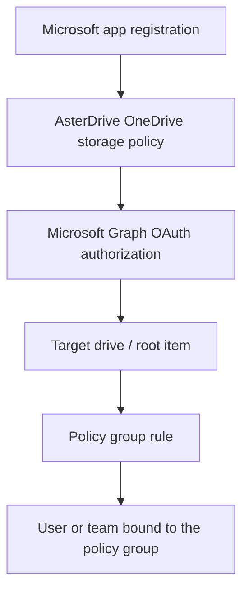

# OneDrive Storage Policy Tutorial

::: tip What this page covers
This page walks through the complete flow for writing AsterDrive files to Microsoft OneDrive or SharePoint / Microsoft 365 group drives: prepare a Microsoft app, create a OneDrive storage policy, authorize Microsoft Graph, configure policy group rules, bind users or teams, and understand how Client ID / Secret are stored.
:::

## When to Use It

OneDrive storage policies are suitable when:

- You already use Microsoft 365, OneDrive, or SharePoint document libraries
- You want team files to be stored in a Microsoft Graph-accessible drive
- You want an administrator to authorize one OneDrive / SharePoint drive as an AsterDrive backend
- You want to use Microsoft Graph delegated permissions through browser-based administrator authorization

If you only need a generic object-storage backend, S3 / MinIO / R2 or Tencent COS is usually more direct. OneDrive integrates with the Microsoft ecosystem, but it requires correct Microsoft app registration, OAuth redirect URI, and delegated permissions.

## First, Separate the Layers



Creating only a OneDrive storage policy is not enough. After saving the policy and Microsoft Graph application credentials, authorize Microsoft from the AsterDrive admin console so AsterDrive can obtain delegated tokens for the target drive.

## Entries Used in This Page

| What you want to do | Entry |
| --- | --- |
| Create a OneDrive policy | `Admin -> Storage Policies -> New Policy` |
| Copy the Microsoft redirect URI | `Admin -> Storage Policies -> OneDrive policy -> Microsoft Graph credential` |
| Authorize or reauthorize | `Admin -> Storage Policies -> OneDrive policy -> Authorize` |
| Validate the saved credential | `Admin -> Storage Policies -> OneDrive policy -> Validate` |
| Create routing rules | `Admin -> Policy Groups` |
| Bind a policy group to a user | `Admin -> Users -> User Details` |
| Bind a policy group to a team | `Admin -> Teams -> Team Details` |

## 1. Choose the Microsoft Cloud Endpoint

Choose the Microsoft cloud endpoint when creating the OneDrive policy:

| Cloud | Sign-in endpoint | Graph endpoint | Accounts |
| --- | --- | --- | --- |
| Global | `login.microsoftonline.com` | `graph.microsoft.com` | Personal Microsoft accounts and Entra ID work or school accounts |
| China (21Vianet) | `login.chinacloudapi.cn` | `microsoftgraph.chinacloudapi.cn` | China cloud organization accounts |

::: warning Do not mix Global and China
The Microsoft app registration, sign-in endpoint, and Graph endpoint must belong to the same cloud. Personal Microsoft accounts do not support the China endpoint. Use Global for personal OneDrive.
:::

## 2. Prepare the Microsoft App Registration

Prepare an app in Microsoft Entra ID app registrations.

At minimum, check:

- Application (client) ID
- Client Secret, required by the current AsterDrive server-side storage authorization flow
- Redirect URI
- Microsoft Graph delegated permissions

### The Redirect URI Must Match Exactly

AsterDrive shows the redirect URI on the OneDrive policy edit page. Copy that full URI into the Microsoft app registration.

A common form is:

```text
https://drive.example.com/api/v1/admin/policies/storage-authorization/callback
```

Microsoft matches redirect URIs exactly. If the scheme, host, port, or path differs by even one character, the authorization callback fails.

### Use Delegated Permissions

OneDrive storage policies use Microsoft Graph delegated authorization completed by an administrator in the browser. They do not use application permissions.

AsterDrive chooses default authorization scopes by target type:

| Target type | Default scopes |
| --- | --- |
| Personal OneDrive / default work or school OneDrive | `offline_access Files.ReadWrite` |
| Personal or work/school account with explicit Drive ID | `offline_access Files.ReadWrite.All` |
| SharePoint site drive / Microsoft 365 group drive | `offline_access Files.ReadWrite.All Sites.ReadWrite.All` |

Do not manually enter scopes in the AsterDrive frontend. Make sure the Microsoft app registration allows the required delegated permissions, then grant consent on the Microsoft authorization page.

::: tip Why offline_access is required
`offline_access` is used to obtain a refresh token. Without a refresh token, background thumbnails, capacity checks, and read/write tasks will require reauthorization after the access token expires.
:::

## 3. Create a OneDrive Storage Policy

Open:

```text
Admin -> Storage Policies -> New Policy
```

Choose the driver type:

```text
OneDrive
```

Fill in:

| Field | Recommendation |
| --- | --- |
| Microsoft cloud | Choose Global or China based on the account's cloud |
| Client ID | Application (client) ID from the Microsoft app registration |
| Client Secret | Microsoft app secret; currently required. Public-client / no-secret flows are not supported by this storage backend. |
| Drive type | Usually keep the default during creation and let authorization resolve the default drive |

After saving the policy, open the policy edit page and start authorization.

::: warning Save before authorizing
The OneDrive authorization request only uses Microsoft Graph application settings already saved on the backend. If you just changed Client ID, Client Secret, tenant, cloud, drive type, or location fields in the form, save the policy first, then click `Authorize` or `Reauthorize`.

This avoids sending unsaved secret drafts in the browser authorization request, and it keeps audit logs, the authorization flow, token refresh, and later background tasks on the same configuration.
:::

## 4. Complete Microsoft Authorization

Open the OneDrive policy edit page:

```text
Admin -> Storage Policies -> target OneDrive policy
```

In the `Microsoft Graph credential` panel, click `Authorize`.

When the backend starts authorization, the request only needs to identify the provider as Microsoft Graph. Client ID, Client Secret, tenant, and scopes are read from the saved connector application config. The older "authorize while carrying draft credentials" flow has been closed.

After authorization succeeds, the browser returns to the AsterDrive admin console and shows the result. AsterDrive stores:

- access token ciphertext
- refresh token ciphertext
- token expiration time
- authorization time
- target drive / root item metadata
- Microsoft cloud / tenant / app metadata

When background tasks need OneDrive access, AsterDrive refreshes the access token automatically. Successful refresh writes the new token state back to the database. If Microsoft rejects the refresh token, the policy enters reauthorization-required state.

::: tip Temporary cleanup after policy deletion
When force-deleting a OneDrive policy that still has temporary upload objects, AsterDrive stores the currently available Microsoft Graph token and drive data in the cleanup task snapshot. That cleanup task may refresh the access token in memory from the snapshotted refresh token, but it does not write OAuth audit records or mark the credential as reauthorization-required. This is intentional: by the time the task runs, the original policy or credential row may already be deleted. Cleanup failures are recorded in the background task error output and failed step, and the service also emits a warning log; reauthorization only applies to OneDrive policies that still exist.
:::

## 5. How the Target Drive Is Resolved

Usually you do not need to enter a Drive ID. AsterDrive resolves it after authorization:

| Drive type | Resolution |
| --- | --- |
| Personal OneDrive | The signed-in account's default drive |
| Work or school OneDrive | The signed-in account's default drive |
| SharePoint site drive | The site's default drive by Site ID, unless Drive ID is provided |
| Microsoft 365 group drive | The group drive by Group ID, unless Drive ID is provided |

Use advanced fields only when you need a non-default document library or a fixed root item:

| Field | When to use it |
| --- | --- |
| Drive ID | Target a non-default drive or bypass automatic resolution |
| Root item ID | Restrict AsterDrive writes to a specific folder |
| Site ID | Required for SharePoint site drive mode unless Drive ID is provided |
| Group ID | Required for Microsoft 365 group drive mode unless Drive ID is provided |

::: tip Root item
Leave Root item ID empty or set it to `root` to write under the drive root.
:::

## 6. Create a Test Policy Group

Do not move real users to a new OneDrive policy immediately. Create a test policy group first.

Open:

```text
Admin -> Policy Groups
```

Create a policy group, for example:

```text
OneDrive Test Group
```

Add one rule:

| Field | Recommendation |
| --- | --- |
| Storage policy | The OneDrive policy you just created and authorized |
| Priority | Keep the default or make it match first |
| File size range | Cover all sizes first, which makes testing easier |

## 7. Bind a Test User or Test Team

### Bind a User

Open:

```text
Admin -> Users -> User Details
```

Change the test user's policy group to `OneDrive Test Group`.

### Bind a Team

Open:

```text
Admin -> Teams -> Team Details
```

Change the test team's policy group to `OneDrive Test Group`.

Team space uploads follow the team policy group, not the individual user's policy group.

## 8. Run a Real Acceptance Check

With a test account, run at least:

1. Upload a small file
2. Upload a larger file
3. Download a file
4. Preview an image or trigger thumbnail generation
5. Delete and restore a file
6. Confirm on the Microsoft side that objects are written into the target drive
7. Click `Validate` in the AsterDrive admin console

If background tasks report Microsoft Graph `401` or token-related errors, check the credential status on the policy edit page. If the status requires reauthorization, click `Reauthorize`.

## 9. Current App Configuration Storage Design

AsterDrive stores the OneDrive Microsoft Graph application settings in a connector application config record instead of keeping them long-term in `storage_policies.access_key` / `storage_policies.secret_key`:

| Storage field | OneDrive meaning |
| --- | --- |
| `storage_connector_application_configs.client_id` | Microsoft Application (client) ID |
| `storage_connector_application_configs.client_secret_ciphertext` | Encrypted Microsoft Client Secret |
| `storage_connector_application_configs.tenant_id` | Microsoft tenant, such as `common` or a tenant ID |
| `storage_connector_application_configs.scopes` | Microsoft Graph delegated scopes |

The Client Secret is encrypted at rest with a key derived from `auth.storage_credential_secret_key`. The plaintext secret entered by an administrator is used only when saving or replacing the application settings; when authorization starts, the backend reads the already saved encrypted secret. If the field is left blank while editing a policy, AsterDrive keeps the existing `client_secret_ciphertext`. API responses and audit logs expose only controlled state such as `client_secret_configured`; they do not return the plaintext secret.

When a OneDrive policy is created or updated, AsterDrive clears the legacy `storage_policies.access_key` / `storage_policies.secret_key` fields at the storage connector boundary. They are not the long-term storage location for OneDrive Microsoft app credentials.

This is an intentional design trade-off: each OneDrive policy owns its Microsoft Graph app settings, but those settings are still stored outside the generic storage policy connection fields so the model can later move to shared app configs if needed.

Benefits of the current design:

- The plaintext Client Secret is not stored long-term in `storage_policies.secret_key`
- The create and authorize flow stays direct
- Connection settings, OAuth tokens, and authorization state have clear table boundaries
- If multiple policies later need to share one Microsoft app, the schema can migrate to a shared app-config reference model

If a future requirement appears, such as multiple OneDrive policies sharing one Microsoft App, Google Drive using the same OAuth storage-app model, or administrators needing centralized app secret rotation, AsterDrive can migrate to a model like:

```text
storage_provider_app_configs
storage_policies.app_config_id -> storage_provider_app_configs.id
```

## FAQ

### Authorization Returns an Error

Check in this order:

1. Whether the redirect URI matches exactly
2. Whether Client ID / Secret come from the same Microsoft app
3. Whether the Microsoft cloud endpoint is correct
4. Whether a personal Microsoft account was accidentally used with the China endpoint
5. Whether the Microsoft app allows the required delegated permissions

### Authorization Succeeds but Drive Resolution Fails

Check the Drive type and target fields:

- Default personal / work-school OneDrive usually does not need Drive ID
- SharePoint site drive needs Site ID unless Drive ID is provided
- Microsoft 365 group drive needs Group ID unless Drive ID is provided
- Leaving Root item ID empty or `root` is the safest initial setup

### Reauthorization Is Required Frequently

The refresh token is usually unavailable or rejected by Microsoft. Check:

- Whether authorization included `offline_access`
- Whether Microsoft organization policy restricts refresh tokens
- Whether an administrator revoked the grant on the Microsoft side
- Whether Client Secret was rotated but the AsterDrive policy was not updated
