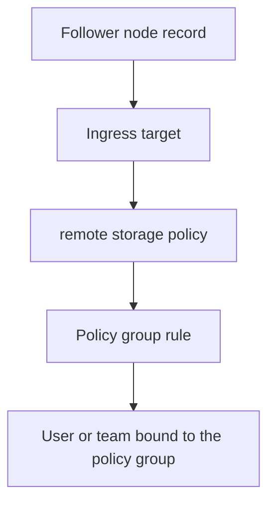
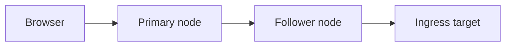
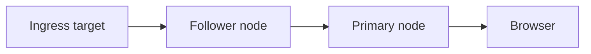
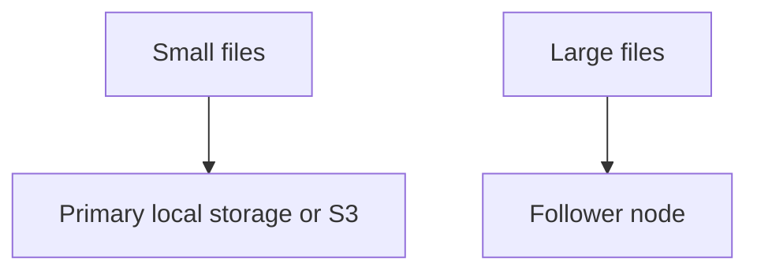

# Follower Node Storage Policy Tutorial

::: tip What this page covers
This page explains how to use an already connected follower node as a storage policy backend: create an ingress target, create a `remote` storage policy, configure policy group rules, bind users or teams, and verify real uploads and downloads.
:::

If you have not connected the follower node to the primary node yet, start with [Follower Nodes](/en/guide/remote-nodes).  
If you run follower nodes with Docker, start with [Deploy a Follower Node with Docker](/en/deployment/docker-follower).

## When to Use It

Follower nodes are suitable for these scenarios:

- The primary node handles login, the admin console, sharing, and WebDAV, while real objects are written to another machine
- You have an extra storage machine at home, in the office, or in a server room
- You want to route large files or files from a specific team to an independent node
- You want a follower node to write to its own local disk or to S3 / MinIO that it can access

It is not a multi-primary cluster or automatic failover. The primary node is still the only control plane.

::: warning Choose transport according to your network
Follower nodes now have three transport modes:

- `direct`: the primary connects directly to the follower `base_url`
- `reverse_tunnel`: the follower actively connects to the primary, and `base_url` can stay empty
- `auto`: direct when `base_url` is set, reverse tunnel when it is empty

If the follower is behind NAT, CGNAT, or a private-only network and can only reach the primary outbound, choose reverse tunnel. Reverse tunnel is still under test and is suitable for `relay_stream` upload/download. If you need `presigned`, you still need direct transport, and browsers must also be able to reach the follower `base_url`.
:::

## First, Separate the Three Layers



Each layer is responsible for something different:

| Layer | Responsibility | Entry |
| --- | --- | --- |
| Follower node record | The primary node knows which follower node exists and how to access it | `Admin -> Follower Nodes` |
| Ingress target | Whether the follower node writes received objects to local storage or S3 | `Admin -> Follower Nodes -> Node Details` |
| remote storage policy | Which follower node is selected during upload | `Admin -> Storage Policies` |
| Policy group | Which users / teams / file sizes match this policy | `Admin -> Policy Groups` |

The primary node and follower currently use internal remote storage protocol `v4`, and the current primary requires the follower to support `v4` as well. Before creating a remote policy or switching policy groups, have the primary node test the node connection once; the test result includes the protocol version, server version, and capability summary.

## 1. Confirm the Follower Node Is Ready

In the primary node admin console, open:

```text
Admin -> Follower Nodes
```

Confirm that the target node meets these conditions:

- Enrollment is complete
- It is enabled
- The transport mode matches the network topology
- If using direct transport, `base_url` is an address the primary node can access
- If using reverse tunnel, the tunnel status is online
- "Test Connection" succeeds
- The internal protocol version in the capability summary is compatible with the current primary node; currently `v4` is required
- `/health/ready` returns successfully

If `base_url` is empty, only `reverse_tunnel` or `auto` can carry remote traffic. A `direct` node must have an HTTP(S) address reachable by the primary. Before production, confirm that "Test Connection" passes with the current transport mode.

## 2. Create the Default Ingress Target

Open the target follower node details and find:

```text
Primary-managed ingress targets
```

For the first setup, create a `local` ingress target.

Example:

| Field | Recommendation |
| --- | --- |
| Name | `default-local` |
| Driver | `local` |
| Base path | `default` |
| Default ingress target | Enabled |

The base path of a `local` ingress target can only be a relative path.  
It is ultimately placed under the follower node's own:

```text
server.follower.remote_storage_target_local_root
```

For example, if the follower node configuration is:

```toml
[server.follower]
remote_storage_target_local_root = "/data/remote-storage-targets"
```

And the ingress target base path is:

```text
default
```

Objects are ultimately written to:

```text
/data/remote-storage-targets/default
```

::: warning Without a default ingress target, a remote policy cannot actually write data
Successful enrollment only means the primary and follower identities are bound. Before receiving real objects, the follower node also needs an applied default ingress target.
:::

## 3. Choose local or s3 for the Ingress Target

| Ingress target | Best for | Notes |
| --- | --- | --- |
| `local` | Follower node local disks or NAS-mounted directories | The base path must be relative and is restricted under the follower ingress root directory |
| `s3` | Object storage that the follower node's network can access | Credentials and endpoint are stored in the follower node ingress target configuration |

For the first integration, use `local` to prove the path from the primary node to the follower node.  
After confirming it is stable, switch the follower ingress target to `s3` if needed.

## 4. Create a remote Storage Policy

Open:

```text
Admin -> Storage Policies -> New Policy
```

Choose the driver type:

```text
remote
```

Fill in:

| Field | Recommendation |
| --- | --- |
| Name | A name that identifies the node, such as `Remote Follower A` |
| Follower node | Select the node you just connected and tested successfully |
| Single-file size limit | Set this according to the test scenario first; `0` means unlimited |
| Chunk size | Keep the default for the first setup |
| Upload mode | Use `relay_stream` for the first setup |
| Download mode | Use `relay_stream` for the first setup |

Save it first, then run a connection test.

## 5. Choosing Upload and Download Modes

### First Choice: `relay_stream`

Upload path:



Download path:



Advantages:

- The browser only needs to access the primary node
- The troubleshooting path is clear
- Works with both direct transport and reverse tunnel

Trade-off:

- The primary node still carries upload and download bandwidth

### Advanced: `presigned`

During upload or download, the browser directly accesses a short-lived URL generated by the follower node.

Suitable when:

- You want to reduce bandwidth pressure on the primary node
- The remote node uses direct transport
- The browser can reliably access the follower node `base_url`
- The reverse proxy already exposes the follower node correctly

Before using it, confirm:

- The remote node transport is not reverse tunnel
- The follower node `base_url` is reachable from the browser
- The HTTPS certificate is trusted
- The reverse proxy does not intercept upload / download paths or required response headers
- The follower node ingress target has been applied successfully
- The primary node connection test shows that the follower supports `browser_presigned_cors`

If the primary node can access the follower node, but user browsers cannot, do not use remote `presigned`. If the remote node uses reverse tunnel, also avoid `presigned` and use `relay_stream` instead.

::: warning A Tailscale / VPN Address Is Not a Public Address
If the follower `base_url` is a Tailscale IP, MagicDNS name, or an internal name that only resolves through split DNS, remote `presigned` is suitable only for tailnet / VPN users. After public users open the primary site, their browsers are still redirected to that follower address. If the public network cannot resolve or route to it, upload and download fail.

To let public users access these files, either give the follower a public HTTPS address, or set the remote policy upload/download mode to `relay_stream` so the primary relays the traffic. For topology trade-offs, see [Follower Node Network Topologies](/en/deployment/follower-network-topologies).
:::

Browser CORS requirements for remote `presigned` are stricter than ordinary primary-node relaying:

| Direction | Required request headers | Response headers that must be exposed |
| --- | --- | --- |
| Upload `PUT` | `content-type` | `ETag` |
| Download `GET` / Range | `range` | `Accept-Ranges`, `Content-Range`, `Content-Length` |

The follower's default internal protocol capabilities declare `content-type, range`, and expose the GET headers `Accept-Ranges`, `Cache-Control`, `Content-Disposition`, `Content-Length`, `Content-Range`, `Content-Type`, `ETag`, plus the PUT header `ETag`. If nginx, Caddy, Traefik, or a CDN sits in front, confirm that it does not drop these response headers.

## 6. Create a Test Policy Group

Do not directly modify the default policy group. Create a test policy group first:

```text
Admin -> Policy Groups -> New Policy Group
```

Example:

```text
Remote Test Group
```

Add a rule:

| Field | Recommendation |
| --- | --- |
| Storage policy | The remote policy you just created |
| Priority | Keep the default or set it to match first |
| File size range | Cover all sizes for the first test |

## 7. Bind a Test User or Team

### Bind a User

Open:

```text
Admin -> Users -> User Details
```

Change the test user's policy group to `Remote Test Group`.

### Bind a Team

Open:

```text
Admin -> Teams -> Team Details
```

Change the test team's policy group to `Remote Test Group`.

Team space uploads match the team policy group, not the individual user's policy group.

## 8. Run a Real Acceptance Check

Log in as the test user and verify, in order:

1. Upload a small file
2. Upload a large file
3. Download the file
4. Create and open a share link
5. Delete the file, then restore it from the trash
6. If previews are enabled, open an image or PDF once
7. On the follower node, check whether objects appear in the ingress target directory or object storage
8. Return to `Admin -> Follower Nodes` on the primary node and test the connection again, confirming that the protocol version and capability summary are still normal

If all of these pass, then consider moving real users or teams to the remote policy group.

## 9. Route by Size to a Follower Node

A common pattern:



Configure multiple rules in the policy group, for example:

| Rule | File size range | Storage policy |
| --- | --- | --- |
| Small files | `0` to `100 MiB` | Local policy |
| Large files | Above `100 MiB` | remote policy |

After saving, upload small and large files separately and confirm that the matched storage policy is as expected.

## 10. Move Real Users or Teams

After confirming the test works, choose a migration method:

| Scenario | Method |
| --- | --- |
| Only a few users should use the follower node | Bind policy groups one by one under `Admin -> Users` |
| A specific team should use the follower node | Bind a policy group under `Admin -> Teams` |
| New users should use the follower node by default | Set the remote policy group as the default policy group for new users |
| Gradual migration | Adjust bindings in batches while watching tasks, logs, and follower node health |

Changing a policy group only affects future uploads. Old files are still read through their original storage policies.

## 11. Routine Maintenance

Check regularly:

- Whether the remote node connection test succeeds
- If reverse tunnel is used, whether the tunnel is online and has no recent errors
- Whether the follower node `/health/ready` is normal
- Whether the default ingress target is still applied
- Whether the follower ingress root directory has enough disk space
- If the follower writes to S3, whether the S3 credentials are still valid
- Whether the remote policy group is still enabled
- Whether there have been recent errors related to remote uploads / downloads

The follower node's local ingress directory is formal data and must be included in the backup strategy.  
If the ingress target is S3, handle it according to the backup and versioning strategy for object storage.

## 12. Common Issues

### Primary Connection Test Fails

Check first:

- Whether the remote node transport mode is correct
- In direct mode, whether `base_url` is an address the primary can actually reach
- In reverse tunnel mode, whether the follower can reach the primary `public_site_url`, and whether proxies allow WebSocket and long-lived connections
- Whether the follower service is running
- Whether the follower is listening on an externally reachable address
- Whether the reverse proxy or firewall allows the traffic
- Whether `/health/ready` returns successfully
- Whether the internal protocol version returned by the follower is compatible with the current primary; the current primary requires `v4`

### remote Policy Upload Fails

Check in this order:

1. Whether the remote node is enabled
2. Whether enrollment is complete
3. Whether an applied default ingress target exists
4. Whether the follower ingress root directory is writable
5. Whether policy group rules really match the remote policy
6. Whether the user or team quota is already full
7. Whether the primary and follower logs contain matching errors

### `presigned` Fails but `relay_stream` Works

This usually means the path from primary to follower is fine, but the browser-to-follower path is not.

Check:

- Whether the remote node uses direct transport
- Whether the browser can access the follower `base_url`
- Whether the HTTPS certificate is trusted
- Whether the reverse proxy forwards upload/download paths
- Whether CORS allows `content-type` / `range`
- Whether responses expose `ETag`, `Accept-Ranges`, `Content-Range`, and `Content-Length`
- Whether a company network or browser policy blocks the follower domain

### Existing Files Suddenly Disappear

First confirm whether anyone recently changed:

- the remote node bound by the remote policy
- the follower ingress target
- `remote_storage_target_local_root`
- the follower local directory
- the S3 endpoint / bucket / prefix used by the follower ingress target

All of these fields decide where old objects live. Do not directly edit a real target that is already in use.
