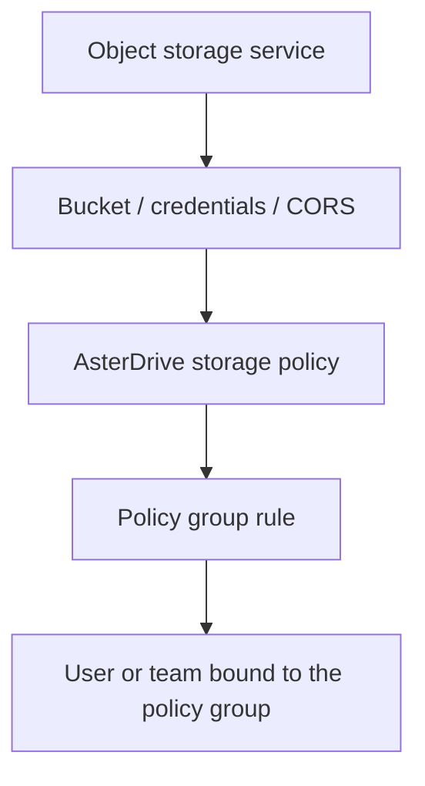
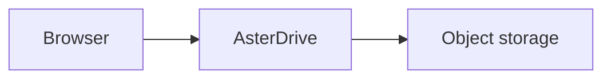
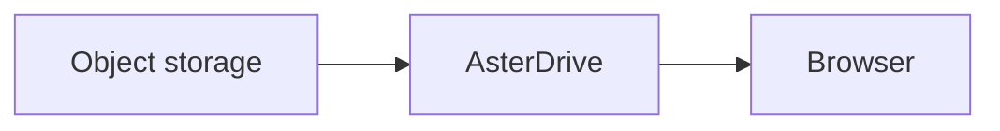
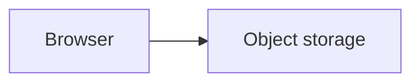
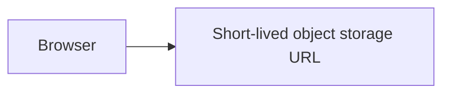
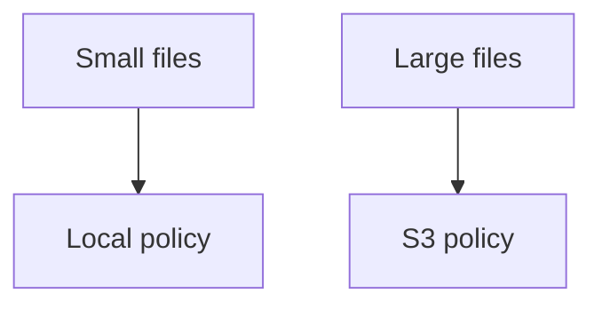

# S3 / MinIO / R2 Storage Policy Tutorial

::: tip What this page covers
This page walks through the complete flow for writing AsterDrive files to S3 or S3-compatible object storage: prepare a bucket, create a storage policy, configure policy group rules, bind users or teams, verify uploads and downloads, and handle the CORS required for `presigned` direct-to-object-storage uploads.
:::

## When to Use It

S3 / MinIO / R2 is suitable for these scenarios:

- You do not want to keep expanding local disk capacity
- You already have MinIO, R2, AWS S3, or another S3-compatible object storage service
- You have many large files and want a dedicated storage service to hold objects
- You want different users or teams to use different buckets / prefixes
- You want to scale application nodes and object storage capacity independently

If you only use a single-node setup for yourself and do not have many files, a local `local` policy is simpler. The S3 backend is optional.

## First, Separate the Layers You Need to Configure



Creating only an S3 storage policy is not enough. When users or teams actually upload files, they first match a policy group, then the policy group rule assigns the upload to a storage policy.

## Entries Used in This Page

| What you want to do | Entry |
| --- | --- |
| Create an S3 policy | `Admin -> Storage Policies -> New Policy` |
| Test the object storage connection | `Admin -> Storage Policies -> Test Connection` |
| Create routing rules | `Admin -> Policy Groups` |
| Bind a policy group to a user | `Admin -> Users -> User Details` |
| Bind a policy group to a team | `Admin -> Teams -> Team Details` |
| Adjust the public site URL | `Admin -> System Settings -> Site Configuration -> Public Site URL` |

## 1. Prepare the Bucket and Prefix

First, prepare a dedicated bucket in object storage, for example:

```text
asterdrive-prod
```

It is recommended to allocate a dedicated prefix for AsterDrive:

```text
prod/
```

Objects are then expanded under that prefix in the bucket using AsterDrive's content-addressed paths. Do not let multiple AsterDrive instances write to the same prefix unless you clearly know that they will not overwrite each other or clean up each other's objects.

::: warning Do not manually move objects in the bucket
The AsterDrive database records object paths. Manually moving, renaming, or deleting objects in the bucket will make database file records inconsistent with the real objects.
:::

## 2. Prepare Access Credentials

Prepare a credential pair for AsterDrive that is used only for this bucket / prefix.

At minimum, it needs to cover:

- Reading objects
- Writing objects
- Deleting objects
- Operations related to multipart upload
- Necessary permissions to list or access the target bucket / prefix

Permission names differ across providers. The principle is: do not grant full-account administrator permissions; only grant the permissions AsterDrive needs to operate on the target bucket / prefix.

## 3. Choose Upload and Download Modes First

For the first integration, use the conservative path:

| Direction | Recommended initial value | Reason |
| --- | --- | --- |
| Upload mode | `relay_stream` | The browser does not need to connect directly to object storage, so there are fewer CORS issues |
| Download mode | `relay_stream` | Downloads are also relayed by AsterDrive first, which makes troubleshooting easier |

After confirming basic reads and writes work, then consider switching to:

- Upload `presigned`
- Download `presigned`

### How `relay_stream` Works

During upload:



During download:



The advantage is a single entry point and simpler troubleshooting. The trade-off is that the application node must carry upload and download bandwidth.

### How `presigned` Works

During upload:



During download:



The advantage is reduced bandwidth pressure on the AsterDrive node. The prerequisite is that browsers can access the object storage endpoint and CORS is configured correctly.

## 4. Create an S3 Storage Policy in AsterDrive

Open:

```text
Admin -> Storage Policies -> New Policy
```

Choose the driver type:

```text
s3
```

Fill in the connection information for your object storage.

### Common MinIO Configuration

| Field | Example |
| --- | --- |
| Endpoint | `https://minio.example.com` |
| Region | `us-east-1` |
| Bucket | `asterdrive-prod` |
| Prefix | `prod/` |
| Path-style | Usually enabled |
| Upload mode | Use `relay_stream` for the first setup |
| Download mode | Use `relay_stream` for the first setup |

If MinIO is only exposed inside the Docker network, for example:

```text
http://minio:9000
```

Then it is usually only suitable for `relay_stream`. To use `presigned`, browsers must also be able to access this endpoint, which usually requires a real HTTPS domain.

### Common Cloudflare R2 Configuration

| Field | Example |
| --- | --- |
| Endpoint | `https://<account-id>.r2.cloudflarestorage.com` |
| Region | `auto` |
| Bucket | `asterdrive-prod` |
| Prefix | `prod/` |
| Path-style | Decide based on the admin-console test result |
| Upload mode | Use `relay_stream` for the first setup |
| Download mode | Use `relay_stream` for the first setup |

R2 custom domains, caching, and public access policies are configured separately on the Cloudflare side. AsterDrive only needs to operate private objects through the S3 API.

### Common AWS S3 Configuration

| Field | Example |
| --- | --- |
| Endpoint | Use the standard AWS endpoint or leave it empty according to the admin-console field requirement |
| Region | The real region, such as `ap-northeast-1` or `us-east-1` |
| Bucket | `asterdrive-prod` |
| Prefix | `prod/` |
| Path-style | Usually disabled |
| Upload mode | Use `relay_stream` for the first setup |
| Download mode | Use `relay_stream` for the first setup |

The AWS S3 region must match the bucket's region.

## 5. Test the Connection Before Saving

Before or after saving, use the admin-console connection test to confirm:

- AsterDrive can access the endpoint
- The bucket exists
- The credentials can read and write the target location
- path-style / region is not misconfigured

When editing an existing policy, leaving Access Key or Secret Key blank lets the draft connection test reuse the credentials already saved for that policy. This lets you test endpoint, region, path-style, or prefix changes without pasting the secret every time. New policies have no saved credentials to reuse, so required credentials still need to be filled in.

When a connection test fails, the admin console prefers the backend diagnostic. Scripts and API clients can read `error.diagnostic.message` from the standard error response. It keeps useful provider context where possible while redacting secrets, SAS values, account keys, and similar credentials.

If the connection test fails, do not move users to this policy. Check in this order first:

1. Whether the endpoint is accessible from the AsterDrive server
2. Whether the HTTPS certificate is trusted
3. Whether the bucket name is correct
4. Whether the region is correct
5. Whether path-style matches the provider requirement
6. Whether the Access Key / Secret Key is correct
7. Whether credential permissions cover the target bucket / prefix
8. Whether the AsterDrive server time is accurate

## 6. Create a Test Policy Group

Do not directly modify the default policy group at the beginning. Create a test policy group first.

Open:

```text
Admin -> Policy Groups
```

Create a policy group, for example:

```text
S3 Test Group
```

Add one rule:

| Field | Recommendation |
| --- | --- |
| Storage policy | The S3 policy you just created |
| Priority | Keep the default or set it to match first |
| File size range | Cover all sizes first, which makes testing easier |

Then any file uploaded by the test user will match this S3 policy.

## 7. Bind a Test User or Test Team

### Bind a User

Open:

```text
Admin -> Users -> User Details
```

Change the test user's policy group to the `S3 Test Group` you just created.

### Bind a Team

Open:

```text
Admin -> Teams -> Team Details
```

Change the test team's policy group to `S3 Test Group`.

Team space uploads follow the team policy group, not the individual user's policy group.

## 8. Run a Real Acceptance Check

Log in as the bound test user and test in order:

1. Upload a small file
2. Upload a file larger than the chunk size
3. Download the file
4. Create and open a share link
5. Delete the file, then restore it from the trash
6. If version history is enabled, overwrite-save once and view the version history
7. Go to the object storage console and confirm that objects were written to the target bucket / prefix

If all of these are normal, then consider switching real users or teams.

## 9. Configure Size-Based Routing

A common production strategy is not "all files go to S3", but routing by size:



Open:

```text
Admin -> Policy Groups
```

Configure multiple rules in the same policy group, for example:

| Rule | File size range | Storage policy |
| --- | --- | --- |
| Small files | `0` to `100 MiB` | Local policy |
| Large files | Above `100 MiB` | S3 policy |

Rules are ordered. After saving, upload small and large files separately as the test user and confirm that the storage policy shown in file details is as expected.

## 10. Move Real Users or Teams

After confirming that the test policy group works, choose a migration method:

| Scenario | Method |
| --- | --- |
| Only a few users should use S3 | Bind policy groups one by one under `Admin -> Users` |
| A specific team should use S3 | Bind a policy group to the team under `Admin -> Teams` |
| New users should use S3 by default | Set the target policy group as the default policy group for new users |
| Gradually migrate everyone | Adjust user or team bindings in batches while watching tasks and logs |

Changing a policy group only affects future uploads. Old files are still read through their original storage policies.

## 11. When to Switch to `presigned`

After `relay_stream` is stable, then consider `presigned`.

Signals that it is suitable:

- Upload or download bandwidth pressure is mainly on the AsterDrive node
- User networks can connect directly to object storage
- The object storage endpoint has trusted HTTPS
- You can configure object storage CORS
- You accept that more download response headers are controlled by object storage

Scenarios where it is not suitable:

- Object storage is only reachable from a private network
- User networks cannot access the object storage endpoint
- CORS is hard to configure
- You want all downloads to remain same-origin responses

## 12. Configure CORS for `presigned` Uploads

When using `presigned` uploads, the browser sends `PUT` requests directly to object storage. Object storage must allow AsterDrive's public origin.

Minimum requirements:

- Allowed Origin: your `public site URL`
- Allowed Method: `PUT`
- Allowed Header: cover browser upload request headers
- Expose Header: `ETag`

Example:

```text
AllowedOrigins:
  - https://drive.example.com
AllowedMethods:
  - PUT
AllowedHeaders:
  - *
ExposeHeaders:
  - ETag
```

Provider interfaces differ, but these are the core items.

::: tip How to tell whether it is a CORS issue
If `relay_stream` succeeds, `presigned` fails, and the browser console shows a cross-origin error, object storage CORS is usually the place to check.
:::

## 13. Common Issues

### Connection Test Failed

First check the network path from the AsterDrive server to object storage. Do not start with the browser.

Check:

- Whether the endpoint is reachable from the server
- Whether the bucket exists
- Whether the region matches
- Whether path-style is correct
- Whether the credentials have permission

### Upload Fails Halfway

If it is `relay_stream`:

- Check AsterDrive logs
- Check whether object storage has write failures
- Check reverse proxy upload limits
- Check policy group rules and the single-file size limit

If it is `presigned`:

- Check the browser console
- Check object storage CORS
- Check whether the user network to object storage is stable
- Check whether multipart permissions are complete

### File Cannot Open After Download Redirect

This usually happens with `presigned` downloads.

Check:

- Whether the user can access the object storage endpoint
- Whether the presigned URL has expired
- Whether object storage returns the correct `Content-Type`
- Whether object storage rewrites `Content-Disposition`
- Whether a CDN or gateway intercepts signature parameters

### Old Files Suddenly Cannot Be Found

First ask whether any of these were changed recently:

- endpoint
- bucket
- prefix
- path-style
- credentials
- real object paths in object storage

If they were changed, restore the original configuration first. Files that have already been written are read by their original paths; directly changing the destination will not automatically migrate old objects.

## 14. Routine Maintenance

- Regularly confirm that credentials have not expired
- Regularly upload and download spot-checks with a real account
- Do not manually clean up objects that are still referenced by AsterDrive
- If lifecycle rules are enabled on the bucket side, confirm that they will not clean up normal objects
- If object storage supports versioning or replication, enable it according to your backup strategy
- Consider backup consistency for the AsterDrive database and object storage together

For the complete backup boundary, see [Backup and Restore](/en/deployment/backup).
