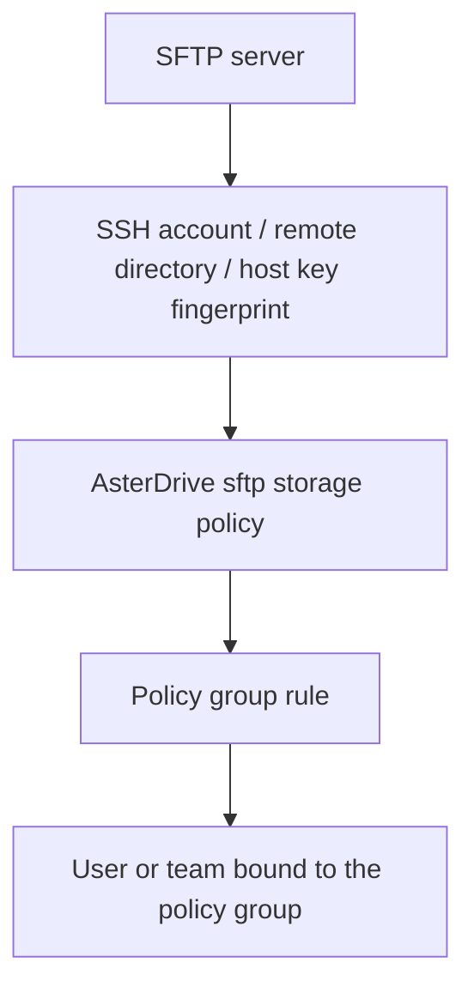

# SFTP Storage Policy Tutorial

::: tip What this page covers
This page explains how to write AsterDrive files to an SFTP server: prepare an SSH account, create an `sftp` storage policy, confirm the SSH host key fingerprint, configure policy group rules, and verify uploads and downloads.
:::

## When to Use It

SFTP is suitable for these scenarios:

- You already have a file server managed through SSH/SFTP
- The target storage is a NAS, traditional server directory, or storage that is only exposed through SFTP
- You do not want browsers to connect directly to the storage backend; uploads and downloads can be relayed by the AsterDrive server
- You want to route some users, teams, or file sizes to an SFTP backend

If you need browser direct upload, presigned URLs, or object-storage multipart upload, prefer [S3 / MinIO / R2](/en/storage/s3-minio-r2), [Azure Blob Storage](/en/storage/azure-blob), or [Tencent COS](/en/storage/tencent-cos). SFTP is currently a server-side streaming backend and does not provide object-storage-style direct upload.

## First, Separate the Layers You Need to Configure



Creating only an SFTP storage policy is not enough. When users or teams upload files, they first match a policy group, then the policy group rule assigns the upload to a storage policy.

## Entries Used in This Page

| What you want to do | Entry |
| --- | --- |
| Create an SFTP policy | `Admin -> Storage Policies -> New Policy` |
| Test the SFTP connection | `Admin -> Storage Policies -> Test Connection` |
| Create routing rules | `Admin -> Policy Groups` |
| Bind a policy group to a user | `Admin -> Users -> User Details` |
| Bind a policy group to a team | `Admin -> Teams -> Team Details` |

## 1. Prepare the SSH Account and Remote Directory

Prepare a dedicated account and directory on the SFTP server, for example:

```text
/srv/asterdrive
```

Grant this account only the permissions needed for the target directory. AsterDrive needs at least:

- Create directories
- Write files
- Read files
- Delete files
- Read file metadata

Do not give AsterDrive an administrator account, a root account, or a directory shared with unrelated applications.

::: warning Do not manually move objects in the remote directory
The AsterDrive database records object paths. Manually moving, renaming, or deleting objects in the SFTP directory will make database file records inconsistent with the real objects.
:::

## 2. Create an SFTP Storage Policy

Open:

```text
Admin -> Storage Policies -> New Policy
```

Choose the driver type:

```text
sftp
```

Fill in the connection fields:

| Field | Example | Notes |
| --- | --- | --- |
| Endpoint | `sftp://sftp.example.com:22` | SFTP server address |
| SSH Username | `asterdrive` | The internal API field is still `access_key`, but the admin UI labels it as SSH Username |
| SSH Password | `********` | The internal API field is still `secret_key`, but the admin UI labels it as SSH Password |
| Base path | `/srv/asterdrive` | Remote root used when AsterDrive writes objects |
| SSH Host Key Fingerprint | `SHA256:...` | Fill this after first-connection confirmation |

Endpoint supports these forms:

```text
sftp://sftp.example.com:22
sftp.example.com
sftp.example.com:2222
```

When the port is omitted, AsterDrive uses `22`. If a scheme is present, only `sftp://` is supported. Do not put usernames, passwords, paths, query strings, or fragments in the Endpoint; put the remote root in Base path and credentials in their own fields.

## 3. Confirm the SSH Host Key Fingerprint

SFTP policies reject unknown host keys by default. During the first connection test, if `SSH Host Key Fingerprint` has not been saved yet, the test fails and reports the server's actual `SHA256:...` fingerprint in the diagnostic message.

Use this flow:

1. Fill Endpoint, SSH Username, SSH Password, and Base path
2. Run the connection test
3. Read the returned `SHA256:...` fingerprint from the failure diagnostic
4. Confirm through a trusted channel that this fingerprint belongs to the intended SFTP server
5. Fill `SSH Host Key Fingerprint` with the confirmed value
6. Run the connection test again, then save after it succeeds

::: warning Do not bypass host key confirmation
Without SSH host key verification, an attacker could impersonate the SFTP server and capture the password. AsterDrive stores the confirmed fingerprint in `storage_policy.options.sftp_host_key_fingerprint`, and later connections must match it. If the server is reinstalled or rotates its SSH host key, confirm and update the fingerprint again.
:::

## 4. Troubleshoot Failed Connection Tests

When a connection test fails, the admin console prefers the standard error response's `error.diagnostic.message`. For SFTP, check in this order:

1. Whether the AsterDrive server can reach the Endpoint and port
2. Whether the Endpoint contains only host and optional port
3. Whether the SSH username and password are correct
4. Whether the account is allowed to use the SFTP subsystem
5. Whether the base path exists, or the account can create it
6. Whether `SSH Host Key Fingerprint` matches the server's current host key
7. Whether the server firewall, fail2ban, or connection limits reject the login

If the error says the host key does not match, do not overwrite the old fingerprint immediately. First confirm whether the server really rotated its host key.

## 5. Create a Test Policy Group and Verify

Do not directly modify the default policy group at the beginning. Create a test policy group, bind one test user or team, and run through:

1. Upload a small file
2. Upload a file larger than ordinary form-upload size
3. Download a file
4. Preview or publicly share a normal file
5. Delete and restore a file
6. Confirm object files appear under the SFTP server target directory

After confirming there are no issues, move real users or teams to the policy group that contains the SFTP policy.

## Migration and Change Boundaries

::: warning Do not directly change these fields on an SFTP policy that already has files

- Endpoint
- Base path
- SSH Username

Old files are read from their original locations. Changing these directly may make existing files unreachable. A safer path is to create a new SFTP policy and use `Admin -> Storage Policies -> Migrate Data`.
:::

You can rotate the SSH password by editing the policy. When editing a saved policy, leaving the password field blank preserves the existing credential.

## Current Capability Boundaries

| Capability | Current behavior |
| --- | --- |
| Upload | AsterDrive server streams writes to SFTP |
| Download | AsterDrive server reads from SFTP and returns data to the browser |
| Browser direct upload | Not supported |
| Object-storage multipart | Not supported |
| Presigned URL | Not supported |
| Capacity observation | No unified capacity query |
| Range reads | Efficient range reads are supported |

SFTP connection pooling is tracked separately; the current implementation prioritizes host key verification and correct basic read/write behavior.
