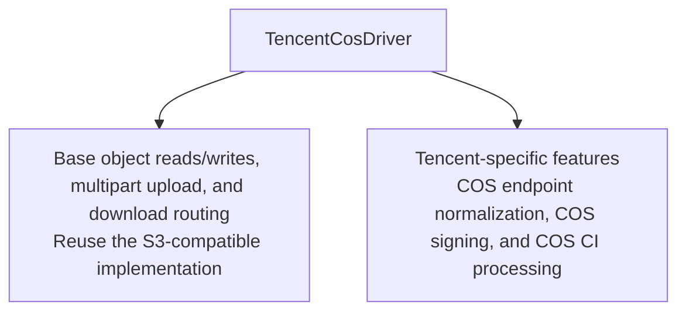
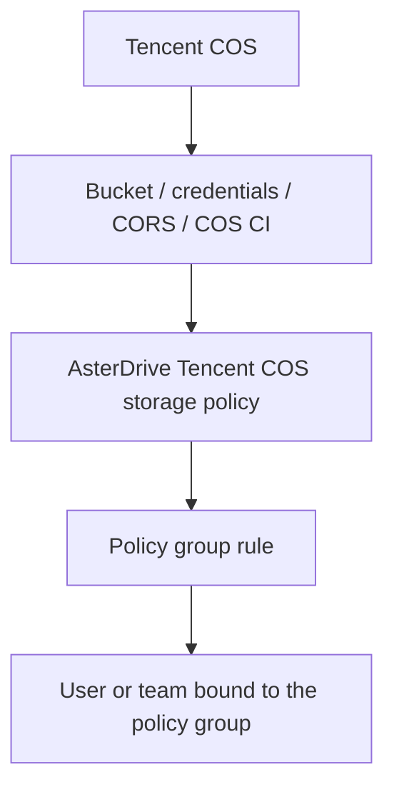
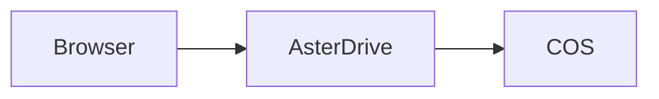
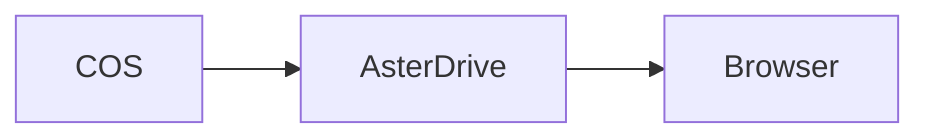
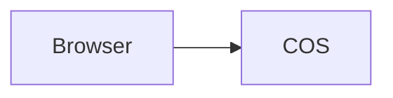
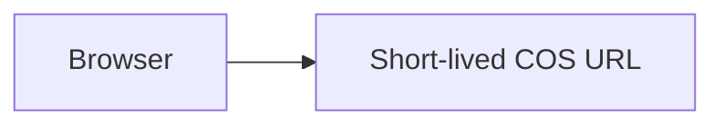

# Tencent COS Storage Policy Tutorial

::: tip What this page covers
This page walks through the complete flow for writing AsterDrive files to Tencent COS: prepare a bucket, create a `tencent_cos` storage policy, configure policy group rules, bind users or teams, verify uploads and downloads, and understand the switches, suffixes, and billing boundaries for COS CI native processing.
:::

## When to Use It

Tencent COS is suitable when:

- You already use Tencent COS and want AsterDrive to write directly into a COS bucket
- You have many or large files and want object storage to carry capacity and bandwidth
- You want to enable Tencent-native COS CI features per storage policy, such as image thumbnails or media-info parsing
- You want the frontend and admin console to clearly show "Tencent COS" instead of hiding it under a generic S3-compatible backend

If you only need generic S3-compatible object storage and do not need Tencent COS CI features, use the [S3 / MinIO / R2 storage policy tutorial](/en/storage/s3-minio-r2) instead.

## Relationship to S3-Compatible Storage

In AsterDrive, `tencent_cos` is an independent storage backend type, but it does not reimplement all object-storage behavior from scratch.



That means:

- Basic object operations are similar to S3-compatible storage
- Tencent COS is displayed independently as `tencent_cos` in the backend and frontend
- Tencent-native features such as COS CI are attached to the `tencent_cos` driver, not the generic `s3` driver

If you want to use COS CI features, choose **Tencent COS** when creating the policy. Do not configure COS as a generic `s3` policy.

## First, Separate the Layers



Creating only a COS storage policy is not enough. When users or teams upload files, they first match a policy group, and then a policy group rule assigns the upload to a storage policy.

## Entries Used in This Page

| What you want to do | Entry |
| --- | --- |
| Create a COS policy | `Admin -> Storage Policies -> New Policy` |
| Test the COS connection | `Admin -> Storage Policies -> Test Connection` |
| Create routing rules | `Admin -> Policy Groups` |
| Bind a policy group to a user | `Admin -> Users -> User Details` |
| Bind a policy group to a team | `Admin -> Teams -> Team Details` |
| Configure global media processing | `Admin -> System Settings -> File Processing` |

## 1. Prepare the Bucket and Prefix

Create a dedicated bucket in the Tencent COS console, for example:

```text
asterdrive-prod-1250000000
```

It is recommended to allocate a dedicated prefix for AsterDrive:

```text
prod/
```

Objects are then expanded under that prefix using AsterDrive's content-addressed paths. Do not let multiple AsterDrive instances write to the same prefix unless you clearly know they will not overwrite each other or clean up each other's objects.

::: warning Do not manually move objects in the bucket
The AsterDrive database records object paths. Manually moving, renaming, or deleting objects in COS will make database file records inconsistent with the real objects.
:::

## 2. Prepare Access Credentials

Prepare a Tencent Cloud credential pair for AsterDrive that is used only for this bucket / prefix.

At minimum, it needs to cover:

- Reading objects
- Writing objects
- Deleting objects
- Multipart-upload related operations
- Necessary access to the target bucket / prefix

If you enable COS CI, also confirm that the credential can make the corresponding CI processing requests, such as image processing or media-info parsing. Permission names and console entries may change with Tencent Cloud product updates; follow Tencent Cloud's latest documentation and console hints.

## 3. Choose Upload and Download Modes First

For the first integration, use the conservative path:

| Direction | Recommended initial value | Reason |
| --- | --- | --- |
| Upload mode | `relay_stream` | The browser does not need to connect directly to COS, so there are fewer CORS issues |
| Download mode | `relay_stream` | Downloads are also relayed by AsterDrive first, which makes troubleshooting easier |

After confirming basic reads and writes work, then consider switching to:

- Upload `presigned`
- Download `presigned`

### How `relay_stream` Works

During upload:



During download:



The advantage is a single entry point and simpler troubleshooting. The trade-off is that the application node must carry upload and download bandwidth.

### How `presigned` Works

During upload:



During download:



The advantage is reduced bandwidth pressure on the AsterDrive node. The prerequisite is that browsers can access the COS endpoint and COS CORS is configured correctly.

## 4. Configure COS CORS

If you only use `relay_stream`, browsers do not directly request COS, so CORS is not the first priority.

If you use `presigned` upload, the COS bucket must allow browser cross-origin uploads. At minimum, check:

- `AllowedOrigin`: your public AsterDrive site URL
- `AllowedMethod`: includes `PUT`
- `AllowedHeader`: allows the headers used by upload requests
- `ExposeHeader`: includes `ETag`

If you use `presigned` download, also confirm that browsers can access the returned COS download URL and that you accept response headers and cache behavior being controlled more by COS.

## 5. Create a Tencent COS Storage Policy in AsterDrive

Open:

```text
Admin -> Storage Policies -> New Policy
```

Choose the driver type:

```text
Tencent COS
```

Common fields:

| Field | Example |
| --- | --- |
| Endpoint | `https://asterdrive-prod-1250000000.cos.ap-guangzhou.myqcloud.com` |
| Bucket | `asterdrive-prod-1250000000` |
| Access Key | Tencent Cloud secret ID |
| Secret Key | Tencent Cloud secret key |
| Prefix / base path | `prod/` |
| Upload mode | Use `relay_stream` for the first setup |
| Download mode | Use `relay_stream` for the first setup |

AsterDrive normalizes the COS endpoint and bucket, then uses COS virtual-hosted style for the underlying S3-compatible requests. You do not need to tune COS as a generic S3 path-style policy manually.

## 6. Test the Connection Before Saving

Before or after saving, use the admin-console connection test to confirm:

- The AsterDrive server can access the COS endpoint
- The bucket name is correct
- The credentials can read and write the target prefix
- The bucket region and endpoint match
- The server time is accurate

If the connection test fails, do not move users to this policy. Check in this order first:

1. Whether the endpoint is accessible from the AsterDrive server
2. Whether the HTTPS certificate is trusted
3. Whether the bucket name is correct
4. Whether the Access Key / Secret Key is correct
5. Whether credential permissions cover the target bucket / prefix
6. Whether the AsterDrive server time is accurate
7. Whether the bucket has the required COS / CI features enabled

## 7. Configure Storage-Native Processing

::: warning Confirm billing before enabling this
Storage-native processing calls Tencent COS CI. AsterDrive caches generated thumbnails, media information, and similar results so they are not processed on every view, but the first generation and provider-side processing requests can still incur charges.
:::

The entry is the **Storage-native processing** section in the COS storage policy editor.

### Master Switch

`Enable storage-native processing` is the master switch for the current policy. When disabled, this policy will not call COS CI features.

### Native Thumbnails

Native thumbnails require all of these conditions:

- `Enable storage-native processing` is enabled
- Thumbnail processor is `storage_native`
- `Native thumbnail extensions` matches the current file name
- The current driver supports COS-native thumbnails

Suffixes are per-policy. For example:

```text
jpg, jpeg, png, webp, gif
```

Files that do not match continue through the global media processors.

### Native Media Info

Native media-info parsing requires all of these conditions:

- `Enable storage-native processing` is enabled
- `Enable native media info` is enabled
- `Native media info extensions` matches the current file name
- The current driver supports COS-native media info

The suffix list is empty by default. Even if `Enable native media info` is on, an empty list will not trigger COS `GetMediainfo` / `ci-process=videoinfo` requests.

Add only audio/video suffixes you intentionally want COS to parse on each COS policy, for example:

```text
mp4, mov, m4v, mkv, webm, mp3, m4a, flac, wav
```

Do not blindly add every possible suffix. AsterDrive caches media information, but the first parsing request still calls COS CI.

### Document Preview

AsterDrive currently does not provide COS document HTML preview and does not call COS document-preview APIs from storage policies. This is intentionally kept out of the current implementation because Tencent Cloud's current public pricing pages do not list a free quota for document HTML preview, so a broad suffix configuration could create uncontrolled costs.

If this is added later, it should use its own explicit switch and suffix list instead of being opened only through the current storage-native processing master switch.

## 8. Free Quotas and Billing Boundaries

References last checked: 2026-06-02. Always confirm against Tencent Cloud's latest pages before enabling billing-sensitive features.

Under Tencent Cloud's current public pricing pages:

| Capability | Free-quota wording | AsterDrive-side note |
| --- | --- | --- |
| Basic image processing | 10 TB monthly free quota | Native image thumbnails use this; usage outside the free-quota rules is billed by Tencent Cloud |
| Video media-info retrieval | 6000 requests / 2 months after first use | Native media-info parsing uses COS `GetMediainfo` / `ci-process=videoinfo` |
| Video snapshot | 6000 requests / 2 months after first use | If COS video thumbnails are enabled later, evaluate this quota first |
| Document HTML preview | No free quota | Not currently implemented in AsterDrive; if added later, it needs a separate switch |

Tencent Cloud pricing, free quotas, expiration rules, and region differences may change. Before production launch, check Tencent Cloud's latest COS / COS CI pricing pages and console prompts.

References:

- [Tencent Cloud COS CI free quotas](https://cloud.tencent.com/document/product/460/36381)
- [Tencent Cloud COS CI basic image processing pricing](https://cloud.tencent.com/document/product/460/47483)
- [Tencent Cloud COS CI media processing pricing](https://cloud.tencent.com/document/product/460/58120)
- [Tencent Cloud COS CI document processing pricing](https://cloud.tencent.com/document/product/460/58121)
- [Tencent Cloud COS CI media-info API](https://cloud.tencent.com/document/product/460/49284)

## 9. Create a Test Policy Group

Do not directly modify the default policy group at the beginning. Create a test policy group first.

Open:

```text
Admin -> Policy Groups
```

Create a policy group, for example:

```text
COS Test Group
```

Add one rule:

| Field | Recommended value |
| --- | --- |
| Storage policy | The COS policy you just created |
| Priority | Keep the default or make it the first matched rule |
| File size range | Cover all sizes first for easier testing |

## 10. Bind a Test User or Team

### Bind a User

Open:

```text
Admin -> Users -> User Details
```

Change the test user's policy group to `COS Test Group`.

### Bind a Team

Open:

```text
Admin -> Teams -> Team Details
```

Change the test team's policy group to `COS Test Group`.

Team-space uploads use the team policy group, not the personal user's policy group.

## 11. Run Real Validation

Use a test account to run through:

- Upload a small file
- Upload a large file
- Download a file
- Preview an image
- If native thumbnails are enabled, upload a matching image suffix and check the thumbnail task
- If native media info is enabled, upload a matching audio/video suffix and check the file-info panel
- Delete a file
- Restore from trash
- Share a file and download it

During validation, also check:

- Whether background tasks succeed
- Whether objects are written under the expected COS prefix
- Whether the browser console reports CORS errors
- Whether AsterDrive logs show COS 403 / 404 / signing errors
- Whether the Tencent Cloud console shows expected CI calls or cost statistics

## 12. Move Production Traffic

After the test policy group is verified, move real users or teams to the target policy group.

If you need to migrate existing files, do not directly change the old policy's bucket, endpoint, or prefix. The correct flow is:

1. Create a new COS policy
2. Test connection and real uploads/downloads
3. Create a migration task through `Admin -> Storage Policies -> Migrate Data`
4. Adjust policy group rules after migration completes

::: warning Do not directly change real destinations for policies that already have files
Bucket, endpoint, and prefix determine where old files are located. If you change them directly, old files may no longer be found.
:::
