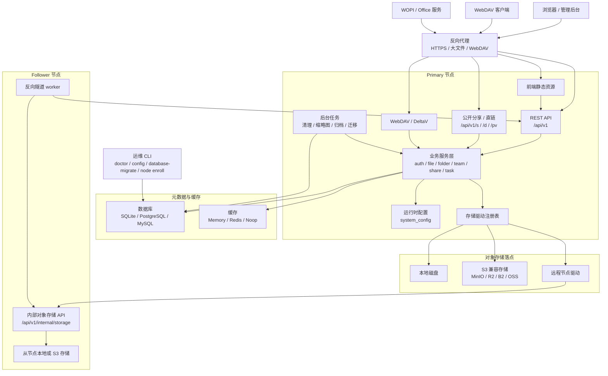
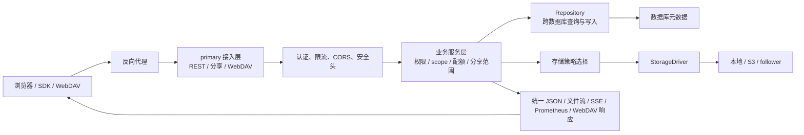
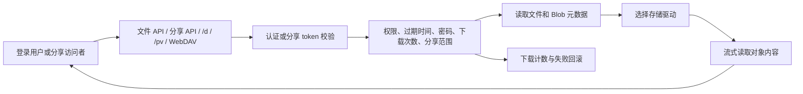
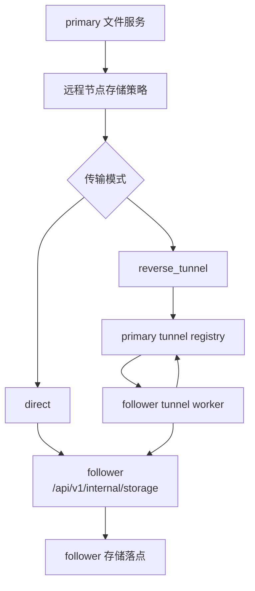

# 架构概览

这一页解释 AsterDrive 运行起来以后各组件怎么协作。它面向部署者、管理员和刚开始参与开发的人，重点是建立系统边界、数据流和排障入口。

如果你要看更细的源码级设计，仓库里还有 `developer-docs/zh-CN/architecture.md` 和 `developer-docs/zh-CN/module-designs.md`。那两份文档更适合改代码前读。

## 60 秒版本

- AsterDrive 是一个 Rust 后端加 React 前端的自托管云盘；生产构建时，前端资源会由后端直接服务。
- 同一套二进制支持两种节点模式：`primary` 负责用户 API、前端、WebDAV、分享、运行时配置和后台任务；`follower` 只暴露健康检查和内部对象存储协议。
- 元数据主要在数据库里，文件内容主要在存储驱动里。数据库记录“谁拥有什么、版本是什么、配额怎么算、分享是否有效”，存储驱动保存实际对象内容。
- 个人空间和团队空间共用同一条文件主链路，只是在权限、配额归属和策略选择上使用不同的工作空间作用域。
- 配置分两层：启动前决定的 `config.toml` / `ASTER__...` 环境变量，以及管理员可热更新的数据库运行时配置。
- 大文件上传可能走后端中转、分片上传、S3 预签名直传或 S3 multipart；最终都要回到数据库完成文件记录、Blob 引用和配额落账。

## 组件关系

这张图里最重要的边界有三条：

- **primary 是用户入口**：普通用户 API、管理后台、公开分享、WebDAV 和前端兜底都挂在 primary 上。
- **follower 是受管存储节点**：它不提供普通用户 API，不服务前端，也不直接参与用户鉴权。
- **数据库和对象存储分离**：数据库不是文件内容仓库，存储驱动也不负责业务权限。

## 运行模式

### Primary

primary 是默认面向用户的节点，负责：

- 服务 React 前端和静态资源
- 注册 `/api/v1/*` REST API
- 处理公开分享 API、直链下载和预览直链
- 挂载 WebDAV / DeltaV
- 加载和热更新运行时配置
- 维护存储策略、策略组、远程节点和后台任务
- 运行清理、缩略图、归档、存储迁移、健康检查等后台任务

生产部署时，通常只需要一个 primary。反向代理、HTTPS、上传体大小、WebDAV 头部和 WOPI 回调都应该先围绕 primary 配好。

### Follower

follower 是远程存储节点，负责：

- 暴露 `/health*` 健康检查
- 暴露 `/api/v1/internal/storage/*` 内部对象存储协议
- 按主节点绑定关系接受对象写入、读取、拼接、列举和 ingress profile 控制
- 在 `reverse_tunnel` 模式下主动连回 primary，取走需要执行的内部存储请求

follower 不处理普通登录、分享页、WebDAV 或管理后台。查远程节点问题时，别先去普通文件路由里翻，先确认 primary 的远程节点配置、绑定状态、网络拓扑和 follower 的内部存储协议是否正常。

## 普通请求数据流

普通 REST 请求的大致顺序是：

1. 反向代理把请求转给 primary。
2. primary 的接入层命中 REST、公开分享或 WebDAV 入口。
3. 中间件和路由级逻辑处理请求 ID、CORS、安全头、认证、管理员权限和限流。
4. service 层执行业务规则，例如工作空间权限、分享范围、配额、锁、版本和回收站状态。
5. repository 层读写数据库；涉及文件内容时，service 层再通过存储策略选择具体驱动。
6. 响应可能是统一 JSON，也可能是文件流、SSE、Prometheus 文本或 WebDAV 响应。

例外要记住：下载、缩略图、分享直链、WebDAV 和 `/health/metrics` 不走普通 JSON 包装。

## 上传数据流

```mermaid
flowchart TB
  File["用户选择文件"] --> Negotiate["创建上传会话 / 选择上传模式"]
  Negotiate --> Scope["校验工作空间、目标文件夹、锁和配额 fast-fail"]
  Scope --> Policy["解析存储策略和策略组"]

  Policy --> Direct["direct<br/>小文件经 primary 写入"]
  Policy --> Chunked["chunked<br/>分片上传到 primary"]
  Policy --> Presigned["presigned<br/>浏览器直传 S3"]
  Policy --> Multipart["presigned_multipart<br/>浏览器分片直传 S3"]

  Direct --> DriverWrite["StorageDriver 写对象"]
  Chunked --> Assemble["primary 收齐分片并组装"]
  Assemble --> DriverWrite
  Presigned --> S3Put["客户端 PUT 到 S3"]
  Multipart --> S3Parts["客户端上传 parts 到 S3"]
  S3Parts --> CompleteMultipart["primary complete multipart"]
  S3Put --> Complete["完成上传"]
  CompleteMultipart --> Complete
  DriverWrite --> Complete

  Complete --> Finalize["事务内 finalize<br/>blob / files / versions / quota / session 状态"]
  Finalize --> Notify["变更通知、任务入队、临时文件清理"]
```

上传不是“对象写完就结束”。真正完成要同时满足：

- 存储对象已经可读
- 数据库里有正确的文件、Blob、版本和上传会话状态
- 配额已经按个人空间或团队空间落账
- 文件名冲突、覆盖、锁、回收站和策略限制都已经处理
- 可恢复上传的本地临时状态或 S3 multipart 状态已经收尾

这也是为什么排查上传问题时要同时看三类信号：浏览器上传任务、primary 日志和数据库里的上传会话 / 后台任务状态。S3 直传还要额外看对象存储侧的 CORS、预签名 URL、multipart 限制和反向代理是否错误拦截回调。

## 下载与分享数据流

公开分享访问不会直接相信原始资源仍然有效。服务会重新检查分享是否过期、密码是否正确、下载次数是否超限、目标文件或文件夹是否还存在，以及子资源是否仍在分享根目录范围内。

对运维来说，下载失败通常要分开判断：

- **权限失败**：登录态、团队角色、分享密码、分享过期或下载次数。
- **元数据失败**：文件记录被删除、Blob 关联异常、版本或回收站状态不符合预期。
- **对象失败**：本地文件缺失、S3 凭证 / endpoint / bucket 错误、远程 follower 不通。
- **网络失败**：反向代理 buffering、超时、Range 请求、WebDAV 客户端兼容性。

## 远程节点数据流

远程 follower 有两种传输方式：

- `direct`：primary 直接请求 follower 的内部对象存储 API。
- `reverse_tunnel`：follower 主动连回 primary，轮询或通过 WebSocket 取走内部存储请求，再把结果传回 primary。

选 direct 还是 reverse tunnel 主要看网络拓扑：primary 能直接访问 follower 时 direct 更直观；follower 在内网或 NAT 后面时 reverse tunnel 更容易打通。

## 配置边界

AsterDrive 有两层配置，不要混在一起改：

| 配置层 | 存放位置 | 适合控制什么 | 何时生效 |
| --- | --- | --- | --- |
| 静态配置 | `data/config.toml` 和 `ASTER__...` 环境变量 | 监听地址、端口、数据库、日志、缓存、节点模式、WebDAV prefix | 通常重启后生效 |
| 运行时配置 | 数据库 `system_config` | 站点公开地址、注册、Cookie、安全策略、邮件、后台任务间隔、回收站、版本、WOPI、审计等 | 管理后台或 API 热更新 |

存储策略和策略组也在数据库中管理。它们决定文件实际写到本地、S3 还是远程 follower，以及某些上传模式、大小限制和迁移行为。

## 后台任务与运维入口

primary 会运行两类后台工作：

- 用户可见任务：缩略图、媒体元数据、压缩包预览、压缩 / 解压、存储迁移、Blob 维护等。
- 系统维护任务：上传会话清理、回收站清理、锁清理、审计日志清理、健康检查、邮件投递等。

运维 CLI 和 HTTP 服务使用同一个二进制。常用入口包括：

- `doctor`：检查数据库、迁移、运行时配置、存储策略和一致性。
- `config`：离线读取、修改、导入、导出运行时配置。
- `database-migrate`：跨 SQLite / PostgreSQL / MySQL 做数据库迁移。
- `node enroll`：把 follower 接入 primary。

## 排障时先定位哪一层

| 现象 | 优先检查 |
| --- | --- |
| 页面打不开 | 反向代理、primary 监听地址、前端资源、HTTPS 和浏览器控制台 |
| 登录失败 | 认证配置、Cookie secure / site URL、外部认证回调、数据库用户状态 |
| 上传失败 | 上传模式、反向代理 body 限制、S3 CORS / 预签名、上传会话、配额、临时目录 |
| 下载失败 | 分享状态、权限、Blob 元数据、本地 / S3 / follower 对象可读性、Range 请求 |
| WebDAV 异常 | WebDAV 开关、prefix、Basic / Bearer 认证、反向代理头部、客户端兼容性 |
| 远程节点异常 | 节点绑定、direct / reverse tunnel 模式、follower 健康检查、内部存储 API |
| 后台任务堆积 | `background_tasks` 状态、dispatcher 间隔、并发配置、任务错误日志 |

如果你不知道从哪开始，先跑 [运维 CLI](/deployment/ops-cli) 里的 `doctor`，再按 [故障排查](/deployment/troubleshooting) 对照具体症状。
