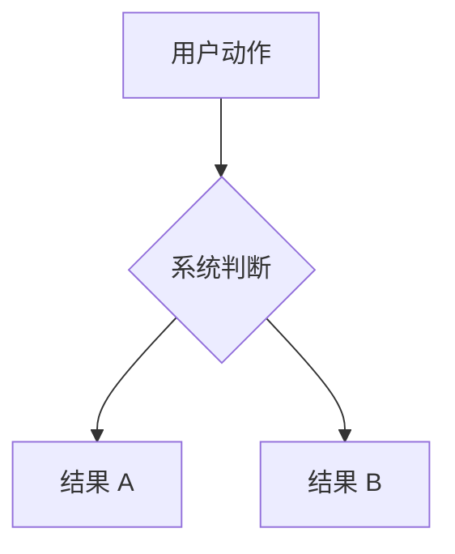

# 文档贡献说明

这页写给准备改 AsterDrive 文档的人。我们希望每一页都能帮读者完成一个明确任务，所以新增内容前先确认它应该放在哪条阅读路径里。

## 先判断放在哪里

AsterDrive 文档按读者任务分层：

| 你要写什么 | 放哪里 | 例子 |
| --- | --- | --- |
| 第一次使用、日常操作、管理员流程 | `guide/` | 用户手册、常用流程、远程节点、文件编辑 |
| 启动配置、后台系统设置、存储策略说明 | `config/` | 服务器、数据库、系统设置、存储策略 |
| 具体存储后端接入教程 | `storage/` | 本地磁盘、S3 / MinIO / R2、Azure Blob Storage、腾讯云 COS、OneDrive、远程节点存储策略 |
| 部署、上线、升级、备份、排障 | `deployment/` | Docker、systemd、反向代理、故障排查 |
| 概念解释、索引、问题分流 | `guide/` 的参考页 | 术语表、常见问题速查、错误码 |

拿不准时，先问一句：**读者打开这页是为了完成什么任务？**

- 是“我想用这个功能” → `guide/`
- 是“我要改哪个配置” → `config/`
- 是“我要接一个具体存储后端” → `storage/`
- 是“我要让服务稳定跑起来” → `deployment/`
- 是“我看不懂词 / 不知道查哪里” → 术语表或 FAQ

## 新增存储后端教程

存储后端教程放在 `storage/`，一页只讲一种后端，按“准备后端服务 -> 创建存储策略 -> 配置策略组 -> 绑定测试用户或团队 -> 验收”的流程写。

新增或改名存储后端页面时，至少同步检查这些入口：

- `docs/storage/index.md`
- `docs/config/storage.md`
- `docs/features/upload-storage.md`
- `docs/.vitepress/config.ts` 里的侧边栏

如果只改某个后端的细节，不要复制另一篇教程的大段内容；把共通模型链接到 [存储策略](/config/storage) 或 [存储策略后端](/storage/)。

## 谨慎调整顶栏

顶栏只做大方向跳转：

- 开始
- 使用
- 管理
- 运维
- 版本

新增文档优先加到固定侧边栏的阅读流程里。只有出现新的一级读者任务时，才考虑调整顶栏。

## 侧边栏是一条阅读流程

侧边栏全站固定，不按目录切换。它的目标是让读者始终知道整本文档的结构。

默认顺序：

1. 开始
2. 日常使用
3. 管理配置
4. 部署运维
5. 参考与项目

新增页面时，按读者第一次需要它的位置插入，不要按文件名排序。

## 术语要和 UI 一致

文档里优先使用产品界面上的中文叫法。必要时第一次出现可以补英文或内部名。

推荐写法：

- `远程节点`，必要时解释它是 follower
- `主控节点`，必要时补 `primary`
- `从节点`，必要时补 `follower`
- `接收落点`
- `存储策略`
- `策略组`
- `系统设置`
- `公开站点地址`
- `预览应用`
- `审计日志`

尽量不要在同一页里混用多套名字，比如一会儿叫“从节点”，一会儿叫“follower 实例”，一会儿又叫“远程存储实例”。第一次解释清楚后，后文保持同一个叫法。

## 页面开头先帮读者定位

长页开头最好有三样东西：

- 这页覆盖什么
- 什么时候该看这页
- 去哪里操作，或者先看哪张速查表

推荐结构：

```md
# 页面标题

::: tip 这一篇覆盖什么
一句话说明边界。避免在本页重复相邻页面的大段内容。
:::

## 入口速查

| 你想做什么 | 去哪里 |
| --- | --- |
| ... | ... |
```

## 链接规则

站内链接优先用绝对路径：

```md
[系统设置](/config/runtime)
[远程节点](/guide/remote-nodes)
[故障排查](/deployment/troubleshooting)
```

同目录短链接也能用，但跨目录建议避免 `../guide/...` 这类相对路径。绝对路径更容易阅读，后续移动文件时也更稳。

## 写法规则

- 先给结论，再给细节
- 用表格做速查，用列表做步骤
- 配置项、路径、命令用反引号
- 危险操作用 `warning`
- 可选背景知识用 `details`
- 不写还没合并的功能承诺
- 不为了“完整”复制另一页的大段内容，应该链接过去

## 流程图规则

流程、拓扑、数据路径这类图优先用 Mermaid：



简单的后台入口、路径、配置值、命令输出仍然用 `text` 代码块，不要为了单行内容硬画图。

Mermaid 图默认支持点击放大。普通文档视图里要保持紧凑，节点文字尽量短；长说明放在图下正文里，不要塞进节点。

## 改完必须验证

改完文档至少跑：

```bash
bun run docs:build
```

如果改了导航、logo、侧边栏或首页，最好再跑：

```bash
bun run docs:dev
```

然后自己点一遍：

- 首页入口
- 顶栏下拉
- 固定侧边栏折叠
- 新增页面
- 编辑本页链接
- 深色 / 浅色 logo

文档能构建只是底线，还需要实际预览一遍，确认读者能顺着入口和侧边栏找到内容。
