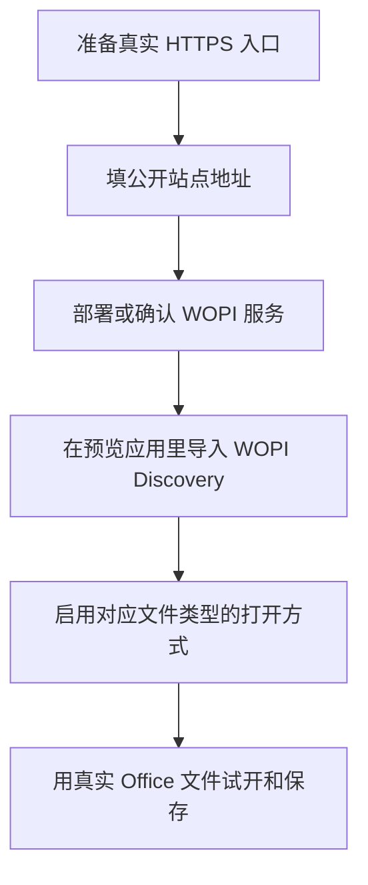

# 在线预览与 WOPI

::: tip 这一篇覆盖什么
这一篇讲怎么给文件增加额外打开方式，尤其是把 Office 文件交给 OnlyOffice、Collabora 或其他 WOPI 兼容服务打开。普通文本编辑看 [文件编辑](/guide/editing)。
:::

## 先分清三类打开方式

| 类型 | 适合什么 | 关键要求 |
| --- | --- | --- |
| 内置预览器 | 图片、PDF、文本、视频、压缩包清单等内置能力覆盖的类型 | AsterDrive 自己提供；部分能力还受系统设置开关限制 |
| URL 模板预览器 | 把文件预览链接交给外部网页 | 外部网页能访问 AsterDrive 生成的预览链接 |
| WOPI 打开方式 | Office 文件在线预览或编辑 | WOPI 服务能回连 AsterDrive 的 WOPI API |

WOPI 最常见的用途是让 `docx`、`xlsx`、`pptx` 这类文件在 OnlyOffice 或 Collabora 里打开。AsterDrive 负责文件访问、会话、令牌和锁；真正的 Office 编辑界面由外部 WOPI 服务提供。

## 推荐接入顺序



## 入口在哪里

管理员入口：

```text
管理 -> 系统设置 -> 站点配置 -> 预览应用
```

相关配置：

```text
管理 -> 系统设置 -> 站点配置 -> 公开站点地址
管理 -> 系统设置 -> 网络访问
```

反向代理相关说明见 [反向代理](/deployment/reverse-proxy#wopi--office-回调的额外要求)。

## `公开站点地址` 为什么最重要

WOPI 服务打开文件时，不是浏览器自己直接读本地文件。它会拿 AsterDrive 给出的 WOPI URL 回连 AsterDrive，读取文件信息和文件内容。

所以 `公开站点地址` 必须满足：

- 是真实 HTTP(S) 来源
- 推荐正式环境使用 HTTPS
- WOPI 服务所在环境能访问
- 多域名部署时，每个真实入口都逐项添加

例如：

```text
https://drive.example.com
https://office-drive.example.com
```

每一项只填来源层，不要带路径：

```text
https://drive.example.com
```

不要写成：

```text
https://drive.example.com/api
```

## Docker 网络里的常见写法

如果 AsterDrive 和 OnlyOffice / Collabora 都在 Docker 里，有两条常见路线：

| 路线 | 公开站点地址 | 适合场景 |
| --- | --- | --- |
| 都走公网域名 | `https://drive.example.com` | 反向代理和证书已经准备好 |
| 内网域名回连 | `https://drive.internal.example.com` | WOPI 服务在内网，能解析内网域名 |

不要直接把 `公开站点地址` 填成 `http://localhost:3000`。  
对 WOPI 服务来说，`localhost` 通常指它自己的容器或主机，不是 AsterDrive。

## 通过 WOPI Discovery 导入

如果你的 WOPI 服务提供 discovery 地址，推荐用导入方式创建打开方式。

常见形态类似：

```text
https://office.example.com/hosting/discovery
```

导入后，AsterDrive 会根据 discovery 返回的应用信息生成对应打开方式。你仍然需要确认：

- 对应文件扩展名已经启用
- 打开方式排序符合预期
- 打开方式是预览还是编辑
- 弹窗或新标签页打开方式符合你的站点使用习惯

如果 WOPI 服务更新了 discovery 内容，可能需要重新导入或等待 discovery 缓存过期。缓存时长在系统设置的 WOPI 相关配置里。

## URL 模板预览器什么时候用

URL 模板预览器适合“把一个可访问的文件预览链接交给外部网页”。

它和 WOPI 的区别是：

- URL 模板通常不负责保存回写
- 外部服务多数只拿到一个文件 URL
- 对方必须能访问这个 URL
- 内网地址、`localhost`、纯 HTTP 链接经常会失败

内置的 Microsoft / Google 预览器通常属于这类思路。它们更适合公开可访问的文件预览场景，不适合作为私有部署里的通用编辑方案。

## 压缩包只读预览

AsterDrive 内置了压缩包预览，但它默认不打开。管理员需要同时确认：

```text
管理 -> 系统设置 -> 文件处理 -> 压缩包预览
管理 -> 系统设置 -> 站点配置 -> 预览应用
```

它做的是**只读清单预览**：

- 目前支持 ZIP
- 读取归档元数据，展示文件夹、文件、大小和修改时间
- 不把压缩包解开到用户文件夹
- 不提供压缩包内单个文件的下载
- 不替代“在线解压”

第一次打开某个压缩包时，如果清单还没有缓存，后端会创建 `archive_preview_generate` 后台任务。前端会显示生成中，稍后自动重试；任务完成后，后续打开会直接使用缓存。

ZIP 里的文件名如果显示为乱码，可以在预览工具栏里切换 `文件名编码`。这个选项只影响 ZIP entry name 的解码方式。常用选项包括：

- `自动`
- `UTF-8`
- `GB18030`
- `CP437`
- `CP850`
- `Shift_JIS`
- `Big5`
- `EUC-KR`
- `Windows-1252`

切换编码会重新生成或读取对应编码的清单缓存。这个设置只影响 ZIP 清单里的文件名显示，不会改动压缩包本身，也不会影响在线解压结果。
如果界面提示当前编码无法解析这个 ZIP，换成压缩包来源系统常用的编码后再试，例如中文 Windows 环境常见 `GB18030`，老式英文 ZIP 常见 `CP437`。

管理员可以单独控制：

- 是否启用压缩包预览总开关
- 是否允许登录用户在个人空间和团队空间里预览
- 是否允许公开分享页预览
- 源压缩包大小、条目数量、manifest 大小和扫描耗时上限

::: warning 分享侧开关要谨慎
分享页压缩包预览会把压缩包内部的路径、文件名、大小和修改时间展示给访问者。即使访问者还没下载整个压缩包，也能看到这些元数据。只在你接受这个行为时开启分享侧预览。
:::

如果一个压缩包打不开，优先看：

- 压缩包预览总开关是否开启
- 当前入口是用户侧还是分享侧，对应开关是否开启
- 文件是不是当前支持的 ZIP，而不是 `rar`、`7z` 或其他格式
- 源压缩包是否超过大小上限
- `管理 -> 任务` 里 `压缩包预览生成` 是否失败

## 音频和视频预览

登录后的音频、视频预览会按当前存储策略读取文件，并支持浏览器 Range 请求。公开分享页里的音频和视频会先创建一个短时效流播放 session，再把播放器指向这个临时地址。

这个 session 默认 `3` 小时有效，管理员可以在这里调整：

```text
管理 -> 系统设置 -> 运行时 -> 分享流播放会话有效期
```

它不是分享链接本身的过期时间。分享链接的密码、过期时间和最大下载次数仍然照常校验；流播放 session 只是给浏览器播放器使用的临时 Range 地址。

## 保存、历史版本和锁

WOPI 保存回 AsterDrive 时，会按覆盖写入处理：

- 保存成功后生成历史版本
- 文件编辑期间会出现锁
- 其他客户端不能随意覆盖、移动或删除被锁文件
- 锁异常残留时，管理员可以到 `管理 -> 锁` 清理

WOPI 是否支持多人协作，取决于你接入的外部服务。AsterDrive 负责按 WOPI 协议提供文件、令牌、会话和锁，不替外部 Office 服务实现协作编辑界面。

## CORS 什么时候需要改

大多数 WOPI 回连问题不是 CORS，而是 WOPI 服务访问不到 `公开站点地址`。

只有在浏览器控制台明确出现 AsterDrive API 跨域错误时，才去这里调整：

```text
管理 -> 系统设置 -> 网络访问 -> 允许跨域来源
```

如果只是 OnlyOffice / Collabora 后端请求 AsterDrive 失败，优先检查网络、域名、证书和反向代理。

## 上线前验收

用真实 Office 文件测试：

1. `docx` 能打开
2. `xlsx` 能打开
3. `pptx` 能打开
4. 保存后 AsterDrive 里文件内容更新
5. 历史版本里能看到新版本
6. 关闭编辑器后锁会释放
7. 分享页或团队空间里的同类文件行为符合预期

如果你只打算提供预览，不提供编辑，也要确认用户界面里的按钮文案和行为符合预期，避免用户以为能保存。

## 常见问题

### 打开方式没有出现

优先检查：

- 预览应用是否启用
- 文件扩展名是否被这条应用覆盖
- 当前用户是否有权限读取该文件
- 预览应用排序里是否被其他打开方式覆盖

### 打开后白屏

最常见原因是 WOPI 服务回连不到 AsterDrive。检查：

- `公开站点地址` 是否真实可达
- WOPI 服务容器或主机能否解析这个域名
- TLS 证书是否被 WOPI 服务信任
- 反向代理是否透传 `/api/v1/wopi/`

### 能打开但保存失败

优先检查：

- 文件是否仍然存在
- 用户是否仍有写权限
- WOPI access token 是否过期
- WOPI 服务和 AsterDrive 的系统时间是否正确
- `管理 -> 锁` 里是否有异常锁

### 内置 Microsoft / Google 预览器打不开

它们通常需要外部服务能访问文件预览链接。私有内网、`localhost`、未受信任证书或纯 HTTP 部署都可能失败。私有部署需要在线编辑时，更推荐接自己的 WOPI 服务。
