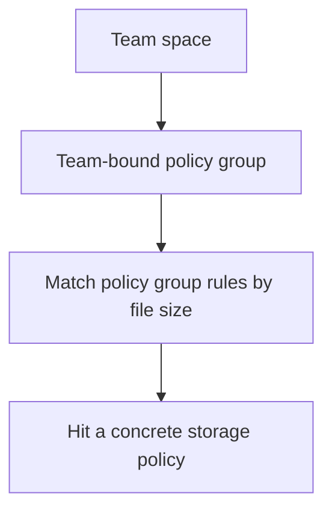

:::tip[What this page covers]
This page explains the boundaries between personal spaces, team spaces, team roles, and the admin console. Read it when preparing multi-user use, creating teams, assigning members, or diagnosing team permissions.
:::

## Entry Quick Reference

| What you want to do | Where to go |
| --- | --- |
| Create, archive, or restore teams | `Admin -> Teams` |
| Manage team members | Administrators use `Admin -> Teams`; team administrators use `Settings -> Teams` |
| Assign storage routes to teams | Bind a policy group in `Admin -> Teams` |
| View team files | Switch the left-side workspace to the target team |
| View team audit | `Admin -> Teams -> Team Details -> Audit`, or the team management page |
| Restore mistakenly deleted team content | Switch to the team space, then open `Trash` |

## Personal Space vs Team Space

The most important boundary in AsterDrive is the **workspace**.

| Item | Personal space | Team space |
| --- | --- | --- |
| File owner | Current user | Current team |
| Shares | Only shares created in the personal space | Only shares created in the team space |
| Trash | Personal space's own trash | Each team's own trash |
| Task center | Personal space tasks | Team space tasks |
| Search | Searches the current personal space | Searches the current team space |
| WebDAV | Dedicated personal-space accounts that open only personal files | Dedicated team-space accounts that open only the current team's files |
| Storage route | Policy group bound to the user | Policy group bound to the team |

After you switch workspaces on the left, files, shares, tasks, trash, and search results all switch with it.  
This is also the first step when diagnosing "why can't I see this file / share / task": confirm which workspace you are currently in.

## Understanding Team Roles

Inside a team, there are usually three roles:

| Role | Best for | What it can do |
| --- | --- | --- |
| Owner | Team lead | Manage the team, members, and files inside the team |
| Administrator | Daily team maintainer | Manage members and daily team content |
| Member | Regular collaborator | Use files, shares, and tasks in the team space |

A system administrator is not automatically a daily collaborator in every team. System administrators mainly perform global maintenance: create teams, archive teams, restore teams, change quotas, change policy groups, and inspect audits. Daily member management inside a team should preferably be handled by team owners or team administrators.

:::tip[Check two layers first when diagnosing permissions]
To decide whether a user can operate team content, first check whether the user is a team member, then check the role inside the team. Do not only check whether the user is a system administrator.
:::

## Boundaries Between Admin Console and Team Settings

### `Admin -> Teams`

This is the system administrator view, suitable for global maintenance:

- Create teams
- Choose the initial team administrator
- View team list, member counts, storage usage, and archive status
- Change team name, description, quota, and policy group
- Archive, restore, or delete teams
- View team audit logs
- Intervene in member management when necessary

### `Settings -> Teams`

This is the regular user's team view. Users see the teams they have joined here.  
If a user is an owner or administrator in a team, they can continue into that team's management page to handle members and team information.

## How to Create a Team

Recommended order:

1. Confirm in `Admin -> Policy Groups` whether a suitable policy group already exists for the team
2. Create the team in `Admin -> Teams`
3. Fill in team name and description
4. Choose the initial team administrator
5. Set the team quota
6. Bind a policy group
7. After creation, open team details and add members

If you are not sure which storage route the team should use, start with the default policy group. When you switch the policy group later, new uploads follow the new rules; old files already written continue to read from their original storage policies.

## Teams and Policy Groups

A team does not bind directly to one storage policy. It binds to a **policy group**.

This means team uploads follow this chain:



Common patterns:

- Small teams use the default policy group directly
- Teams with many large files use a separate object storage policy group
- Teams in another location use a separate follower-node policy group
- Temporary project teams use smaller quotas and an independent policy group

Before changing a team's policy group, confirm the target policy group is enabled and has at least one usable rule.

## Archive and Restore Teams

Team archiving fits these scenarios:

- A project ended, but you do not want to delete content yet
- Team usage is paused
- You need to remove the team from daily lists

After archiving, the team is no longer used as a normal daily workspace.  
If it needs to be restored later, a system administrator can restore it from `Admin -> Teams`.

Team archive retention is configured at:

```text
Admin -> System Settings -> Storage and Retention -> Team archive retention
```

:::caution[Archiving is not backup]
Archiving is only an in-product state. It does not replace database and file-object backups. Long-term retention or compliance retention still needs [Backup and Restore](/en/deployment/backup/).
:::

## Shares, Tasks, and Trash in Teams

These team-space contents are separated from personal-space contents:

- Share links
- Trash items
- Online compression / online extraction / package download tasks
- WebDAV accounts
- Audit records
- Search results

If a user says "I can't find the share I just created", first confirm they switched to the same team space where the share was created.  
If a user says "the task center has no task", also confirm the current workspace first.

## Audit and Diagnosis

For team-related problems, start with:

- `Admin -> Teams -> Team Details`
- The member list in team details
- Team audit logs
- `Admin -> Audit Logs`
- `Admin -> Tasks`

Common diagnosis order:

1. Whether the user is a team member
2. Whether the user's team role is sufficient
3. Whether the current workspace is the target team
4. Whether the team has been archived
5. Whether the team's bound policy group is usable
6. Whether the related share, task, or trash item belongs to the same team space

## Boundaries

- A team space is not another independent site; it is still served by the same AsterDrive instance
- Team spaces have their own WebDAV accounts. The WebDAV address is global; credentials decide whether the client enters personal space or a team space
- Understand team quota separately from each user's personal quota
- A team's policy group affects future upload routes and does not automatically migrate old files
- System administrators can perform global maintenance, but daily team collaboration is best left to team owners and team administrators
