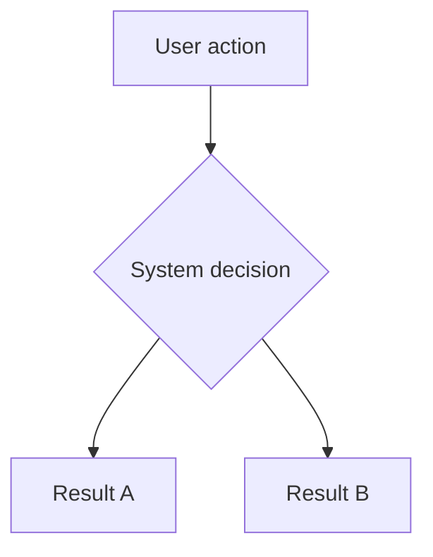

This page is for people preparing to change AsterDrive documentation. We want every page to help readers complete one clear task, so before adding content, first confirm which reading path it belongs to.

## Decide Where It Belongs First

AsterDrive documentation is layered by reader task:

| What you are writing | Where it goes | Examples |
| --- | --- | --- |
| First use, daily operations, administrator workflows | `guide/` | User manual, common workflows, follower nodes, file editing |
| Startup configuration, backend system settings, storage policy descriptions | `config/` | Server, database, system settings, storage policies |
| Specific storage backend tutorials | `storage/` | Local disk, S3 / MinIO / R2, Azure Blob Storage, Tencent COS, OneDrive, follower node storage policy |
| Deployment, launch, upgrade, backup, troubleshooting | `deployment/` | Docker, systemd, reverse proxy, troubleshooting |
| Concept explanations, indexes, problem routing, project background | `reference/` | Architecture overview, glossary, FAQ triage, error codes, about |

When unsure, ask first: **what task did the reader open this page to complete?**

- "I want to use this feature" -> `guide/`
- "I need to change which configuration" -> `config/`
- "I need to connect a specific storage backend" -> `storage/`
- "I need to keep the service running steadily" -> `deployment/`
- "I do not understand a term / do not know where to look / want to learn about the project" -> `reference/`

## Adding Storage Backend Tutorials

Storage backend tutorials belong under `storage/`. Keep each page focused on one backend and follow the flow "prepare the backend service -> create a storage policy -> configure policy groups -> bind a test user or team -> validate".

When adding or renaming a storage backend page, at least check these entry points:

- `docs/src/content/docs/en/storage/index.md`
- `docs/src/content/docs/en/config/storage.md`
- `docs/src/content/docs/en/features/upload-storage.md`
- the sidebar in `docs/astro.config.mts`

If you only change details for one backend, do not copy large sections from another tutorial. Link common concepts to [Storage Policies](/en/config/storage/) or [Storage Policy Backends](/en/storage/).

## The Sidebar Is a Reading Flow

The docs site is built with Astro Starlight. There are no top-nav dropdown menus; site-wide navigation is the fixed sidebar, which does not switch by directory. Its goal is to keep readers aware of the whole documentation structure.

Prefer adding new pages into the fixed sidebar reading flow. Insert each page where readers first need it, and do not sort by filename.

Default order:

1. Start
2. Daily Use
3. Management and Configuration
4. Deployment and Operations
5. Reference and Project

When adding a page, insert it where readers first need it. Do not sort by filename.

## Terminology Should Match the UI

Prefer using the product UI wording in documentation. When needed, add an English or internal name on first mention.

Recommended wording:

- `Follower Nodes`, and explain that they are followers when needed
- `Primary node`, and add `primary` when needed
- `Follower node`, and add `follower` when needed
- `Remote storage target`
- `Storage policy`
- `Policy group`
- `System settings`
- `Public site URL`
- `Preview app`
- `Audit log`

Avoid mixing multiple names on the same page, such as calling something "follower node", then "follower instance", then "remote storage instance". Explain it clearly once, then keep the same name.

## Help Readers Orient at the Start

Long pages should ideally start with three things:

- What the page covers
- When to read it
- Where to operate, or which quick-reference table to read first

Recommended structure (the page title lives in frontmatter; the body starts from level-2 headings):

```md
---
title: Page Title
---

:::tip[What this page covers]
One sentence defining the boundary. Avoid repeating large parts of adjacent pages here.
:::

## Entry Quick Reference

| What you want to do | Where to go |
| --- | --- |
| ... | ... |
```

## Link Rules

Prefer absolute paths for site links:

```md
[System Settings](/en/config/runtime/)
[Follower Nodes](/en/guide/remote-nodes/)
[Troubleshooting](/en/deployment/troubleshooting/)
```

Same-directory short links are also fine, but avoid relative paths such as `../guide/...` across directories. Absolute paths are easier to read and more stable when files move later.

## Writing Rules

- Give the conclusion first, then details
- Use tables for quick reference and lists for steps
- Use backticks for configuration items, paths, and commands
- Use `:::caution[title]` for dangerous operations
- Use `<details><summary>title</summary>` for optional background knowledge
- Do not write promises for features that have not been merged
- Do not copy large sections from another page just to be "complete"; link to that page instead

## Flow Diagram Rules

For flows, topologies, and data paths, prefer Mermaid:



For simple admin entry points, paths, configuration values, and command output, keep using `text` code blocks. Do not turn a single-line hint into a diagram.

Mermaid diagrams support click-to-zoom by default. Keep the normal document view compact: use short node labels, and put long explanations in the surrounding prose instead of inside nodes.

## How Versioning Works

The documentation is versioned by branch, not by build snapshots:

- Each released minor version's docs live on a `release/x.y` branch. The root path `/` serves the newest release branch, `/vX.Y/` serves older versions, and `/next/` serves the master development version
- On every release, CI automatically cuts the matching `release/x.y` branch from the tag. Any docs change pushed to `master` or `release/**` triggers a full rebuild of every version, so navigation and the version switcher stay current everywhere
- To fix docs for an old version, commit (or cherry-pick) directly to its `release/x.y` branch; CI rebuilds that version. Ancient versions without a branch (such as 0.1 and 0.2) are built automatically from the last tag of that minor line
- The version list is resolved entirely from git (`docs/scripts/resolve-versions.sh`): tags define which versions exist, and a `release/x.y` branch takes precedence over the tag when present. No static version table is maintained anywhere
- To preview the full versioned site locally:

```bash
bun run docs:preview:all
```

It builds every version with the same logic as CI (`/next/` uses your current working tree, including uncommitted changes) and starts a local preview.

## Chinese-English Sync Policy

The Chinese version is the source of truth. The English version is allowed to lag behind.

- A PR that only changes the Chinese version is acceptable, but note "English version not synced" in the PR description so maintainers can catch up later
- When you change technical facts (ports, paths, configuration keys, error codes, version numbers), both languages must be updated together. Never leave a stale value on one side
- If you are unsure about the English wording, change only the Chinese side rather than writing inconsistent facts on both sides

## Error Code Changes Must Pass the Check

When changing `src/api/api_error_code.rs` or `errors.md`, run locally first:

```bash
bun docs/scripts/check-error-codes.mjs
```

It compares the full set of error codes in the source against the error code documentation: referencing a non-existent code fails the check, and codes added in source but not mentioned in the docs are listed as warnings. CI runs the same check for changes to these paths.

## Verify After Changes

After changing documentation, run at least:

```bash
bun run docs:build
```

If you changed navigation, logo, sidebar, or the homepage, it is better to also run:

```bash
bun run docs:dev
```

Then click through:

- Homepage entry points
- Fixed sidebar collapse
- New pages
- Edit-this-page links
- Dark / light logos

Successful build is only the baseline. You still need to preview it yourself and confirm readers can follow the entry points and sidebar to find the content.
