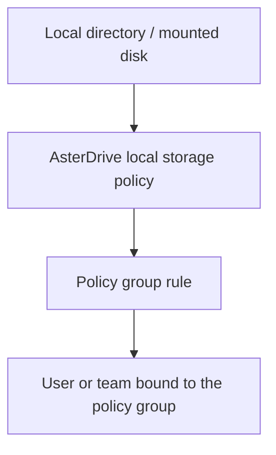

:::tip[What this page covers]
This page walks through the complete flow for writing AsterDrive files to a local directory: plan the directory, create a `local` storage policy, configure content deduplication, create a test policy group, bind users or teams, and understand capacity checks and migration boundaries.
:::

## When to Use It

Local disk storage is suitable when:

- You run a single-node deployment
- A NAS or mounted disk is already available on the application server
- You do not have many files and want fewer external dependencies
- You want the most direct upload and download path
- You want the simplest backend to get the instance running first

If you want object storage to carry capacity and bandwidth, see [S3 / MinIO / R2](/en/storage/s3-minio-r2/), [Azure Blob Storage](/en/storage/azure-blob/), or [Tencent COS](/en/storage/tencent-cos/). If you want the control plane and real object placement split across nodes, see [Follower Node Storage Policy](/en/storage/remote-follower/).

## First, Separate the Layers



Creating only a local storage policy is not enough. When users or teams upload files, they first match a policy group, and then a policy group rule assigns the upload to a storage policy.

## 1. Prepare the Local Directory

For long-running deployments, use an absolute path, for example:

```text
/srv/asterdrive/data
```

If you use Docker, confirm that this directory is mounted into the container as a volume. The host path and container path are not the same thing; the storage policy must use the path seen by the AsterDrive process.

:::caution[Do not use temporary directories or ambiguous relative paths for production files]
Relative paths depend on the service process working directory; temporary directories may be cleaned by the system. Use a stable absolute path or an explicitly mounted volume in production.
:::

## 2. Confirm Permissions and Capacity

The system user running AsterDrive needs:

- Permission to create directories
- Permission to write files
- Permission to read files
- Permission to delete files

Also confirm that the filesystem containing the directory has enough capacity. Local policies support capacity observation; the admin console reads total, available, and used bytes from the filesystem containing the policy base directory.

## 3. Create a Local Storage Policy in AsterDrive

Open:

```text
Admin -> Storage Policies -> New Policy
```

Choose the driver type:

```text
Local
```

Common fields:

| Field | Example |
| --- | --- |
| Base path | `/srv/asterdrive/data` |
| Single-file size limit | `0` means unlimited |
| Chunk size | Default: `5,242,880` bytes (5 MB). Increase it, for example to 16-64 MB, for large-file-heavy workloads to reduce chunk metadata and improve throughput; decrease it only for small-file-heavy or memory-constrained environments. |
| Content deduplication | Disabled by default |

Before or after saving, use the admin-console connection test to confirm that the directory is readable and writable.

## 4. Choosing Content Deduplication

Content deduplication is disabled by default for local policies.

After enabling it:

- AsterDrive reads the temporary upload file again after upload completes
- It calculates a SHA-256 content fingerprint
- Identical content reuses the same underlying blob
- Repeated files can use less disk space

Keep it disabled:

- The upload path is more direct
- There is no extra full-file read
- Identical content creates separate blobs

Home and single-node deployments usually do not need deduplication. Small teams that repeatedly upload the same assets can enable it.

## 5. Create a Test Policy Group

Do not directly modify the default policy group at the beginning. Create a test policy group first.

Open:

```text
Admin -> Policy Groups
```

Create a policy group, for example:

```text
Local Test Group
```

Add one rule:

| Field | Recommended value |
| --- | --- |
| Storage policy | The local policy you just created |
| Priority | Keep the default or make it the first matched rule |
| File size range | Cover all sizes first for easier testing |

## 6. Bind a Test User or Team

### Bind a User

Open:

```text
Admin -> Users -> User Details
```

Change the test user's policy group to `Local Test Group`.

### Bind a Team

Open:

```text
Admin -> Teams -> Team Details
```

Change the test team's policy group to `Local Test Group`.

Team-space uploads use the team policy group, not the personal user's policy group.

## 7. Run Real Validation

Use a test account to run through:

- Upload a small file
- Upload a large file
- Download a file
- Preview an image
- Delete a file
- Restore from trash
- Share a file and download it

During validation, also check:

- Whether admin-console capacity observation is normal
- Whether object files appear under the local directory
- Whether AsterDrive logs show permission errors
- If content deduplication is enabled, whether repeated uploads of the same file reuse blob references

## 8. Move Production Traffic

After the test policy group is verified, move real users or teams to the target policy group.

If you need to migrate existing files, do not directly change the old policy directory. The correct flow is:

1. Create a new local policy
2. Test connection and real uploads/downloads
3. Create a migration task through `Admin -> Storage Policies -> Migrate Data`
4. Adjust policy group rules after migration completes

:::caution[Do not directly change real destinations for policies that already have files]
The local directory determines where old files are located. If you change it directly, old files may no longer be found.
:::

## Daily Maintenance

- Regularly confirm remaining disk capacity
- Use absolute paths or stable mounted volumes in production
- Do not manually move, rename, or delete object files under the policy directory
- Back up the database, configuration files, and local object directory together
- Before production migrations, read [Backup and Restore](/en/deployment/backup/)
