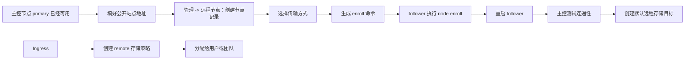

:::tip[这一篇讲什么]
这一篇只讲怎么把另一台 AsterDrive 接成**从节点**，以及主控节点怎么登记远程节点、生成 enroll 命令、验证连通性。

如果你连主控实例都还没跑起来，先看 [部署概览](/deployment/)。
:::

:::tip[如果 follower 用 Docker]
现在 Docker follower 已经支持在容器启动时直接读取 bootstrap ENV 自动 enroll。
如果你不想再手动进容器执行 `aster_drive node enroll`，直接看 [Docker 部署从节点](/deployment/docker-follower/)。
:::

## 先把概念说清楚

AsterDrive 的远程节点能力，本质上是让**另一台 AsterDrive** 充当存储后端。

- **主控节点**：负责登录、前端、管理后台、分享、WebDAV、存储策略和远程节点管理
- **从节点**：只提供 `/health`、`/health/ready` 和内部远程存储协议；接收主控节点签名后的对象请求，再按主控节点下发的**远程存储目标**把对象落到 follower 本地目录或 S3

当前内部远程存储协议版本是 `v5`，当前主控支持与 `v4` 到 `v5` 的 follower 通信。主控测试连接和绑定远程策略时，会比较双方声明的协议版本范围，并读取 follower 暴露的服务端版本、对象读写能力、Range 能力、compose 能力、metadata 能力，以及浏览器直传所需的 CORS 契约。只要版本范围有交集即可继续；`v2` / `v3` follower 需要先升级。

默认情况下，AsterDrive 跑在 `primary` 模式。
只有把 `[server].start_mode` 切成 `follower`，它才会变成从节点。

:::caution[这不是多主集群]
从节点不是第二个登录站点，也不是第二套管理后台。

它的目标只有一个：**给主控节点提供远程对象存储落点**。
如果你要的是多主热备、自动故障切换、跨地域强一致复制，当前能力暂不覆盖这些场景。
:::

## 接入流程图



:::tip[最容易漏的一步]
enroll 成功不等于可以上传。真正承接远程存储前，还要在主控节点给这个从节点创建默认远程存储目标。
:::

## 接入前先确认这几件事

### 主控和从节点必须彼此独立

它们可以互相通信，但**不能共用同一套 `data/`、数据库、上传目录或临时目录**。

至少需要独立配置以下内容：

- `data/config.toml`
- 数据库文件，或者外部数据库连接
- 本地上传目录
- 临时目录

### `public_site_url` 是 enroll 的前置条件

主控节点生成 enroll 命令时，会直接读取：

```text
管理 -> 系统设置 -> 站点配置 -> 公开站点地址
```

如果这里没填真实可访问的 HTTP(S) 来源，后台就签不出命令。多来源配置时，enroll 命令使用第一行作为主控地址，所以把 follower 能访问到的主控地址放在第一行。

### 先选传输方式，再决定 `base_url`

创建远程节点记录时，可以选择三种传输方式：

| 传输方式 | `base_url` 怎么填 | 适合场景 |
| --- | --- | --- |
| 直连 | 必须填写主控能访问到的 follower HTTP(S) 地址 | 同机房、同内网、VPN、已有反向代理 |
| 反向通道 | 可以留空 | follower 只能主动访问主控，主控不能回连 follower |
| 自动 | 填了 `base_url` 就走直连；留空就走反向通道 | 想先按地址有无决定路线 |

`auto` 不会在直连失败后自动改走反向通道。它只看 `base_url` 是否为空。

如果远程策略要使用 `presigned` 上传或下载，请使用直连，并确保浏览器也能访问 follower 的 `base_url`。反向通道适合 `relay_stream`，当前不支持生成给浏览器直连 follower 的 presigned URL。

如果你的 follower 要放在公网、Tailscale / VPN、Docker 网络或反向通道后面，先看 [从节点网络部署方式](/deployment/follower-network-topologies/)。那一页专门讲 `base_url` 对主控和浏览器分别意味着什么。

:::caution[反向通道仍处于测试阶段]
反向通道会让 follower 主动连接主控节点，不要求主控回连 follower，但它仍然依赖 follower 能访问主控的 `public_site_url`，并且中间代理、防火墙不要拦截 WebSocket 或长连接。

如果你的网络已经能让主控稳定访问 follower，生产环境优先用直连，排障更简单。
:::

### 第一次接从节点，先用一个本地远程存储目标

当前版本里，从节点（follower）接收对象的位置由主控节点在 `管理 -> 远程节点` 里创建，界面名称是**远程存储目标**。它就是 follower 最终把对象写入本地目录或 S3 的位置。
第一次接从节点，建议先创建一个 `local` 远程存储目标，路径就用简单的相对目录，例如：

```text
default
```

这个路径会被 follower 限制在自己的 `server.follower.remote_storage_target_local_root` 下面，不会让主控节点随便写宿主机上的任意路径。
原因不是“S3 不能用”，而是**先把主从链路跑通，再切换复杂落点，有助于降低排查成本**。

## 1. 先把主控节点配好

主控节点就是普通的 `primary` 部署。

开始接从节点前，先确认：

- 主控节点后台能正常打开
- `公开站点地址` 已经填好
- 你打算给这个从节点使用的名称和传输方式已经想明白

名称不需要过度复杂。首次测试时，可以按环境、地域或租户命名，例如：

- `home-storage`
- `hangzhou-a`
- `tenant-a`

## 2. 准备从节点实例

从节点和主控节点一样，还是同一个 `aster_drive` 二进制，只是运行模式不同。

最少要确认下面几件事：

- 它有自己的工作目录和数据卷
- 它的 `[server].start_mode` 是 `follower`
- 如果要用主控下发的本地远程存储目标，`[server.follower].remote_storage_target_local_root` 指向容量合适的目录

最直接的写法是修改 `config.toml`：

```toml
[server]
start_mode = "follower"

[server.follower]
remote_storage_target_local_root = "remote-storage-targets"
```

如果你是 Docker 部署，也可以用环境变量覆盖：

```bash
ASTER__SERVER__START_MODE=follower
ASTER__SERVER__FOLLOWER__REMOTE_STORAGE_TARGET_LOCAL_ROOT=/data/remote-storage-targets
ASTER__DATABASE__URL=sqlite:///data/asterdrive.db?mode=rwc
```

这些 `ASTER__...` 环境变量走的是和 `config.toml` 同一套启动配置，只是优先级更高。

如果想让 Docker follower 首次启动时自动接入主控，还需要额外提供一组一次性 bootstrap ENV，完整写法见 [Docker 部署从节点](/deployment/docker-follower/)。

<details>
<summary>当前目录里还没有 `config.toml` 怎么办？</summary>

`aster_drive node enroll` 在当前目录还没有配置文件时，会按 follower 模式生成一份默认 `data/config.toml`，并同时初始化数据库状态。

但你至少要先决定：

- 这个目录是不是以后服务真正运行的工作目录
- 这个目录下面的 `data/` 会不会被持久化

避免在临时目录完成 enroll 后，systemd 或 Docker 实际使用另一套数据卷。
</details>

## 3. 在主控节点登记远程节点

入口：

```text
管理 -> 远程节点
```

创建记录时最关键的是这三项：

- **名称**：给人看的，方便你在后台和策略里识别
- **传输方式**：直连、反向通道或自动
- **`base_url`**：直连必填；反向通道可以留空；自动模式下留空即走反向通道，填写即走直连

保存后，后台会生成一条一次性命令，形态大概像这样：

```bash
aster_drive node enroll --master-url https://drive.example.com --token enr_xxxxx
```

这个 token 默认 **30 分钟** 过期。token 过期后请回到主控节点重新生成。

## 4. 到从节点执行 enroll

进入从节点自己的工作目录后，执行刚才那条命令。

如果你要显式指定数据库，可以这样追加参数：

```bash
aster_drive node enroll \
  --master-url https://drive.example.com \
  --token enr_xxxxx \
  --database-url sqlite:///data/asterdrive.db?mode=rwc
```

这条命令会做几件事：

- 用 token 去主控节点兑换一次性的 bootstrap 配置
- 在从节点本地写入主控绑定；对象隔离前缀由 follower 自动生成
- 把这次 enroll 回执写回主控节点，让主控节点知道这条接入已经完成

注意，这一步**不会自动创建远程存储目标**。
远程存储目标现在由主控节点在远程节点详情里下发，原因很简单：管理员后续要在同一个地方看到它、改它、测试它，也避免后续需要在 follower 机器上回溯当时的 CLI 参数。

如果当前配置还是 `primary` 模式，CLI 会直接报错，并要求你先把 `start_mode` 改成 `follower`。
这是预期保护行为，用于避免把普通主控实例误接成从节点。

## 5. 重启从节点服务，再回主控测试

当前版本里，enroll 把主控绑定写进数据库后，**运行中的从节点服务不会自动热刷新**。
所以流程一定是：

1. 执行 `node enroll`
2. 重启从节点服务
3. 回主控节点点击“测试连接”

测试连接会按远程节点当前的传输方式执行：直连节点会访问 `base_url`；反向通道节点会通过 follower 主动建立的通道访问。反向通道刚启动时可能需要等几十秒，先看到通道状态变成在线，再测试会少走很多弯路。

这里有个很容易误判的地方：

| 接口 | enroll 前 | enroll 后 |
| --- | --- | --- |
| `/health` | 返回 `200` 代表进程活着 | 仍然应该返回 `200` |
| `/health/ready` | 返回 `503` 是正常的，因为还没有启用中的主控绑定 | 重启并接入成功后应返回 `200` |

enroll 前 `/health/ready` 返回 `503` 不代表服务故障。
在 enroll 前，它本来就尚未进入 ready 状态。

测试连接通过后，主控会在远程节点详情里展示能力摘要。至少要看到协议版本范围与当前主控兼容，才适合继续创建 remote 存储策略。当前主控协议版本为 `v5`，最低兼容 `v4`；`v2` / `v3` follower 需要先升级。

## 6. 在主控节点创建远程存储目标

回到：

```text
管理 -> 远程节点
```

打开刚才这台 follower，找到**远程存储目标**。这里决定主控写到 follower 的对象最后落在哪里。

当前支持两类远程存储目标：

- `local`：写入 follower 本地目录
- `s3`：写入 follower 能访问的 S3 / MinIO / R2 这类对象存储

第一次建议创建 `local`：

- 名称填一个容易识别的名字，例如 `default-local`
- 基础路径填相对路径，例如 `default`
- 勾选“设为默认远程存储目标”

这里的本地路径**只能是相对路径**，并且始终会被限制在 follower 的：

```toml
[server.follower]
remote_storage_target_local_root = "remote-storage-targets"
```

也就是说，`base_path = "default"` 最终会落到 follower 的 `data/remote-storage-targets/default` 这一类目录下面。
如果你想让 follower 直接把对象写到 S3，也是在这里新建 `s3` 远程存储目标，填 endpoint、bucket、凭证和可选前缀。

:::caution[没有默认远程存储目标，远程写入会被拒绝]
enroll 成功只代表主从身份绑定成功。
真正接收对象前，follower 还需要一个已应用的默认远程存储目标。否则远程策略上传时会返回“还没有默认远程存储目标”。
:::

远程存储目标由主控节点通过 follower API 下发，所以这里还有几个前提：

- 直连节点必须填了主控可访问的 `base_url`
- 反向通道或 `auto + 空 base_url` 节点必须已经显示通道在线
- 当前 follower 只能绑定一个 primary；多 primary 绑定会拒绝这套由主控管理远程存储目标的模式

## 7. 回主控节点创建远程存储策略

从节点接入完成后，回到主控节点：

```text
管理 -> 存储策略
```

这里可以新建 `远程节点` 类型的存储策略。完整的策略组分流、测试用户绑定和上线验收步骤见 [远程节点存储策略教程](/storage/remote-follower/)。

它和本地 / S3 策略最大的区别是：

- 真正的网络传输、访问密钥和签名都由“远程节点”记录负责
- 策略本身只负责远端路径前缀、上传限制，以及是否设为默认
- 远程存储策略应绑定**已接入、已启用，并且当前传输方式可用**的远程节点
- follower 真正写到哪里，由上一步绑定到策略的远程存储目标决定；没有显式选择时使用默认目标

也就是说，**远程存储策略中不再配置 endpoint、access key、secret key**；那一层已经由远程节点记录托管。

建好策略之后，再把它放进策略组，或者设成默认路线，后续就和本地 / S3 一样了。

## 协议能力和 `presigned` 的额外要求

remote 策略不只是看当前传输方式能不能通。主控会按当前策略的上传/下载方式校验 follower 能力：

- 基础读写需要对象 `GET`、`HEAD`、`PUT`、`DELETE`
- 文件夹和对象维护需要 `list`、`compose`、`metadata`
- 预览、续传和流式读取需要 `range_get` 和 `accept_ranges_header`
- 使用远程 `presigned` 上传或下载时，还需要 `browser_presigned_cors`，并且远程节点不能走反向通道

如果选择远程 `presigned`，浏览器会直接访问 follower，所以必须使用直连传输，浏览器也必须能访问 follower 的 `base_url`。follower 的反向代理还要把内部存储 API 的 CORS 头透出来。

上传 `presigned` 至少要求：

- 允许请求头：`content-type`
- 暴露响应头：`ETag`

下载 `presigned` 至少要求：

- 允许请求头：`range`
- 暴露响应头：`Accept-Ranges`、`Content-Range`、`Content-Length`

当前 follower 默认声明的浏览器 CORS 契约会覆盖 `content-type, range`，并暴露 GET 所需的 `Accept-Ranges`、`Cache-Control`、`Content-Disposition`、`Content-Length`、`Content-Range`、`Content-Type`、`ETag`，以及 PUT 所需的 `ETag`。如果你在 follower 前面加了反向代理，不要把这些头吞掉。

## 常见判断题

### `base_url` 留空能不能 enroll？

能，但要看传输方式：

- `direct`：只能先保存记录和完成 enroll；没有 `base_url` 时不能测试连接，也不能承接远程存储流量
- `reverse_tunnel`：follower 重启后会主动连主控；通道在线后可以测试连接、下发远程存储目标，并承接 `relay_stream` 远程策略
- `auto`：`base_url` 为空时等同于反向通道；填了 `base_url` 时等同于直连

无论哪种方式，远程 `presigned` 上传/下载都需要直连和浏览器可访问的 follower `base_url`。

### 从节点能不能开给普通用户登录？

不能。当前设计中，从节点不作为普通用户登录入口。

`follower` 模式只暴露：

- `/health`
- `/health/ready`
- 内部远程存储 API

### 远程存储目标能不能再选一个 remote 策略？

不能。
从节点接收入站对象时，落点必须能在 follower 这一侧直接写入，例如 `local` 或 `s3`；不能再套一层 `remote`。

### enroll 成功后为什么还得重启？

因为当前版本只把绑定写进数据库，不会对正在运行的 follower 进程做热刷新。
**写入成功 ≠ 已经生效**，重启之后才真正开始接流量。

### 禁用远程节点会发生什么？

主控节点的远程策略会停止使用它；从节点也会拒绝对应的签名入站请求。
禁用会实际停止这条链路，而不只是隐藏后台记录。
