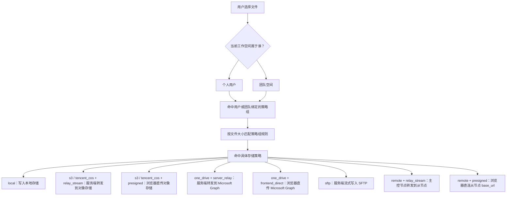

这一篇只讲上传时你会碰到什么。普通用户看前半段就够了，管理员再看后半段。

## 普通用户先记住这几件事

- 小文件通常会很快完成
- 大文件会自动拆成多段上传
- 上传中断后，能继续就继续
- 继续上传时，重新选同一个文件
- 可恢复上传也有时效：普通分片通常 24 小时，对象存储直传通常更短

日常使用时，你不用分辨“普通上传”“分片上传”还是“对象存储直传”。

## 上传路径怎么决定

:::tip[排查上传失败时从策略组开始]
很多上传问题看起来像“文件传不上去”，实际是当前用户或团队命中的策略组不对。先确认工作空间，再确认策略组，再看具体存储策略。
:::

## 管理员部署前要准备什么

如果你负责部署，先确认下面这些事：

- 当前用户或团队绑的是哪一个策略组
- 这个策略组会把文件分到哪条存储策略
- 策略的单文件大小上限和分片大小是否合适
- 服务本地临时目录有没有足够空间
- 反向代理的上传大小和超时是否足够
- 如果要直传对象存储，浏览器上传所需的 CORS 是否已经配好
- 如果使用 OneDrive Graph 直传，确认浏览器和当前网络可以正常访问 Microsoft；直传所需的跨域支持由 Microsoft 提供，不需要在 AsterDrive 里另配
- 如果用 SFTP，SSH 主机密钥指纹是否已经确认并保存
- 如果用远程节点，follower 是否已经有已应用的默认远程存储目标
- 如果用远程节点 `presigned`，远程节点是否使用直连传输、浏览器是否能访问 follower 的 `base_url`，并且 follower 对外暴露了所需的 CORS 响应头

## 哪些上传会明显占用本地磁盘

不是所有上传都会先落到本地盘。最常见会明显占用临时目录空间的情况有：

- 使用本地存储，尤其是大文件分片组装时
- 一些需要服务端参与处理的上传路径

重点看这两个目录的容量：

- `data/.tmp`
- `data/.uploads`

## 如果你使用对象存储，最常见的两种方式

### 服务端转发

浏览器先把文件传给 AsterDrive，再由服务端转到 S3 / MinIO / 腾讯云 COS。
这条路不靠本地临时目录，也不会做内容去重。

### 对象存储直传

浏览器直接把文件传到 S3 / MinIO / 腾讯云 COS。大文件会自动分成多段。
这种方式最省服务端带宽，但对象存储必须先配好浏览器上传所需的 CORS。

如果你用这条路，至少确认：

- 允许浏览器发起 `PUT`
- 允许上传站点的来源
- `ExposeHeaders` 里包含 `ETag`

## 如果你使用 SFTP

SFTP 上传和下载都由 AsterDrive 服务端中继。浏览器不会直接连 SFTP 服务器，也没有预签名 URL 或 CORS 配置项。

上线前重点确认：

- AsterDrive 服务器能访问 SFTP endpoint 和端口
- SSH 用户名 / 密码可用
- 基础路径可写
- SSH 主机密钥指纹已经通过可信渠道确认并保存

## 如果你使用 OneDrive

OneDrive 有两条上传路径：

- `server_relay`：浏览器先上传到 AsterDrive，再由 AsterDrive 写入 Microsoft Graph。这是兼容已有策略的默认值，文件流量会经过 AsterDrive 节点。
- `frontend_direct`：浏览器把文件直接上传到 Microsoft Graph，文件流量不经过 AsterDrive 节点，因此更节省服务器带宽。

Graph 直传按开箱可用设计，不需要额外配置 Microsoft Graph 的跨域规则。Microsoft 凭据仍保存在 AsterDrive 服务端，不会发送给浏览器。

完整配置和安全边界见 [OneDrive 存储策略教程](/storage/onedrive/)。

## 上传失败时，先按这个顺序查

1. 当前工作空间是不是切对了
2. 当前用户或团队绑的是哪一个策略组
3. 命中的存储策略单文件大小上限是否够
4. 反向代理的请求体大小和超时时间是否够
5. 如果走对象存储直传，CORS 配置是否正确
6. 如果走 OneDrive Graph 直传，检查浏览器扩展或公司网络是否拦截了对 Microsoft 的访问
7. 如果走 SFTP，Endpoint、SSH 凭据、基础路径和主机密钥指纹是否正确
8. 如果走远程节点，节点是否启用、当前传输方式是否测试通过、协议能力是否兼容、默认远程存储目标是否已应用
9. 用户或团队配额是不是已经满了

## 什么时候应该改配置

如果用户经常上传大文件，通常只要看这几处：

- `管理 -> 存储策略` 的单文件大小上限和分片大小
- `管理 -> 策略组` 的文件大小分流规则
- 服务器本地临时目录的可用空间
- 反向代理的上传大小和超时
- 对象存储的浏览器直传放行规则
- OneDrive 的 `server_relay` / `frontend_direct` 上传方式，以及浏览器和当前网络能否正常访问 Microsoft
- SFTP 的 endpoint、基础路径和 SSH 主机密钥指纹
- 远程节点的传输方式、协议能力、默认远程存储目标和网络可达性；如果使用远程 `presigned`，再确认浏览器能访问 follower 的 `base_url`
