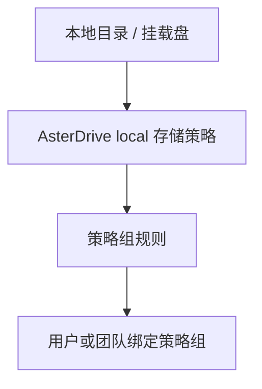

:::tip[这一篇覆盖什么]
这一篇按完整流程讲怎么把 AsterDrive 文件写到本机目录：规划目录、创建 `local` 存储策略、配置内容去重、测试策略组、绑定用户或团队，并说明容量检查和迁移边界。
:::

## 适合什么时候用

本地磁盘适合这些场景：

- 单机部署
- NAS 或挂载盘已经在应用服务器上
- 文件规模不大，想减少外部依赖
- 希望上传、下载路径最直接
- 想先用最简单的后端把实例跑起来

如果你希望把容量和带宽交给对象存储，看 [S3 / MinIO / R2](/storage/s3-minio-r2/)、[Azure Blob Storage](/storage/azure-blob/) 或 [腾讯云 COS](/storage/tencent-cos/)。如果你希望主控节点和真实对象落点拆开，看 [远程节点存储策略](/storage/remote-follower/)。

## 先分清你要配哪几层



只创建本地存储策略还不够。用户或团队上传时，会先命中策略组，再由策略组规则分配到某条存储策略。

## 1. 准备本地目录

长期部署建议使用绝对路径，例如：

```text
/srv/asterdrive/data
```

如果使用 Docker，确认这个目录已经作为 volume 挂载到容器内。容器内路径和宿主机路径不是一回事，存储策略里填写的是 AsterDrive 进程看到的路径。

:::caution[不建议用临时目录或相对路径承载生产文件]
相对路径依赖服务进程工作目录；临时目录可能被系统清理。生产环境请使用稳定的绝对路径或明确挂载的卷。
:::

## 2. 确认权限和容量

运行 AsterDrive 的系统用户需要对该目录有：

- 创建目录权限
- 写入文件权限
- 读取文件权限
- 删除文件权限

还要确认目录所在文件系统有足够容量。本地策略支持容量观测，后台会读取策略基础目录所在文件系统的总量、可用量和已用量。

## 3. 在 AsterDrive 创建 local 存储策略

进入：

```text
管理 -> 存储策略 -> 新建策略
```

选择驱动类型：

```text
本地
```

常见字段：

| 字段 | 示例 |
| --- | --- |
| 基础路径 | `/srv/asterdrive/data` |
| 单文件大小上限 | `0` 表示不限 |
| 分片大小 | 默认值通常够用 |
| 内容去重 | 默认关闭 |

保存前或保存后，先用后台的连接测试确认目录可读写。

## 4. 内容去重怎么选

本地策略的内容去重默认关闭。

开启后：

- 上传完成后会再读一遍临时文件
- 计算 SHA-256 内容指纹
- 相同内容复用同一份底层 blob
- 可以节省重复文件占用的磁盘空间

保持关闭：

- 上传路径更直接
- 不会多一次全文件读取
- 相同内容会分别创建 blob

家用、单机部署多半不需要去重；多人重复上传相同素材的小团队可以开启。

## 5. 创建测试策略组

不要一上来直接改默认策略组。建议先创建一个测试策略组。

进入：

```text
管理 -> 策略组
```

创建策略组，例如：

```text
Local Test Group
```

添加一条规则：

| 字段 | 建议 |
| --- | --- |
| 存储策略 | 刚创建的 local 策略 |
| 优先级 | 保持默认或设为最先命中 |
| 文件大小范围 | 先覆盖所有大小，方便测试 |

## 6. 绑定测试用户或测试团队

### 绑定用户

进入：

```text
管理 -> 用户 -> 用户详情
```

把测试用户的策略组改成刚才创建的 `Local Test Group`。

### 绑定团队

进入：

```text
管理 -> 团队 -> 团队详情
```

把测试团队的策略组改成 `Local Test Group`。

团队空间上传时会按团队策略组走，不按个人用户策略组走。

## 7. 做一轮真实验收

用测试账号完成这些操作：

- 上传小文件
- 上传大文件
- 下载文件
- 预览图片
- 删除文件
- 从回收站恢复
- 分享文件并下载

验收时同时观察：

- 后台容量观测是否正常
- 本地目录下是否出现对象文件
- AsterDrive 日志是否有权限错误
- 如果启用了内容去重，重复上传相同文件后 blob 引用是否复用

## 8. 切真实流量

确认测试策略组没有问题后，再把真实用户或团队迁到目标策略组。

如果要迁移已有文件，不要直接改旧策略的目录。正确做法是：

1. 新建本地策略
2. 测试连接和真实上传下载
3. 用 `管理 -> 存储策略 -> 迁移数据` 创建迁移任务
4. 迁移完成后调整策略组规则

:::caution[已写入文件的策略，不要直接改真实落点]
本地目录决定旧文件在哪里。直接改掉，旧文件可能会全部找不到。
:::

## 日常维护

- 定期确认磁盘剩余空间
- 生产部署使用绝对路径或稳定挂载卷
- 不要手动移动、重命名或删除策略目录里的对象文件
- 备份时同时备份数据库、配置文件和本地对象目录
- 生产迁移前先看 [备份与恢复](/deployment/backup/)
