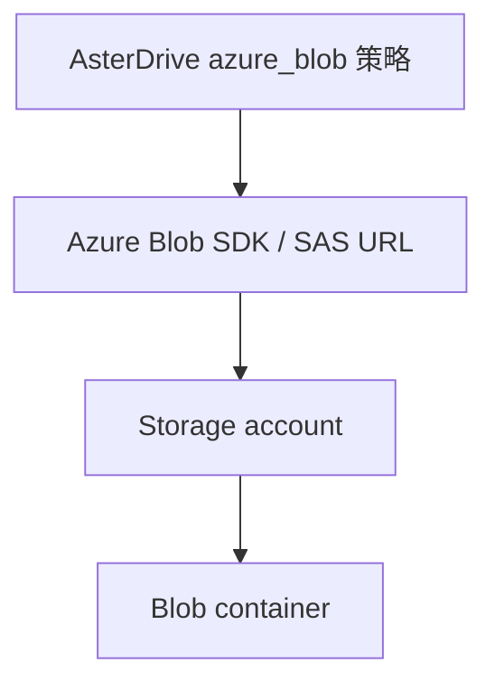
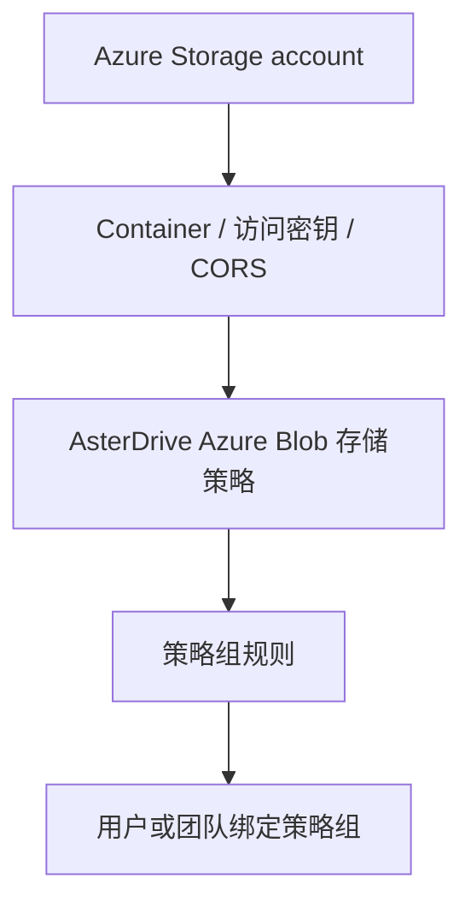
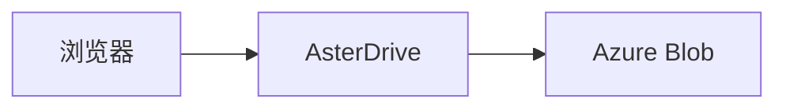
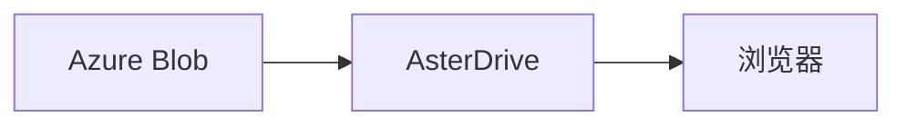
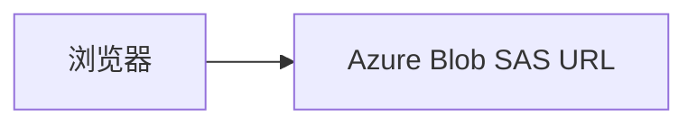

# Azure Blob Storage 存储策略教程

::: tip 这一篇覆盖什么
这一篇按完整流程讲怎么把 AsterDrive 文件写到 Azure Blob Storage：准备 storage account 和 container、创建 `azure_blob` 存储策略、配置策略组规则、绑定用户或团队、验收上传下载，并说明 `presigned` 直传、CORS 和 SAS 协议边界。
:::

## 适合什么时候用

Azure Blob Storage 适合这些场景：

- 你已经在 Azure 上使用 Storage account 和 Blob container
- 希望把文件容量、对象持久化和下载带宽交给 Azure 承接
- 希望 AsterDrive 使用 Azure 官方 Blob SDK 访问对象，而不是把 Azure 当 S3-compatible 存储

如果你用的是 S3、MinIO、R2 或其他 S3-compatible 服务，看 [S3 / MinIO / R2 存储策略教程](/storage/s3-minio-r2)。如果你用腾讯云 COS，并且要接数据万象能力，看 [腾讯云 COS 存储策略教程](/storage/tencent-cos)。

## Azure Blob 和 S3-compatible 的区别

AsterDrive 里 `azure_blob` 是独立存储后端，不走 S3 兼容接口。



几个名字不要混：

| AsterDrive 字段 | Azure 里的概念 | 说明 |
| --- | --- | --- |
| Endpoint | Blob service endpoint | 例如 `https://<account>.blob.core.windows.net` |
| Bucket / 容器 | Container | Azure 叫 container，不叫 bucket |
| Access Key / 存储账户名 | Storage account name | 不是 Access Key ID |
| Secret Key / 存储账户密钥 | Storage account key | 用于服务端签名 SAS |
| 基础路径 | Blob name prefix | 可选，用于把对象放到某个前缀下 |

## 先分清你要配哪几层



只创建 Azure Blob 存储策略还不够。用户或团队上传时，会先命中策略组，再由策略组规则分配到某条存储策略。

## 这篇用到的入口

| 你要做什么 | 入口 |
| --- | --- |
| 创建 Azure Blob 策略 | `管理 -> 存储策略 -> 新建策略` |
| 测试 Azure Blob 连接 | `管理 -> 存储策略 -> 测试连接` |
| 创建分流规则 | `管理 -> 策略组` |
| 给用户绑定策略组 | `管理 -> 用户 -> 用户详情` |
| 给团队绑定策略组 | `管理 -> 团队 -> 团队详情` |
| 调公开站点地址 | `管理 -> 系统设置 -> 站点配置 -> 公开站点地址` |

## 1. 准备 Storage account 和 container

先在 Azure 创建或选择一个 Storage account，例如：

```text
asterdriveprod
```

再创建一个专用 container，例如：

```text
asterdrive-prod
```

建议给 AsterDrive 单独规划 prefix：

```text
prod/
```

这样对象最终会在 container 里按 AsterDrive 的内容寻址路径继续展开。不要让多个 AsterDrive 实例写同一个 prefix，除非你明确知道它们不会互相覆盖或清理对象。

::: warning 不建议人工移动 container 里的 blob
AsterDrive 数据库记录了对象路径。人工移动、重命名或删除 Azure Blob 里的对象，会让数据库里的文件记录和真实对象不一致。
:::

## 2. 准备访问凭证

AsterDrive 当前使用 Storage account name 和 account key 访问 Azure Blob。

在 Azure Portal 里找到：

```text
Storage account -> Security + networking -> Access keys
```

准备这些值：

| 值 | 填到 AsterDrive |
| --- | --- |
| Storage account name | `Access Key / 存储账户名` |
| key1 或 key2 | `Secret Key / 存储账户密钥` |
| Blob service endpoint | `Endpoint` |
| Container name | `Bucket / 容器` |

如果你的组织使用更细的密钥轮换流程，可以先用 `key2` 配新策略，验证通过后再切换策略组。不要在有活动上传时直接改正在使用策略的 endpoint、container 或基础路径。

## 3. 先选上传和下载方式

第一次接入建议先用保守路线：

| 方向 | 建议初始值 | 原因 |
| --- | --- | --- |
| 上传方式 | `relay_stream` | 浏览器不需要直连 Azure Blob，少踩 CORS |
| 下载方式 | `relay_stream` | 下载也先由 AsterDrive 中继，便于排查 |

确认基本读写没问题后，再考虑切换到：

- 上传 `presigned`
- 下载 `presigned`

### `relay_stream` 怎么工作

上传时：



下载时：



好处是入口集中，排查简单。代价是应用节点要承接上传和下载带宽。

### `presigned` 怎么工作

Azure Blob 下的 `presigned` 使用 Azure SAS URL，不是 S3 presigned URL。

上传时：



下载时：


好处是减轻 AsterDrive 节点带宽压力。前提是浏览器能访问 Azure Blob endpoint，并且 container CORS 配置正确。

::: tip Azure 单次直传不强制要求浏览器读取 ETag
Azure Blob 单次 `presigned` PUT 需要请求头 `x-ms-blob-type: BlockBlob`。AsterDrive 会在初始化上传时把这个请求头返回给前端。

S3 / COS 直传通常要求浏览器能从响应里读取 `ETag`；Azure Blob 单次直传由后端显式标记为不强制要求 `ETag`。分片直传仍会使用 Azure block id 作为完成组装所需的 part marker。
:::

## 4. 在 AsterDrive 创建 Azure Blob 存储策略

进入：

```text
管理 -> 存储策略 -> 新建策略
```

选择驱动类型：

```text
Azure Blob
```

按下面填写：

| 字段 | 示例 | 说明 |
| --- | --- | --- |
| Endpoint | `https://asterdriveprod.blob.core.windows.net` | Blob service endpoint，末尾 `/` 会自动规整 |
| Bucket / 容器 | `asterdrive-prod` | Azure container name |
| Access Key / 存储账户名 | `asterdriveprod` | Storage account name，保存前会 trim |
| Secret Key / 存储账户密钥 | `...` | Storage account key，保存前会 trim |
| 基础路径 | `prod/` | 可选，作为 blob name prefix |
| 上传方式 | 初次建议 `relay_stream` | 稳定后再切 `presigned` |
| 下载方式 | 初次建议 `relay_stream` | 稳定后再切 `presigned` |

::: warning Endpoint 要写 Blob service endpoint
不要把 Azure Portal 首页 URL、container URL 或 SAS URL 填进 Endpoint。Endpoint 应该类似 `https://<account>.blob.core.windows.net`。Container 单独填到“Bucket / 容器”字段。
:::

## 5. 保存前先测试连接

保存前或保存后，先用后台的连接测试确认：

- AsterDrive 能访问 endpoint
- container 存在
- account name 和 key 能完成签名和对象操作
- 基础路径没有填错
- 如果使用 `presigned`，浏览器也能访问这个 endpoint

编辑已有策略时，如果存储账户名或账户密钥字段留空，草稿连接测试会复用这条策略已经保存的凭据。这样你可以先测试 endpoint、container、基础路径、上传方式等变更，不必每次重新粘贴 account key。新建策略没有可复用凭据，仍然必须填完整。

连接测试失败时，后台会优先展示后端返回的诊断说明。脚本或 API 客户端可以读取标准错误响应里的 `error.diagnostic.message`；这里会尽量保留 Azure 返回的可排查信息，同时脱敏 SAS、account key 等敏感值。

如果连接测试失败，不要继续把用户切到这条策略。先按下面顺序查：

1. Endpoint 是否包含 `http://` 或 `https://`
2. Endpoint 是否是 Blob service endpoint
3. Container 名是否正确
4. Storage account name 是否正确
5. Storage account key 是否复制完整
6. AsterDrive 服务器时间是否准确
7. 服务器网络是否能访问 Azure Blob endpoint
8. 如果是私有网络、专线或防火墙，是否允许 AsterDrive 所在网络访问

## 6. 配置 CORS

如果你只使用 `relay_stream`，浏览器不会直接请求 Azure Blob，CORS 不是第一优先级。

如果要使用 `presigned` 上传或下载，需要在 Azure Storage account 的 Blob service CORS 中允许 AsterDrive 站点来源。

最少关注：

| 项 | 建议 |
| --- | --- |
| Allowed origins | AsterDrive 的公开站点 origin，例如 `https://drive.example.com` |
| Allowed methods | 至少包含 `PUT`、`GET`、`HEAD` |
| Allowed headers | 至少允许 `Content-Type`、`x-ms-blob-type`、`x-ms-version`、`Range`，不确定时先用 `*` 验证 |
| Exposed headers | 建议包含 `ETag`、`Content-Length`、`Content-Range`、`Content-Disposition`、`Accept-Ranges`、`x-ms-request-id` |
| Max age | 可按你的安全策略设置，例如 `600` |

`Allowed origins` 要填浏览器访问 AsterDrive 的站点 origin，通常来自：

```text
管理 -> 系统设置 -> 站点配置 -> 公开站点地址
```

不要填 AsterDrive 后端到 Azure Blob 的内网地址；CORS 判断的是浏览器页面来源。

## 7. 创建测试策略组

不要一上来直接改默认策略组。建议先创建一个测试策略组。

进入：

```text
管理 -> 策略组
```

创建策略组，例如：

```text
Azure Blob Test Group
```

添加一条规则：

| 字段 | 建议 |
| --- | --- |
| 存储策略 | 刚创建的 Azure Blob 策略 |
| 优先级 | 保持默认或设为最先命中 |
| 文件大小范围 | 先覆盖所有大小，方便测试 |

## 8. 绑定测试用户或测试团队

### 绑定用户

进入：

```text
管理 -> 用户 -> 用户详情
```

把测试用户的策略组改成刚才创建的 `Azure Blob Test Group`。

### 绑定团队

进入：

```text
管理 -> 团队 -> 团队详情
```

把测试团队的策略组改成 `Azure Blob Test Group`。

团队空间上传时会按团队策略组走，不按个人用户策略组走。

## 9. 做一轮真实验收

用被绑定到测试策略组的真实账号测试：

1. 上传一个小文件
2. 上传一个超过分片阈值的大文件
3. 下载文件
4. 分享文件并访问分享链接
5. 删除文件，再从回收站恢复
6. 再删除并清理回收站，确认 Azure container 里的对象清理正常

如果你准备启用 `presigned`，再额外测试：

1. 把上传方式改成 `presigned`
2. 上传小文件和大文件
3. 在浏览器开发者工具里确认请求直接发往 Azure Blob endpoint
4. 确认请求头包含 `x-ms-blob-type: BlockBlob`
5. 如果启用 `presigned` 下载，确认下载链接能从浏览器直接访问

## 常见问题

### 为什么后台还显示 Bucket 字段？

AsterDrive 内部存储策略模型复用了一部分对象存储字段名，所以表单和 API 里仍可能看到 `bucket`。对 Azure Blob 来说，它对应的是 **container**。创建向导和校验提示会尽量用“容器”描述。

### 为什么 `presigned` 上传失败但 `relay_stream` 正常？

`relay_stream` 只要求 AsterDrive 服务器能访问 Azure Blob。`presigned` 还要求浏览器能访问 Azure Blob endpoint，并且 CORS 允许这个浏览器来源发起 `PUT` / `GET`。

优先检查：

1. 浏览器能否访问 endpoint
2. Storage account 防火墙是否允许客户端网络
3. Blob service CORS 是否包含你的 AsterDrive 公开站点 origin
4. Allowed headers 是否包含 `x-ms-blob-type`
5. SAS URL 是否还在有效期内

### 为什么生产 SAS URL 只允许 HTTPS？

生产 endpoint 默认只允许 `https`，避免签出来的 URL 被 HTTP 使用。上线环境应使用 HTTPS Blob service endpoint。

### 可以直接改已经使用中的 Azure 策略吗？

不要直接改 endpoint、container 或基础路径。这些字段决定旧文件在哪里。更稳的做法是：

1. 新建一条 Azure Blob 策略
2. 创建测试策略组验证
3. 如果要迁移已有数据，用 `管理 -> 存储策略 -> 迁移数据`
4. 完成后再调整用户或团队的策略组

## 上线检查清单

- Storage account 和 container 已准备好
- Account name 和 key 已填对，并已通过连接测试
- 基础路径规划清楚，不和其他实例混用
- 上传 / 下载方式已按网络条件选择
- 如果使用 `presigned`，Blob service CORS 已配置
- 用测试用户上传、下载、分享、删除、恢复都通过
- 大文件分片上传通过
- 生产环境使用 HTTPS endpoint
- 已确认 Azure 存储容量、请求次数和出站流量费用边界
