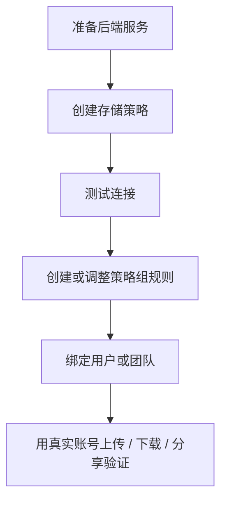

# 存储策略后端

::: tip 这一类文档讲什么
这里按“后端类型”写教程：怎么准备外部服务、怎么创建存储策略、怎么配置策略组规则、怎么把用户或团队切过去，以及上线前怎么验收。
:::

AsterDrive 里有两层概念：

- **存储策略**：文件最终写到哪里，例如本地磁盘、S3 / MinIO / R2、腾讯云 COS、远程节点
- **策略组**：用户或团队上传时，按规则命中哪条存储策略

如果你只想理解整体模型，先看 [存储策略](/config/storage)。  
如果你已经决定要接某种后端，就看这里的教程。

## 当前教程

| 后端 | 适合场景 | 教程 |
| --- | --- | --- |
| 本地磁盘 | 单机、NAS、小团队、最少依赖 | [本地磁盘](/storage/local) |
| S3 / MinIO / R2 | 对象存储、大文件、外部 bucket、云存储 | [S3 / MinIO / R2](/storage/s3-minio-r2) |
| 腾讯云 COS | 腾讯云对象存储、COS 数据万象、按策略启用原生处理 | [腾讯云 COS](/storage/tencent-cos) |
| 远程节点 | 控制面在主控，真实对象写到另一台 AsterDrive | [远程节点存储策略](/storage/remote-follower) |

## 通用配置流程

## 先别急着切生产流量

新的后端建议先单独建一条策略，不要直接改正在使用的旧策略。

推荐做法：

1. 新建后端策略
2. 新建测试策略组
3. 绑定一个测试用户或测试团队
4. 上传、下载、分享、删除、恢复各跑一遍
5. 确认没有问题后，再把真实用户或团队迁到新策略组

::: warning 已写入文件的策略，不要直接改真实落点
`local` 的目录、S3 的 bucket / endpoint / prefix、远程节点绑定，这些字段决定旧文件在哪里。直接改掉，旧文件可能会找不到。
:::
