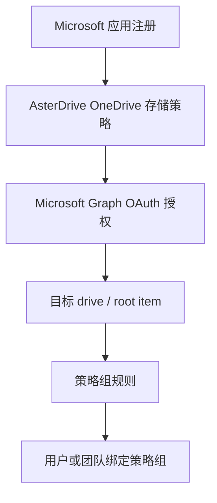

# OneDrive 存储策略教程

::: tip 这一篇覆盖什么
这一篇按完整流程讲怎么把 AsterDrive 文件写到 Microsoft OneDrive 或 SharePoint / Microsoft 365 group drive：准备 Microsoft 应用、创建 OneDrive 存储策略、完成 Microsoft Graph 授权、配置策略组规则、绑定用户或团队，并说明当前 Client ID / Secret 的存储设计。
:::

## 适合什么时候用

OneDrive 存储策略适合这些场景：

- 你已经使用 Microsoft 365、OneDrive 或 SharePoint 文档库
- 希望把团队文件写入 Microsoft Graph 可访问的 drive
- 希望通过管理员授权把某个 OneDrive / SharePoint drive 作为 AsterDrive 的后端
- 希望使用 Microsoft Graph delegated permissions，由管理员在浏览器里完成授权

如果你只需要一个通用对象存储后端，S3 / MinIO / R2 或腾讯云 COS 会更直接。OneDrive 的优势是接入 Microsoft 生态，代价是需要正确配置 Microsoft 应用注册、OAuth redirect URI 和 delegated permissions。

## 先分清你要配哪几层



只创建 OneDrive 存储策略还不够。策略和 Microsoft Graph 应用凭据保存后，还需要在 AsterDrive 后台发起 Microsoft 授权，让 AsterDrive 获得访问目标 drive 的 delegated token。

## 这篇用到的入口

| 你要做什么 | 入口 |
| --- | --- |
| 创建 OneDrive 策略 | `管理 -> 存储策略 -> 新建策略` |
| 复制 Microsoft redirect URI | `管理 -> 存储策略 -> OneDrive 策略 -> Microsoft Graph 凭据` |
| 发起授权或重新授权 | `管理 -> 存储策略 -> OneDrive 策略 -> 授权` |
| 验证已保存凭据 | `管理 -> 存储策略 -> OneDrive 策略 -> 验证` |
| 创建分流规则 | `管理 -> 策略组` |
| 给用户绑定策略组 | `管理 -> 用户 -> 用户详情` |
| 给团队绑定策略组 | `管理 -> 团队 -> 团队详情` |

## 1. 选择 Microsoft 云端点

创建 OneDrive 策略时先选 Microsoft 云端点：

| 云端点 | 登录端点 | Graph 端点 | 适合账号 |
| --- | --- | --- | --- |
| 国际版 | `login.microsoftonline.com` | `graph.microsoft.com` | 个人 Microsoft 账号、Entra ID 工作或学校账号 |
| 中国版（世纪互联） | `login.chinacloudapi.cn` | `microsoftgraph.chinacloudapi.cn` | 中国云组织账号 |

::: warning 不要混用 Global 和 China
Microsoft 应用注册、登录端点和 Graph 端点需要在同一个云环境里。个人 Microsoft 账号不支持中国版端点，如果要使用个人 OneDrive，请选择国际版。
:::

## 2. 准备 Microsoft 应用注册

在 Microsoft Entra ID 应用注册里准备一个应用。

最少需要关注：

- Application (client) ID
- Client Secret，当前 AsterDrive 服务端存储授权流程必填
- Redirect URI
- Microsoft Graph delegated permissions

### Redirect URI 必须完全一致

AsterDrive 会在 OneDrive 策略编辑页显示 redirect URI。把这个地址完整复制到 Microsoft 应用注册里。

常见格式类似：

```text
https://drive.example.com/api/v1/admin/policies/storage-authorization/callback
```

Microsoft 对 redirect URI 做精确匹配。协议、域名、端口、路径只要有一个字符不一致，授权回调就会失败。

### 使用 delegated permissions

OneDrive 存储策略使用管理员在浏览器里完成的 Microsoft Graph delegated authorization，不是 application permissions。

AsterDrive 会按目标类型选择默认授权范围：

| 目标类型 | 默认 scopes |
| --- | --- |
| 个人 OneDrive / 工作或学校默认 OneDrive | `offline_access Files.ReadWrite` |
| 个人或工作学校账号，但显式填写 Drive ID | `offline_access Files.ReadWrite.All` |
| SharePoint site drive / Microsoft 365 group drive | `offline_access Files.ReadWrite.All Sites.ReadWrite.All` |

不要在 AsterDrive 前端手工填写 scopes。管理员只需要在 Microsoft 应用注册中确保这些 delegated permissions 已允许，并在授权时按 Microsoft 页面提示同意。

::: tip 为什么需要 offline_access
`offline_access` 用于获取 refresh token。没有 refresh token，后台缩略图、容量检查和读写任务在 access token 过期后会要求重新授权。
:::

## 3. 创建 OneDrive 存储策略

进入：

```text
管理 -> 存储策略 -> 新建策略
```

选择驱动类型：

```text
OneDrive
```

填写：

| 字段 | 建议 |
| --- | --- |
| Microsoft 云端点 | 按账号所在云选择国际版或中国版 |
| Client ID | Microsoft 应用注册里的 Application (client) ID |
| Client Secret | Microsoft 应用 secret；当前必填，不支持公共客户端 / 无 secret 授权流程 |
| Drive 类型 | 新建时通常保持默认，授权后自动解析默认 drive |

保存策略后，进入策略编辑页发起授权。

::: warning 先保存，再授权
OneDrive 授权请求只会使用已经保存到后端的 Microsoft Graph 应用配置。你在表单里刚改过 Client ID、Client Secret、tenant、cloud、drive 类型或定位字段时，先保存策略，再点击 `授权` 或 `重新授权`。

这样做是为了避免浏览器把未保存的 secret 草稿塞进授权请求，也能保证审计日志、授权 flow、token 刷新和后续后台任务看到的是同一份配置。
:::

## 4. 完成 Microsoft 授权

进入 OneDrive 策略编辑页：

```text
管理 -> 存储策略 -> 目标 OneDrive 策略
```

在 `Microsoft Graph 凭据` 区域点击 `授权`。

后端启动授权时，请求体只需要说明 provider 是 Microsoft Graph；Client ID、Client Secret、tenant 和 scopes 会从已保存的 connector application config 读取。旧版本里那种“边带草稿凭据边授权”的流程已经收口掉了。

授权成功后，浏览器会回到 AsterDrive 管理后台，并显示授权结果。AsterDrive 会保存：

- access token ciphertext
- refresh token ciphertext
- token 过期时间
- 授权时间
- 目标 drive / root item metadata
- Microsoft cloud / tenant / app metadata

后续后台任务需要访问 OneDrive 时，会自动刷新 access token。刷新成功会写回数据库；如果 Microsoft 拒绝 refresh token，策略会进入需要重新授权状态。

::: tip 删除策略后的临时清理任务
强制删除仍有临时上传对象的 OneDrive 策略时，AsterDrive 会把当时可用的 Microsoft Graph token 和 drive 信息写入清理任务快照。这个清理任务使用快照里的 refresh token 在内存中刷新 access token，但不会写 OAuth 审计，也不会把凭据状态改成“需要重新授权”。这是刻意设计：任务运行时原始策略或凭据记录可能已经被删除。清理失败会写入后台任务错误输出和失败步骤，并记录服务端警告日志；管理员需要重新授权的是仍然存在的 OneDrive 策略。
:::

## 5. 目标 drive 如何解析

默认情况下不需要填写 Drive ID。AsterDrive 会在授权完成后自动解析：

| Drive 类型 | 自动解析方式 |
| --- | --- |
| 个人 OneDrive | 当前登录账号的默认 drive |
| 工作或学校 OneDrive | 当前登录账号的默认 drive |
| SharePoint site drive | 按 Site ID 解析站点默认 drive，除非已填写 Drive ID |
| Microsoft 365 group drive | 按 Group ID 解析 group drive，除非已填写 Drive ID |

高级字段只在你明确需要非默认文档库或固定 root item 时再填写：

| 字段 | 什么时候填 |
| --- | --- |
| Drive ID | 要访问非默认 drive，或者要绕过自动解析 |
| Root item ID | 要把 AsterDrive 写入限定到某个文件夹 |
| Site ID | SharePoint site drive 模式需要，除非已有 Drive ID |
| Group ID | Microsoft 365 group drive 模式需要，除非已有 Drive ID |

::: tip root item
Root item ID 留空或填写 `root` 表示写入 drive 根目录。
:::

## 6. 创建测试策略组

不要一上来直接把真实用户切到新的 OneDrive 策略。建议先创建测试策略组。

进入：

```text
管理 -> 策略组
```

创建策略组，例如：

```text
OneDrive Test Group
```

添加一条规则：

| 字段 | 建议 |
| --- | --- |
| 存储策略 | 刚创建并授权成功的 OneDrive 策略 |
| 优先级 | 保持默认或设为最先命中 |
| 文件大小范围 | 先覆盖所有大小，方便测试 |

## 7. 绑定测试用户或测试团队

### 绑定用户

进入：

```text
管理 -> 用户 -> 用户详情
```

把测试用户的策略组改成刚才创建的 `OneDrive Test Group`。

### 绑定团队

进入：

```text
管理 -> 团队 -> 团队详情
```

把测试团队的策略组改成 `OneDrive Test Group`。

团队空间上传时会按团队策略组走，不按个人用户策略组走。

## 8. 做一轮真实验收

用测试账号至少跑一遍：

1. 上传小文件
2. 上传较大的文件
3. 下载文件
4. 预览图片或触发缩略图生成
5. 删除和恢复文件
6. 在 Microsoft 侧确认对象写入目标 drive
7. 在 AsterDrive 后台点击 `验证`

如果后台任务报 Microsoft Graph `401` 或 token 相关错误，先回到策略编辑页查看凭据状态。状态为需要重新授权时，点击 `重新授权`。

## 9. 当前应用配置存储设计

AsterDrive 把 OneDrive 的 Microsoft Graph 应用配置存放在独立的 connector application config 记录里，而不是长期写入 `storage_policies.access_key` / `storage_policies.secret_key`：

| 存储字段 | OneDrive 含义 |
| --- | --- |
| `storage_connector_application_configs.client_id` | Microsoft Application (client) ID |
| `storage_connector_application_configs.client_secret_ciphertext` | 加密后的 Microsoft Client Secret |
| `storage_connector_application_configs.tenant_id` | Microsoft tenant，例如 `common` 或租户 ID |
| `storage_connector_application_configs.scopes` | Microsoft Graph delegated scopes |

Client Secret 使用 `auth.storage_credential_secret_key` 派生的加密密钥加密后落库。管理员在前端输入的明文 secret 只用于首次保存或主动覆盖；发起授权时，后端会读取已保存并加密保存的 secret。如果编辑策略时留空，AsterDrive 会保留已有的 `client_secret_ciphertext`。API 响应和审计日志只暴露 `client_secret_configured` 这类布尔状态，不回显明文。

创建或更新 OneDrive 策略时，AsterDrive 会在存储连接边界清空 legacy `storage_policies.access_key` / `storage_policies.secret_key` 字段。它们不作为 OneDrive Microsoft 应用凭据的长期存储位置。

这是刻意的设计折中：每条 OneDrive 策略拥有自己的 Microsoft Graph 应用配置，但应用配置仍然和 storage policy 分表存储，方便后续迁移到共享应用配置模型。

当前设计的好处是：

- 明文 Client Secret 不长期写入 `storage_policies.secret_key`
- 创建和授权流程更直接
- 连接配置、OAuth token 和授权状态有清晰的表边界
- 未来需要多个策略共享一个 Microsoft App 时，可以迁移到共享 app config 引用模型

如果以后出现明确需求，例如多个 OneDrive 策略共享一个 Microsoft App、Google Drive 也接入 OAuth 存储后端、管理员需要统一轮换 app secret，可以迁移到类似下面的模型：

```text
storage_provider_app_configs
storage_policies.app_config_id -> storage_provider_app_configs.id
```

## 常见问题

### 授权回来显示失败

优先检查：

1. Redirect URI 是否完全一致
2. Client ID / Secret 是否来自同一个 Microsoft 应用
3. Microsoft 云端点是否选对
4. 个人 Microsoft 账号是否误选了中国版端点
5. Microsoft 应用是否允许所需 delegated permissions

### 授权成功但无法解析 drive

检查 Drive 类型和目标字段：

- 默认个人 / 工作学校 OneDrive 通常不需要 Drive ID
- SharePoint site drive 需要 Site ID，除非已填写 Drive ID
- Microsoft 365 group drive 需要 Group ID，除非已填写 Drive ID
- Root item ID 留空或 `root` 最稳

### 需要经常重新授权

通常是 refresh token 不可用或被 Microsoft 拒绝。检查：

- 授权时是否包含 `offline_access`
- Microsoft 组织策略是否限制 refresh token
- 管理员是否在 Microsoft 侧撤销了授权
- Client Secret 是否轮换但 AsterDrive 策略没有更新
