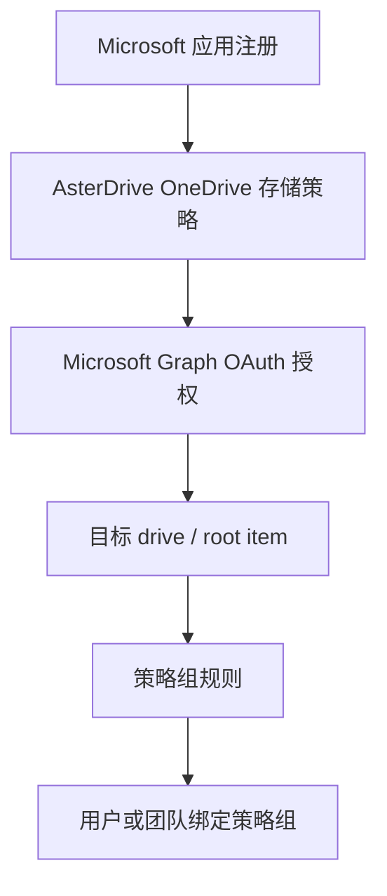
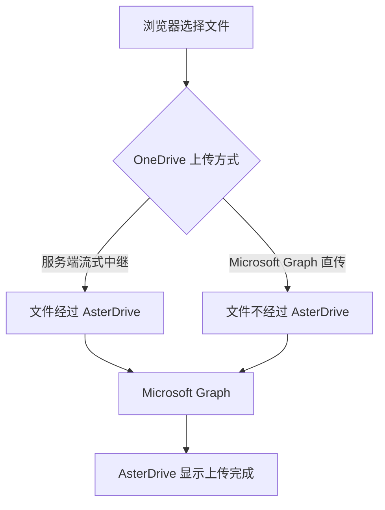

# OneDrive 存储策略教程

::: tip 这一篇覆盖什么
这一篇按完整流程讲怎么把 AsterDrive 文件写到 Microsoft OneDrive 或 SharePoint / Microsoft 365 group drive：准备 Microsoft 应用、完成 Microsoft Graph 授权、选择服务端中继或浏览器直传、配置策略组规则、绑定用户或团队，并说明凭据如何受到保护。
:::

## 适合什么时候用

OneDrive 存储策略适合这些场景：

- 你已经使用 Microsoft 365、OneDrive 或 SharePoint 文档库
- 希望把团队文件写入 Microsoft Graph 可访问的 drive
- 希望通过管理员授权把某个 OneDrive / SharePoint drive 作为 AsterDrive 的后端
- 希望使用 Microsoft Graph delegated permissions，由管理员在浏览器里完成授权

如果你只需要一个通用对象存储后端，S3 / MinIO / R2 或腾讯云 COS 会更直接。OneDrive 的优势是接入 Microsoft 生态，代价是需要正确配置 Microsoft 应用注册、OAuth redirect URI 和 delegated permissions。

## 先分清你要配哪几层



只创建 OneDrive 存储策略还不够。策略和 Microsoft Graph 应用凭据保存后，还需要在 AsterDrive 后台发起 Microsoft 授权，让 AsterDrive 获得访问目标 drive 的 delegated token。

## 这篇用到的入口

| 你要做什么 | 入口 |
| --- | --- |
| 创建 OneDrive 策略 | `管理 -> 存储策略 -> 新建策略` |
| 复制 Microsoft redirect URI | `管理 -> 存储策略 -> OneDrive 策略 -> Microsoft Graph 凭据` |
| 发起授权或重新授权 | `管理 -> 存储策略 -> OneDrive 策略 -> 授权` |
| 验证已保存凭据 | `管理 -> 存储策略 -> OneDrive 策略 -> 验证` |
| 创建分流规则 | `管理 -> 策略组` |
| 给用户绑定策略组 | `管理 -> 用户 -> 用户详情` |
| 给团队绑定策略组 | `管理 -> 团队 -> 团队详情` |

## 1. 选择 Microsoft 云端点

创建 OneDrive 策略时先选 Microsoft 云端点：

| 云端点 | 登录端点 | Graph 端点 | 适合账号 |
| --- | --- | --- | --- |
| 国际版 | `login.microsoftonline.com` | `graph.microsoft.com` | 个人 Microsoft 账号、Entra ID 工作或学校账号 |
| 中国版（世纪互联） | `login.chinacloudapi.cn` | `microsoftgraph.chinacloudapi.cn` | 中国云组织账号 |

::: warning 不要混用 Global 和 China
Microsoft 应用注册、登录端点和 Graph 端点需要在同一个云环境里。个人 Microsoft 账号不支持中国版端点，如果要使用个人 OneDrive，请选择国际版。
:::

## 2. 准备 Microsoft 应用注册

在 Microsoft Entra ID 应用注册里准备一个应用。

最少需要关注：

- Application (client) ID
- Client Secret，当前 AsterDrive 服务端存储授权流程必填
- Redirect URI
- Microsoft Graph delegated permissions

### Redirect URI 必须完全一致

AsterDrive 会在 OneDrive 策略编辑页显示 redirect URI。把这个地址完整复制到 Microsoft 应用注册里。

常见格式类似：

```text
https://drive.example.com/api/v1/admin/policies/storage-authorization/callback
```

Microsoft 对 redirect URI 做精确匹配。协议、域名、端口、路径只要有一个字符不一致，授权回调就会失败。

### 使用 delegated permissions

OneDrive 存储策略使用管理员在浏览器里完成的 Microsoft Graph delegated authorization，不是 application permissions。

AsterDrive 会按目标类型选择默认授权范围：

| 目标类型 | 默认 scopes |
| --- | --- |
| 个人 OneDrive / 工作或学校默认 OneDrive | `offline_access Files.ReadWrite` |
| 个人或工作学校账号，但显式填写 Drive ID | `offline_access Files.ReadWrite.All` |
| SharePoint site drive / Microsoft 365 group drive | `offline_access Files.ReadWrite.All Sites.ReadWrite.All` |

不要在 AsterDrive 前端手工填写 scopes。管理员只需要在 Microsoft 应用注册中确保这些 delegated permissions 已允许，并在授权时按 Microsoft 页面提示同意。

::: tip 为什么需要 offline_access
`offline_access` 用于获取 refresh token。没有 refresh token，后台缩略图、容量检查和读写任务在 access token 过期后会要求重新授权。
:::

## 3. 创建 OneDrive 存储策略

进入：

```text
管理 -> 存储策略 -> 新建策略
```

选择驱动类型：

```text
OneDrive
```

填写：

| 字段 | 建议 |
| --- | --- |
| Microsoft 云端点 | 按账号所在云选择国际版或中国版 |
| Client ID | Microsoft 应用注册里的 Application (client) ID |
| Client Secret | Microsoft 应用 secret；当前必填，不支持公共客户端 / 无 secret 授权流程 |
| Drive 类型 | 新建时通常保持默认，授权后自动解析默认 drive |
| OneDrive 上传方式 | 按带宽路径选择“服务端流式中继”或“Microsoft Graph 直传”；Graph 直传不需要额外配置跨域规则 |

保存策略后，进入策略编辑页发起授权。

::: warning 先保存，再授权
OneDrive 授权请求只会使用已经保存到后端的 Microsoft Graph 应用配置。你在表单里刚改过 Client ID、Client Secret、tenant、cloud、drive 类型或定位字段时，先保存策略，再点击 `授权` 或 `重新授权`。

这样做是为了避免浏览器把未保存的 secret 草稿塞进授权请求，也能保证审计日志、授权 flow、token 刷新和后续后台任务看到的是同一份配置。
:::

## 4. 完成 Microsoft 授权

进入 OneDrive 策略编辑页：

```text
管理 -> 存储策略 -> 目标 OneDrive 策略
```

在 `Microsoft Graph 凭据` 区域点击 `授权`。

授权会使用已经保存的 Microsoft 应用配置，不会读取页面上尚未保存的 Client ID 或 Client Secret。授权成功后，浏览器会回到 AsterDrive 管理后台并显示结果。

AsterDrive 会安全保存后续访问 OneDrive 所需的信息，并在需要时自动续期。如果 Microsoft 取消授权或凭据失效，策略页会提示重新授权。

::: tip 删除策略后的临时清理任务
删除仍有临时上传数据的策略后，AsterDrive 会继续执行清理。清理失败时，可以在后台任务页面查看失败原因。
:::

## 5. 目标 drive 如何解析

默认情况下不需要填写 Drive ID。AsterDrive 会在授权完成后自动解析：

| Drive 类型 | 自动解析方式 |
| --- | --- |
| 个人 OneDrive | 当前登录账号的默认 drive |
| 工作或学校 OneDrive | 当前登录账号的默认 drive |
| SharePoint site drive | 按 Site ID 解析站点默认 drive，除非已填写 Drive ID |
| Microsoft 365 group drive | 按 Group ID 解析 group drive，除非已填写 Drive ID |

高级字段只在你明确需要非默认文档库或固定 root item 时再填写：

| 字段 | 什么时候填 |
| --- | --- |
| Drive ID | 要访问非默认 drive，或者要绕过自动解析 |
| Root item ID | 要把 AsterDrive 写入限定到某个文件夹 |
| Site ID | SharePoint site drive 模式需要，除非已有 Drive ID |
| Group ID | Microsoft 365 group drive 模式需要，除非已有 Drive ID |

::: tip root item
Root item ID 留空或填写 `root` 表示写入 drive 根目录。
:::

## 6. 选择 OneDrive 上传方式

OneDrive 策略支持两种上传方式：

| 上传方式 | 数据路径 | 适合场景 |
| --- | --- | --- |
| 服务端流式中继（`server_relay`） | 浏览器 -> AsterDrive -> Microsoft Graph | 为了兼容已有策略而保留的默认方式；浏览器流量统一经过 AsterDrive |
| Microsoft Graph 直传（`frontend_direct`） | 浏览器直接上传到 Microsoft Graph | 开箱可用的省带宽路径；适合大文件或服务器带宽有限的环境 |

服务端流式中继是为了兼容已有策略而保留的默认值。管理员可以在 OneDrive 策略编辑页随时切换上传方式。

### 服务端流式中继

浏览器先把文件上传到 AsterDrive，再由服务端写入 Microsoft Graph。

这条路径会占用 AsterDrive 节点的上传带宽，但浏览器只需要访问 AsterDrive。用户设备无法稳定连接 Microsoft 时，可以优先使用这种方式。

### Microsoft Graph 直传

AsterDrive 确认本次上传后，浏览器会把文件直接上传到 Microsoft Graph。文件不经过 AsterDrive 节点，因此可以明显减少服务器带宽占用。



Microsoft access token 和 refresh token 始终保留在 AsterDrive 服务端，不会发送给浏览器。直传中断后可以继续上传，取消或过期的上传也会自动清理。

::: tip Graph 直传不需要额外配置跨域规则
Graph 直传按开箱可用设计。所需的跨域支持由 Microsoft 提供，AsterDrive、Microsoft 应用注册和存储策略里都没有对应的配置项。

如果某个网络环境下直传失败，先检查浏览器扩展、公司网络，以及所选的 Microsoft 云是否正确。也可以切回服务端流式中继。
:::

## 7. 创建测试策略组

不要一上来直接把真实用户切到新的 OneDrive 策略。建议先创建测试策略组。

进入：

```text
管理 -> 策略组
```

创建策略组，例如：

```text
OneDrive Test Group
```

添加一条规则：

| 字段 | 建议 |
| --- | --- |
| 存储策略 | 刚创建并授权成功的 OneDrive 策略 |
| 优先级 | 保持默认或设为最先命中 |
| 文件大小范围 | 先覆盖所有大小，方便测试 |

## 8. 绑定测试用户或测试团队

### 绑定用户

进入：

```text
管理 -> 用户 -> 用户详情
```

把测试用户的策略组改成刚才创建的 `OneDrive Test Group`。

### 绑定团队

进入：

```text
管理 -> 团队 -> 团队详情
```

把测试团队的策略组改成 `OneDrive Test Group`。

团队空间上传时会按团队策略组走，不按个人用户策略组走。

## 9. 做一轮真实验收

用测试账号至少跑一遍：

1. 使用服务端流式中继上传小文件和较大文件
2. 切换到 Graph 直传后，再次上传小文件和较大文件
3. 下载文件
4. 预览图片或触发缩略图生成
5. 删除和恢复文件
6. 在 Microsoft 侧确认对象写入目标 drive
7. 在 AsterDrive 后台点击 `验证`

如果后台提示 Microsoft Graph 授权失效，先回到策略编辑页查看凭据状态。状态为需要重新授权时，点击 `重新授权`。

## 10. 凭据如何保存

AsterDrive 会加密保存 Microsoft Client Secret 和授权信息。浏览器、API 响应和审计日志都不会回显这些明文凭据。

编辑已有策略时，如果 Client Secret 留空，AsterDrive 会继续使用已经保存的 secret；只有输入新值并保存时才会替换。

凭据加密依赖 `auth.storage_credential_secret_key`。备份或迁移 AsterDrive 时，需要同时保留这项配置，详见 [登录与会话 — `storage_credential_secret_key`](/config/auth#storage-credential-secret-key)。

## 常见问题

### 授权回来显示失败

优先检查：

1. Redirect URI 是否完全一致
2. Client ID / Secret 是否来自同一个 Microsoft 应用
3. Microsoft 云端点是否选对
4. 个人 Microsoft 账号是否误选了中国版端点
5. Microsoft 应用是否允许所需 delegated permissions

### 授权成功但无法解析 drive

检查 Drive 类型和目标字段：

- 默认个人 / 工作学校 OneDrive 通常不需要 Drive ID
- SharePoint site drive 需要 Site ID，除非已填写 Drive ID
- Microsoft 365 group drive 需要 Group ID，除非已填写 Drive ID
- Root item ID 留空或 `root` 最稳

### 需要经常重新授权

通常是 refresh token 不可用或被 Microsoft 拒绝。检查：

- 授权时是否包含 `offline_access`
- Microsoft 组织策略是否限制 refresh token
- 管理员是否在 Microsoft 侧撤销了授权
- Client Secret 是否轮换但 AsterDrive 策略没有更新

### 服务端中继正常，但 Microsoft Graph 直传失败

先确认普通上传、下载和后台“验证”都正常，再检查浏览器扩展、公司网络，以及所选的 Microsoft 云是否正确。AsterDrive 里没有额外的 Graph 跨域配置项。这类情况通常只影响浏览器直传；需要时可以切回“服务端流式中继”。
