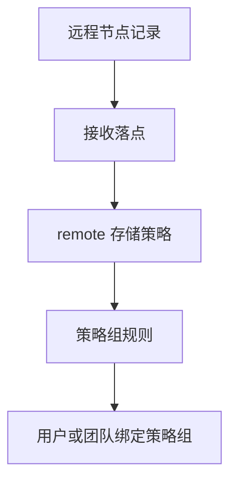
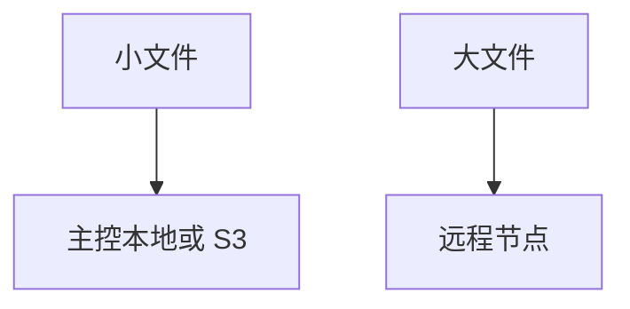

# 远程节点存储策略教程

::: tip 这一篇覆盖什么
这一篇讲怎么把已经接入的从节点作为存储策略后端使用：创建接收落点、创建 `remote` 存储策略、配置策略组规则、绑定用户或团队，并验收真实上传下载。
:::

如果你还没有把从节点接入主控，先看 [远程节点](/guide/remote-nodes)。  
如果你用 Docker 跑从节点，先看 [Docker 部署从节点](/deployment/docker-follower)。

## 适合什么时候用

远程节点适合这些场景：

- 主控节点负责登录、后台、分享和 WebDAV，真实对象写到另一台机器
- 家里 / 办公室 / 机房有额外存储机器
- 想把大文件或特定团队的文件分流到独立节点
- 想让某个从节点再写入它本地磁盘或它能访问的 S3 / MinIO

它不是多主集群，也不是自动故障切换。主控仍然是唯一控制面。

::: warning 先按网络选择传输方式
远程节点现在有三种传输方式：

- `direct`：主控节点直接访问从节点 `base_url`
- `reverse_tunnel`：从节点主动连接主控，`base_url` 可以留空
- `auto`：填了 `base_url` 就走直连，留空就走反向通道

如果从节点在 NAT、CGNAT 或纯内网后方，只能主动访问主控，可以选择反向通道。反向通道仍处于测试阶段，适合 `relay_stream` 上传/下载；如果你要用 `presigned`，仍然需要直连，并且浏览器也要能访问从节点 `base_url`。
:::

## 先分清三层



每一层负责的事不同：

| 层级 | 负责什么 | 入口 |
| --- | --- | --- |
| 远程节点记录 | 主控知道有哪台从节点，怎么访问它 | `管理 -> 远程节点` |
| 接收落点 | 从节点收到对象后写到本地还是 S3 | `管理 -> 远程节点 -> 节点详情` |
| remote 存储策略 | 上传时选择哪台远程节点 | `管理 -> 存储策略` |
| 策略组 | 哪些用户/团队/文件大小命中这条策略 | `管理 -> 策略组` |

当前主控和 follower 之间使用内部远程存储协议 `v4`，且当前主控要求 follower 同样支持 `v4`。创建 remote 策略和切换策略组前，先让主控测试一次节点连接；测试结果里会带协议版本、服务端版本和能力摘要。

## 1. 先确认从节点已经 ready

在主控后台进入：

```text
管理 -> 远程节点
```

确认目标节点满足：

- 已完成 enroll
- 已启用
- 传输方式和网络拓扑匹配
- 如果用直连，`base_url` 是主控能访问到的地址
- 如果用反向通道，通道状态已经在线
- 点击“测试连接”通过
- 能力摘要里的内部协议版本兼容当前主控，当前要求 `v4`
- `/health/ready` 返回正常

如果 `base_url` 为空，只有 `reverse_tunnel` 或 `auto` 才能承接远程流量；`direct` 节点必须补上主控能访问的 HTTP(S) 地址。生产前先确认“测试连接”按当前传输方式通过。

## 2. 创建默认远程存储目标

打开目标远程节点详情，找到：

```text
主控指定的远程存储目标
```

第一次建议创建 `local` 远程存储目标。

示例：

| 字段 | 建议 |
| --- | --- |
| 名称 | `default-local` |
| 驱动 | `local` |
| 基础路径 | `default` |
| 默认远程存储目标 | 开启 |

`local` 远程存储目标的基础路径只能填相对路径。  
最终会落在从节点自己的：

```text
server.follower.remote_storage_target_local_root
```

下面。例如从节点配置是：

```toml
[server.follower]
remote_storage_target_local_root = "/data/remote-storage-targets"
```

远程存储目标基础路径是：

```text
default
```

最终对象会写到：

```text
/data/remote-storage-targets/default
```

::: warning 没有默认远程存储目标，remote 策略不能真正写入
enroll 成功只代表主从身份绑定成功。真正接收对象前，从节点还需要一个已应用的默认远程存储目标。
:::

## 3. 远程存储目标选 local 还是 s3

| 远程存储目标 | 适合场景 | 注意事项 |
| --- | --- | --- |
| `local` | 从节点本地磁盘、NAS 挂载目录 | 基础路径只能是相对路径，并被限制在 follower 接收根目录下 |
| `s3` | 从节点所在网络能访问的对象存储 | 凭证和 endpoint 存在从节点远程存储目标配置里 |

第一次接入建议先用 `local`，把主控到从节点的链路跑通。  
确认稳定后，再按需要把从节点远程存储目标切到 `s3`。

## 4. 创建 remote 存储策略

进入：

```text
管理 -> 存储策略 -> 新建策略
```

选择驱动类型：

```text
remote
```

填写：

| 字段 | 建议 |
| --- | --- |
| 名称 | `Remote Follower A` 这类能识别节点的名字 |
| 远程节点 | 选择刚才接入并测试通过的节点 |
| 单文件大小上限 | 先按测试场景设置，`0` 表示不限制 |
| 分片大小 | 初次保持默认 |
| 上传方式 | 初次建议 `relay_stream` |
| 下载方式 | 初次建议 `relay_stream` |

创建后先保存，并做连接测试。

## 5. 上传和下载方式怎么选

### 初次建议：`relay_stream`

上传链路：


下载链路：


优点：

- 浏览器只需要访问主控节点
- 排查路径清楚
- 可以走直连，也可以走反向通道

代价：

- 主控节点仍然承接上传和下载带宽

### 进阶：`presigned`

上传或下载时，浏览器会直接访问从节点生成的短时效地址。

适合：

- 想降低主控节点带宽压力
- 远程节点使用直连传输
- 浏览器能稳定访问从节点 `base_url`
- 反向代理已经正确暴露从节点

使用前确认：

- 远程节点传输方式不是反向通道
- 从节点 `base_url` 对浏览器可达
- HTTPS 证书可信
- 反向代理不会拦截上传/下载路径和必要响应头
- 从节点接收落点已经应用成功
- 主控测试连接显示 follower 支持 `browser_presigned_cors`

如果主控能访问从节点，但用户浏览器访问不到从节点，就不要用远程 `presigned`。如果远程节点走反向通道，也不要用 `presigned`，改用 `relay_stream`。

::: warning Tailscale / VPN 地址不是公网地址
如果从节点 `base_url` 是 Tailscale IP、MagicDNS 名称，或只在内网 split DNS 里解析的域名，远程 `presigned` 只适合 tailnet / VPN 内用户。公网用户打开主控站点后，浏览器仍然会被重定向到这个 follower 地址；公网无法解析或路由到它时，下载和上传都会失败。

要让公网用户访问这类文件，要么给 follower 提供公网可达的 HTTPS 地址，要么把远程策略的上传/下载方式改成 `relay_stream`，让主控节点代转流量。不同拓扑的取舍见 [从节点网络部署方式](/deployment/follower-network-topologies)。
:::

远程 `presigned` 的浏览器 CORS 要求比普通主控中继更严格：

| 方向 | 需要允许的请求头 | 需要暴露的响应头 |
| --- | --- | --- |
| 上传 `PUT` | `content-type` | `ETag` |
| 下载 `GET` / Range | `range` | `Accept-Ranges`、`Content-Range`、`Content-Length` |

follower 默认的内部协议能力会声明 `content-type, range`，并暴露 GET 所需的 `Accept-Ranges`、`Cache-Control`、`Content-Disposition`、`Content-Length`、`Content-Range`、`Content-Type`、`ETag`，以及 PUT 所需的 `ETag`。如果前面有 nginx、Caddy、Traefik 或 CDN，确认它们没有丢这些响应头。

## 6. 创建测试策略组

不要直接改默认策略组。先创建一个测试策略组：

```text
管理 -> 策略组 -> 新建策略组
```

示例：

```text
Remote Test Group
```

添加规则：

| 字段 | 建议 |
| --- | --- |
| 存储策略 | 刚创建的 remote 策略 |
| 优先级 | 保持默认或设为最先命中 |
| 文件大小范围 | 初次覆盖所有大小 |

## 7. 绑定测试用户或团队

### 绑定用户

进入：

```text
管理 -> 用户 -> 用户详情
```

把测试用户的策略组改成 `Remote Test Group`。

### 绑定团队

进入：

```text
管理 -> 团队 -> 团队详情
```

把测试团队的策略组改成 `Remote Test Group`。

团队空间上传时命中团队策略组，不使用个人用户策略组。

## 8. 做真实验收

用测试用户登录，按顺序验证：

1. 上传一个小文件
2. 上传一个大文件
3. 下载文件
4. 创建分享链接并访问
5. 删除文件，再从回收站恢复
6. 如果启用了预览，打开一次图片或 PDF
7. 到从节点检查接收落点目录或对象存储里是否出现对象
8. 回主控 `管理 -> 远程节点` 再测一次连接，确认协议版本和能力摘要仍然正常

如果这些都通过，再考虑把真实用户或团队切到远程策略组。

## 9. 按大小分流到远程节点

常见做法：



在策略组里配置多条规则，例如：

| 规则 | 文件大小范围 | 存储策略 |
| --- | --- | --- |
| 小文件 | `0` 到 `100 MiB` | 本地策略 |
| 大文件 | `100 MiB` 以上 | remote 策略 |

保存后分别上传小文件和大文件，确认命中的存储策略符合预期。

## 10. 切换真实用户或团队

确认测试可用后，再选择切换方式：

| 场景 | 做法 |
| --- | --- |
| 只让少数用户走从节点 | 到 `管理 -> 用户` 逐个绑定策略组 |
| 让某个团队走从节点 | 到 `管理 -> 团队` 绑定策略组 |
| 新用户默认走从节点 | 把远程策略组设为新用户默认策略组 |
| 逐步迁移 | 分批调整绑定，观察任务、日志和远程节点健康状态 |

切换策略组只影响后续上传。旧文件仍按原来的存储策略读取。

## 11. 日常维护

定期检查：

- 远程节点测试连接是否成功
- 如果使用反向通道，通道状态是否在线且最近没有错误
- 从节点 `/health/ready` 是否正常
- 默认接收落点是否仍然已应用
- 从节点接收根目录磁盘是否充足
- 从节点如果再写 S3，S3 凭证是否仍然有效
- 远程策略组是否仍然启用
- 最近是否有远程上传/下载相关错误

从节点本地接收目录属于正式数据，必须纳入备份策略。  
如果接收落点是 S3，也要按对象存储的备份和版本化策略处理。

## 12. 常见故障

### 主控测试连接失败

优先检查：

- 远程节点传输方式是否选对
- 直连模式下，`base_url` 是否是主控能访问到的地址
- 反向通道模式下，follower 是否能访问主控 `public_site_url`，中间代理是否允许 WebSocket 和长连接
- 从节点服务是否正在运行
- 从节点是否监听外部可达地址
- 反向代理或防火墙是否放行
- `/health/ready` 是否返回正常
- follower 返回的内部协议版本是否兼容当前主控；当前主控要求 `v4`

### remote 策略上传失败

按顺序查：

1. 远程节点是否启用
2. 是否完成 enroll
3. 是否有已应用的默认远程存储目标
4. 从节点 `remote_storage_target_local_root` 是否可写
5. 策略组规则是否真的命中 remote 策略
6. 用户或团队配额是否已满
7. 主控和从节点日志里是否有对应错误

### `presigned` 模式失败，但 `relay_stream` 正常

这通常说明主控到从节点没问题，但浏览器到从节点有问题。

检查：

- 远程节点是否使用直连传输
- 浏览器能否访问从节点 `base_url`
- HTTPS 证书是否可信
- 反向代理是否转发上传/下载路径
- CORS 是否允许 `content-type` / `range`
- 响应是否暴露 `ETag`、`Accept-Ranges`、`Content-Range`、`Content-Length`
- 公司网络或浏览器是否拦截从节点域名

### 已有文件突然找不到

优先确认最近是否改过：

- remote 策略绑定的远程节点
- 从节点接收落点
- `remote_storage_target_local_root`
- 从节点本地目录
- 从节点接收落点的 S3 endpoint / bucket / prefix

这些字段都决定旧对象在哪里。不要直接改正在使用的真实落点。
