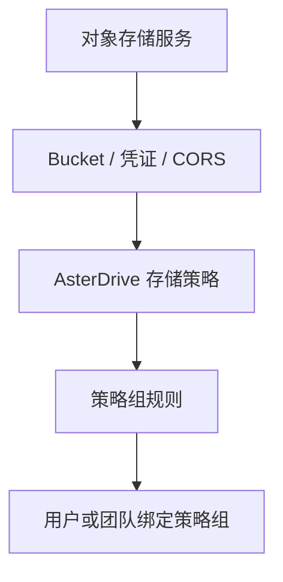
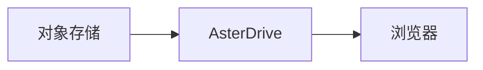
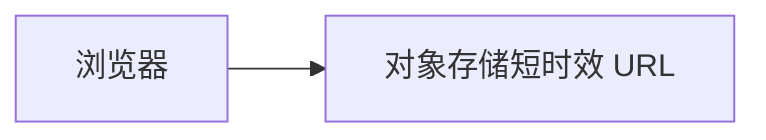
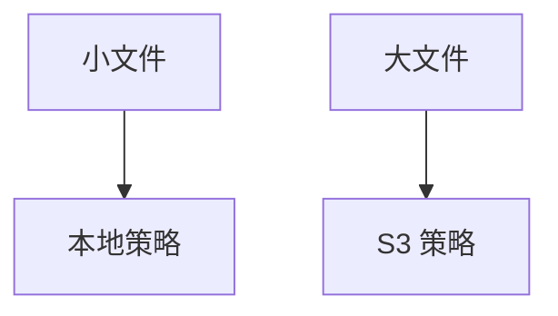

# S3 / MinIO / R2 存储策略教程

::: tip 这一篇覆盖什么
这一篇按完整流程讲怎么把 AsterDrive 的文件写到 S3 或兼容对象存储：准备 bucket、创建存储策略、配置策略组规则、绑定用户或团队、验收上传下载，并处理 `presigned` 直传需要的 CORS。
:::

## 适合什么时候用

S3 / MinIO / R2 适合这些场景：

- 本地磁盘容量不想继续扩
- 已经有 MinIO、R2、AWS S3 或其他 S3 兼容对象存储
- 大文件较多，希望把对象交给专门的存储服务承接
- 想让不同用户或团队使用不同 bucket / prefix
- 想把应用节点和对象存储容量分开扩展

如果你只是单机自用、文件量不大，本地 `local` 策略更简单。S3 后端不是必须项。

## 先分清你要配哪几层



只创建 S3 存储策略还不够。用户或团队真正上传时，会先命中策略组，再由策略组规则分配到某条存储策略。

## 这篇用到的入口

| 你要做什么 | 入口 |
| --- | --- |
| 创建 S3 策略 | `管理 -> 存储策略 -> 新建策略` |
| 测试对象存储连接 | `管理 -> 存储策略 -> 测试连接` |
| 创建分流规则 | `管理 -> 策略组` |
| 给用户绑定策略组 | `管理 -> 用户 -> 用户详情` |
| 给团队绑定策略组 | `管理 -> 团队 -> 团队详情` |
| 调公开站点地址 | `管理 -> 系统设置 -> 站点配置 -> 公开站点地址` |

## 1. 准备 bucket 和 prefix

先在对象存储里准备一个专用 bucket，例如：

```text
asterdrive-prod
```

建议给 AsterDrive 单独规划 prefix：

```text
prod/
```

这样对象最终会在 bucket 里按 AsterDrive 的内容寻址路径继续展开。不要让多个 AsterDrive 实例写同一个 prefix，除非你明确知道它们不会互相覆盖或清理对象。

::: warning 不建议人工移动 bucket 里的对象
AsterDrive 数据库记录了对象路径。人工移动、重命名或删除 bucket 里的对象，会让数据库里的文件记录和真实对象不一致。
:::

## 2. 准备访问凭证

给 AsterDrive 准备一组只用于这个 bucket / prefix 的凭证。

最少需要覆盖：

- 读取对象
- 写入对象
- 删除对象
- multipart upload 相关操作
- 列出或访问目标 bucket / prefix 的必要权限

不同服务商的权限名不完全一样。原则是：不要给全账号管理员权限，只给 AsterDrive 操作目标 bucket / prefix 所需的权限。

## 3. 先选上传和下载方式

第一次接入建议先用保守路线：

| 方向 | 建议初始值 | 原因 |
| --- | --- | --- |
| 上传方式 | `relay_stream` | 浏览器不需要直连对象存储，少踩 CORS |
| 下载方式 | `relay_stream` | 下载也先由 AsterDrive 中继，便于排查 |

确认基本读写没问题后，再考虑切换到：

- 上传 `presigned`
- 下载 `presigned`

### `relay_stream` 怎么工作

上传时：


下载时：



好处是入口集中，排查简单。代价是应用节点要承接上传和下载带宽。

### `presigned` 怎么工作

上传时：


下载时：



好处是减轻 AsterDrive 节点带宽压力。前提是浏览器能访问对象存储 endpoint，并且 CORS 配置正确。

## 4. 在 AsterDrive 创建 S3 存储策略

进入：

```text
管理 -> 存储策略 -> 新建策略
```

选择驱动类型：

```text
s3
```

按你的对象存储填写连接信息。

### MinIO 常见写法

| 字段 | 示例 |
| --- | --- |
| Endpoint | `https://minio.example.com` |
| Region | `us-east-1` |
| Bucket | `asterdrive-prod` |
| Prefix | `prod/` |
| Path-style | 通常开启 |
| 上传方式 | 初次建议 `relay_stream` |
| 下载方式 | 初次建议 `relay_stream` |

如果 MinIO 只暴露在 Docker 内网，例如：

```text
http://minio:9000
```

那它通常只适合 `relay_stream`。如果要用 `presigned`，浏览器也必须能访问这个 endpoint，通常需要一个真实 HTTPS 域名。

### Cloudflare R2 常见写法

| 字段 | 示例 |
| --- | --- |
| Endpoint | `https://<account-id>.r2.cloudflarestorage.com` |
| Region | `auto` |
| Bucket | `asterdrive-prod` |
| Prefix | `prod/` |
| Path-style | 按后台测试结果决定 |
| 上传方式 | 初次建议 `relay_stream` |
| 下载方式 | 初次建议 `relay_stream` |

R2 的自定义域名、缓存和公开访问策略在 Cloudflare 侧单独配置。AsterDrive 只需要能通过 S3 API 操作私有对象。

### AWS S3 常见写法

| 字段 | 示例 |
| --- | --- |
| Endpoint | 使用 AWS 标准 endpoint 或按后台字段要求留空 |
| Region | `ap-northeast-1`、`us-east-1` 等真实 region |
| Bucket | `asterdrive-prod` |
| Prefix | `prod/` |
| Path-style | 通常关闭 |
| 上传方式 | 初次建议 `relay_stream` |
| 下载方式 | 初次建议 `relay_stream` |

AWS S3 的 region 要和 bucket 所在 region 一致。

## 5. 保存前先测试连接

保存前或保存后，先用后台的连接测试确认：

- AsterDrive 能访问 endpoint
- bucket 存在
- 凭证能读写目标位置
- path-style / region 没填错

如果连接测试失败，不要继续把用户切到这条策略。先按下面顺序查：

1. Endpoint 从 AsterDrive 服务器能不能访问
2. HTTPS 证书是否可信
3. Bucket 名是否正确
4. Region 是否正确
5. path-style 是否符合服务商要求
6. Access Key / Secret Key 是否正确
7. 凭证权限是否覆盖目标 bucket / prefix
8. AsterDrive 服务器时间是否准确

## 6. 创建测试策略组

不要一上来直接改默认策略组。建议先创建一个测试策略组。

进入：

```text
管理 -> 策略组
```

创建策略组，例如：

```text
S3 Test Group
```

添加一条规则：

| 字段 | 建议 |
| --- | --- |
| 存储策略 | 刚创建的 S3 策略 |
| 优先级 | 保持默认或设为最先命中 |
| 文件大小范围 | 先覆盖所有大小，方便测试 |

这样测试用户上传任何大小的文件都会命中这条 S3 策略。

## 7. 绑定测试用户或测试团队

### 绑定用户

进入：

```text
管理 -> 用户 -> 用户详情
```

把测试用户的策略组改成刚才创建的 `S3 Test Group`。

### 绑定团队

进入：

```text
管理 -> 团队 -> 团队详情
```

把测试团队的策略组改成 `S3 Test Group`。

团队空间上传时会按团队策略组走，不按个人用户策略组走。

## 8. 做一轮真实验收

用被绑定的测试用户登录，按顺序测试：

1. 上传一个小文件
2. 上传一个大于分片大小的文件
3. 下载文件
4. 创建分享链接并访问
5. 删除文件，再从回收站恢复
6. 如果启用了历史版本，覆盖保存一次并查看版本历史
7. 到对象存储控制台确认对象写入目标 bucket / prefix

如果这些都正常，再考虑切换真实用户或团队。

## 9. 配置按大小分流

常见生产策略不是“所有文件都走 S3”，而是按大小分流：



进入：

```text
管理 -> 策略组
```

在同一个策略组里配置多条规则，例如：

| 规则 | 文件大小范围 | 存储策略 |
| --- | --- | --- |
| 小文件 | `0` 到 `100 MiB` | 本地策略 |
| 大文件 | `100 MiB` 以上 | S3 策略 |

规则是有序的。保存后，用测试用户分别上传小文件和大文件，确认文件详情里的存储策略符合预期。

## 10. 切换真实用户或团队

确认测试策略组可用后，再选择切换方式：

| 场景 | 做法 |
| --- | --- |
| 只让少数用户使用 S3 | 到 `管理 -> 用户` 逐个绑定策略组 |
| 让某个团队使用 S3 | 到 `管理 -> 团队` 给团队绑定策略组 |
| 新用户默认使用 S3 | 把目标策略组设为新用户默认策略组 |
| 所有人逐步迁移 | 分批调整用户或团队绑定，观察任务和日志 |

切换策略组只影响后续上传。旧文件仍按原来的存储策略读取。

## 11. 什么时候切到 `presigned`

等 `relay_stream` 稳定后，再考虑 `presigned`。

适合切换的信号：

- 上传或下载带宽主要压力在 AsterDrive 节点
- 用户网络能直连对象存储
- 对象存储 endpoint 有可信 HTTPS
- 你能配置对象存储 CORS
- 你接受下载响应头更多由对象存储控制

不适合切换的场景：

- 对象存储只在内网可达
- 用户网络无法访问对象存储 endpoint
- CORS 不好配置
- 希望所有下载都保持同源响应

## 12. 给 `presigned` 上传配置 CORS

使用 `presigned` 上传时，浏览器会直接对对象存储发 `PUT` 请求。对象存储必须允许 AsterDrive 的公开来源。

最少需要：

- Allowed Origin：你的 `公开站点地址`
- Allowed Method：`PUT`
- Allowed Header：覆盖浏览器上传请求头
- Expose Header：`ETag`

示意：

```text
AllowedOrigins:
  - https://drive.example.com
AllowedMethods:
  - PUT
AllowedHeaders:
  - *
ExposeHeaders:
  - ETag
```

不同服务商界面不一样，但核心都是这几项。

::: tip 判断是不是 CORS 问题
`relay_stream` 成功，`presigned` 失败，浏览器控制台又出现跨域错误时，基本就该看对象存储 CORS。
:::

## 13. 常见故障

### 连接测试失败

优先看 AsterDrive 服务器到对象存储的网络，不要先看浏览器。

检查：

- endpoint 是否能从服务器访问
- bucket 是否存在
- region 是否匹配
- path-style 是否正确
- 凭证是否有权限

### 上传到一半失败

如果是 `relay_stream`：

- 看 AsterDrive 日志
- 看对象存储是否有写入失败
- 看反向代理上传限制
- 看策略组规则和单文件大小上限

如果是 `presigned`：

- 看浏览器控制台
- 看对象存储 CORS
- 看用户网络到对象存储是否稳定
- 看 multipart 权限是否完整

### 下载重定向后打不开

通常发生在 `presigned` 下载。

检查：

- 用户是否能访问对象存储 endpoint
- presigned URL 是否过期
- 对象存储是否返回正确 `Content-Type`
- 对象存储侧是否改写 `Content-Disposition`
- CDN 或网关是否拦截签名参数

### 旧文件突然找不到

先问最近有没有改过：

- endpoint
- bucket
- prefix
- path-style
- 凭证
- 对象存储里的实际对象路径

如果改过，先恢复原配置。已经写入的文件按原路径读，直接改落点不会自动搬迁旧对象。

## 14. 日常维护

- 定期确认凭证没有过期
- 定期用真实账号上传和下载抽查
- 不要手动清理仍被 AsterDrive 引用的对象
- bucket 侧如果开启生命周期规则，确认不会清理正常对象
- 如果对象存储支持版本化或复制，按你的备份策略启用
- AsterDrive 数据库和对象存储要一起考虑备份一致性

完整备份边界见 [备份与恢复](/deployment/backup)。
