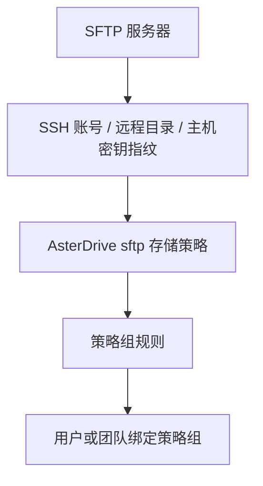

# SFTP 存储策略教程

::: tip 这一篇覆盖什么
这一篇讲怎么把 AsterDrive 的文件写到 SFTP 服务器：准备 SSH 账号、创建 `sftp` 存储策略、确认 SSH 主机密钥指纹、配置策略组规则，并验收上传和下载。
:::

## 适合什么时候用

SFTP 适合这些场景：

- 已经有一台通过 SSH/SFTP 管理的文件服务器
- 目标存储是 NAS、传统服务器目录或只能通过 SFTP 暴露的存储
- 不希望浏览器直接访问存储后端，上传下载都可以由 AsterDrive 服务端中继
- 需要按用户、团队或文件大小把部分文件写到 SFTP 后端

如果你需要浏览器直传、预签名 URL 或对象存储 multipart 上传，优先看 [S3 / MinIO / R2](/storage/s3-minio-r2)、[Azure Blob Storage](/storage/azure-blob) 或 [腾讯云 COS](/storage/tencent-cos)。SFTP 当前是服务端流式读写后端，不提供对象存储式的直传能力。

## 先分清你要配哪几层



只创建 SFTP 存储策略还不够。用户或团队真正上传时，会先命中策略组，再由策略组规则分配到某条存储策略。

## 这篇用到的入口

| 你要做什么 | 入口 |
| --- | --- |
| 创建 SFTP 策略 | `管理 -> 存储策略 -> 新建策略` |
| 测试 SFTP 连接 | `管理 -> 存储策略 -> 测试连接` |
| 创建分流规则 | `管理 -> 策略组` |
| 给用户绑定策略组 | `管理 -> 用户 -> 用户详情` |
| 给团队绑定策略组 | `管理 -> 团队 -> 团队详情` |

## 1. 准备 SSH 账号和远程目录

先在 SFTP 服务器上准备一个专用账号和目录，例如：

```text
/srv/asterdrive
```

建议只授予这个账号对目标目录的读写权限。AsterDrive 至少需要：

- 创建目录
- 写入文件
- 读取文件
- 删除文件
- 读取文件元数据

不要把管理员账号、root 账号或和其他应用共用的目录直接交给 AsterDrive。

::: warning 不建议人工移动远程目录里的对象
AsterDrive 数据库记录了对象路径。人工移动、重命名或删除 SFTP 目录里的对象，会让数据库里的文件记录和真实对象不一致。
:::

## 2. 创建 SFTP 存储策略

进入：

```text
管理 -> 存储策略 -> 新建策略
```

选择驱动类型：

```text
sftp
```

填写连接信息：

| 字段 | 示例 | 说明 |
| --- | --- | --- |
| Endpoint | `sftp://sftp.example.com:22` | SFTP 服务器地址 |
| SSH 用户名 | `asterdrive` | 内部 API 字段仍是 `access_key`，管理界面会显示为 SSH 用户名 |
| SSH 密码 | `********` | 内部 API 字段仍是 `secret_key`，管理界面会显示为 SSH 密码 |
| 基础路径 | `/srv/asterdrive` | AsterDrive 写入对象时使用的远程根目录 |
| SSH 主机密钥指纹 | `SHA256:...` | 首次连接确认后填写 |

Endpoint 支持这些写法：

```text
sftp://sftp.example.com:22
sftp.example.com
sftp.example.com:2222
```

没有端口时默认使用 `22`。如果写了协议，只支持 `sftp://`。不要把用户名、密码、路径、query 或 fragment 放进 Endpoint；远程根目录放到“基础路径”，账号密码放到对应凭据字段。

## 3. 确认 SSH 主机密钥指纹

SFTP 策略默认拒绝未知主机密钥。第一次测试连接时，如果还没有保存 `SSH 主机密钥指纹`，连接会失败，并在诊断信息里返回服务器实际的 `SHA256:...` 指纹。

正确流程是：

1. 先填写 Endpoint、SSH 用户名、SSH 密码和基础路径
2. 点击连接测试
3. 从失败诊断里读取服务器返回的 `SHA256:...` 指纹
4. 用可信渠道和服务器管理员确认这个指纹确实属于目标 SFTP 服务器
5. 把确认后的指纹填入 `SSH 主机密钥指纹`
6. 再次连接测试，确认通过后保存策略

::: warning 不要跳过主机密钥确认
如果不校验 SSH 主机密钥，攻击者可以伪装成 SFTP 服务器并获取密码。AsterDrive 会把确认后的指纹保存在 `storage_policy.options.sftp_host_key_fingerprint`，后续连接必须匹配这个指纹；服务器重装或轮换 SSH host key 后，需要重新确认并更新。
:::

## 4. 连接测试失败怎么查

连接测试失败时，后台会优先展示标准错误响应里的 `error.diagnostic.message`。SFTP 常见排查顺序：

1. AsterDrive 服务器能否访问 Endpoint 和端口
2. Endpoint 是否只包含 host 和可选端口
3. SSH 用户名和密码是否正确
4. 账号是否允许 SFTP 子系统
5. 基础路径是否存在，或者账号是否有权限创建它
6. `SSH 主机密钥指纹` 是否和服务器当前 host key 一致
7. 服务器防火墙、fail2ban 或连接数限制是否拒绝了登录

如果错误提示主机密钥不匹配，不要直接覆盖旧指纹。先确认服务器是否确实轮换了 host key。

## 5. 创建测试策略组并验收

不要一上来直接改默认策略组。建议先创建一个测试策略组，绑定一个测试用户或测试团队，然后跑完整流程：

1. 上传小文件
2. 上传一个超过普通表单大小的大文件
3. 下载文件
4. 预览或公开分享一个普通文件
5. 删除并恢复文件
6. 确认 SFTP 服务器目标目录里出现对象文件

确认没有问题后，再把真实用户或团队切到包含 SFTP 策略的策略组。

## 迁移和修改边界

::: warning 已经写入文件的 SFTP 策略，不要直接改这些字段

- Endpoint
- 基础路径
- SSH 用户名

旧文件按原位置读取，直接改位置 = 已有文件可能找不到。更稳的做法是新建一条 SFTP 策略，再用 `管理 -> 存储策略 -> 迁移数据` 迁移。
:::

SSH 密码可以通过编辑策略轮换。编辑已保存策略时，密码字段留空会保留现有凭据。

## 当前能力边界

| 能力 | 当前行为 |
| --- | --- |
| 上传 | AsterDrive 服务端流式写入 SFTP |
| 下载 | AsterDrive 服务端从 SFTP 读取后返回给浏览器 |
| 浏览器直传 | 不支持 |
| 对象存储 multipart | 不支持 |
| 预签名 URL | 不支持 |
| 容量观测 | 不支持统一容量查询 |
| Range 读取 | 支持高效 range 读取 |

SFTP 连接池优化单独跟踪中；当前实现优先保证主机密钥校验和基础读写正确性。
