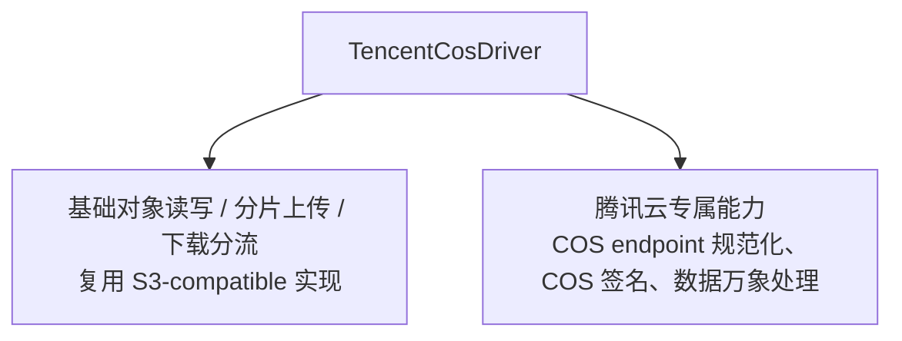
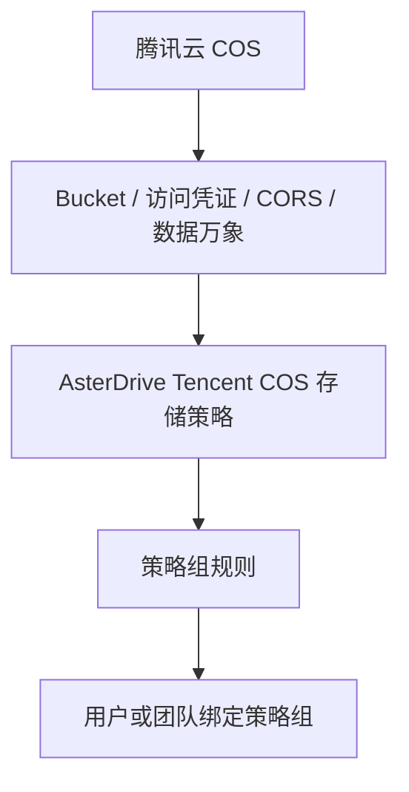
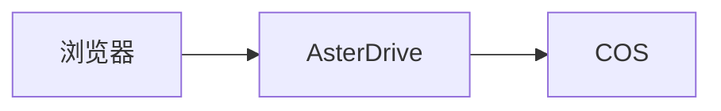
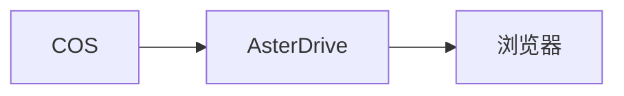
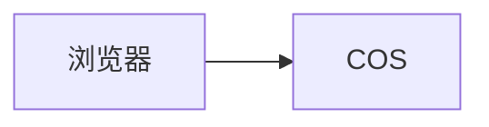
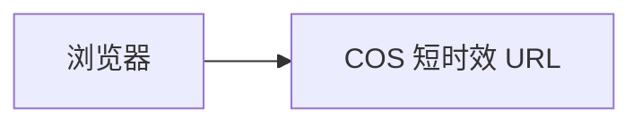

# 腾讯云 COS 存储策略教程

::: tip 这一篇覆盖什么
这一篇按完整流程讲怎么把 AsterDrive 文件写到腾讯云 COS：准备 bucket、创建 `tencent_cos` 存储策略、配置策略组规则、绑定用户或团队、验收上传下载，并说明 COS 数据万象原生处理的开关、后缀和计费边界。
:::

## 适合什么时候用

腾讯云 COS 适合这些场景：

- 你已经在腾讯云上使用 COS，想让 AsterDrive 直接写入 COS bucket
- 文件较多或较大，希望把容量和带宽交给对象存储承接
- 希望按存储策略启用 COS 数据万象能力，例如图片缩略图或媒体信息解析
- 希望前端和后台明确显示“腾讯云 COS”，而不是把它混在普通 S3-compatible 后端里

如果你只需要一个通用 S3 兼容对象存储，而且不需要腾讯云数据万象能力，看 [S3 / MinIO / R2 存储策略教程](/storage/s3-minio-r2) 更合适。

## COS 和 S3-compatible 的关系

AsterDrive 里 `tencent_cos` 是独立的存储后端类型，但它不是从零实现一套对象存储逻辑。



也就是说：

- 普通对象读写能力和 S3-compatible 类似
- 腾讯云 COS 在后台和前端会独立显示为 `tencent_cos`
- 数据万象等腾讯云原生能力只挂在 `tencent_cos` driver 上，不挂在通用 `s3` driver 上

如果你要使用 COS 数据万象能力，创建策略时请选择 **腾讯云 COS**，不要把 COS 当普通 `s3` 策略配置。

## 先分清你要配哪几层



只创建 COS 存储策略还不够。用户或团队上传时，会先命中策略组，再由策略组规则分配到某条存储策略。

## 这篇用到的入口

| 你要做什么 | 入口 |
| --- | --- |
| 创建 COS 策略 | `管理 -> 存储策略 -> 新建策略` |
| 测试 COS 连接 | `管理 -> 存储策略 -> 测试连接` |
| 创建分流规则 | `管理 -> 策略组` |
| 给用户绑定策略组 | `管理 -> 用户 -> 用户详情` |
| 给团队绑定策略组 | `管理 -> 团队 -> 团队详情` |
| 配置全局媒体处理 | `管理 -> 系统设置 -> 文件处理` |

## 1. 准备 bucket 和 prefix

先在腾讯云 COS 控制台创建一个专用 bucket，例如：

```text
asterdrive-prod-1250000000
```

建议给 AsterDrive 单独规划 prefix：

```text
prod/
```

这样对象最终会在 bucket 里按 AsterDrive 的内容寻址路径继续展开。不要让多个 AsterDrive 实例写同一个 prefix，除非你明确知道它们不会互相覆盖或清理对象。

::: warning 不建议人工移动 bucket 里的对象
AsterDrive 数据库记录了对象路径。人工移动、重命名或删除 COS 里的对象，会让数据库里的文件记录和真实对象不一致。
:::

## 2. 准备访问凭证

给 AsterDrive 准备一组只用于这个 bucket / prefix 的腾讯云访问凭证。

最少需要覆盖：

- 读取对象
- 写入对象
- 删除对象
- multipart upload 相关操作
- 访问目标 bucket / prefix 的必要权限

如果你要启用 COS 数据万象，还要确认这组凭证可以发起对应 CI 处理请求，例如图片处理或媒体信息解析。权限名和控制台入口会随腾讯云产品调整，按腾讯云最新文档和控制台为准。

## 3. 先选上传和下载方式

第一次接入建议先用保守路线：

| 方向 | 建议初始值 | 原因 |
| --- | --- | --- |
| 上传方式 | `relay_stream` | 浏览器不需要直连 COS，少踩 CORS |
| 下载方式 | `relay_stream` | 下载也先由 AsterDrive 中继，便于排查 |

确认基本读写没问题后，再考虑切换到：

- 上传 `presigned`
- 下载 `presigned`

### `relay_stream` 怎么工作

上传时：



下载时：



好处是入口集中，排查简单。代价是应用节点要承接上传和下载带宽。

### `presigned` 怎么工作

上传时：



下载时：



好处是减轻 AsterDrive 节点带宽压力。前提是浏览器能访问 COS endpoint，并且 COS CORS 配置正确。

## 4. 配置 COS CORS

如果你只使用 `relay_stream`，浏览器不会直接请求 COS，CORS 不是第一优先级。

如果要使用 `presigned` 上传，COS bucket 需要允许浏览器跨域上传。最少关注：

- `AllowedOrigin`：你的 AsterDrive 公开站点地址
- `AllowedMethod`：包含 `PUT`
- `AllowedHeader`：允许上传请求用到的请求头
- `ExposeHeader`：包含 `ETag`

如果要使用 `presigned` 下载，也要确认浏览器可以访问 COS 返回的下载地址，并且你接受下载响应头、缓存行为更多由 COS 决定。

## 5. 在 AsterDrive 创建 Tencent COS 存储策略

进入：

```text
管理 -> 存储策略 -> 新建策略
```

选择驱动类型：

```text
腾讯云 COS
```

常见字段：

| 字段 | 示例 |
| --- | --- |
| Endpoint | `https://asterdrive-prod-1250000000.cos.ap-guangzhou.myqcloud.com` |
| Bucket | `asterdrive-prod-1250000000` |
| Access Key | 腾讯云访问密钥 ID |
| Secret Key | 腾讯云访问密钥 Secret |
| Prefix / 基础路径 | `prod/` |
| 上传方式 | 初次建议 `relay_stream` |
| 下载方式 | 初次建议 `relay_stream` |

AsterDrive 会把 COS endpoint 和 bucket 规范化，并按 COS 虚拟托管风格处理底层 S3-compatible 请求。你不需要手动把 COS 当普通 S3 path-style 策略调。

## 6. 保存前先测试连接

保存前或保存后，先用后台的连接测试确认：

- AsterDrive 服务器能访问 COS endpoint
- bucket 名正确
- 凭证能读写目标 prefix
- bucket 地域和 endpoint 匹配
- 服务器时间准确

如果连接测试失败，不要继续把用户切到这条策略。先按下面顺序查：

1. Endpoint 从 AsterDrive 服务器能不能访问
2. HTTPS 证书是否可信
3. Bucket 名是否正确
4. Access Key / Secret Key 是否正确
5. 凭证权限是否覆盖目标 bucket / prefix
6. AsterDrive 服务器时间是否准确
7. Bucket 是否启用了需要的 COS / CI 能力

## 7. 配置存储原生处理

::: warning 开启前先确认费用
存储原生处理会调用腾讯云 COS 数据万象。AsterDrive 会缓存生成后的缩略图、媒体信息等结果，避免每次访问都重新处理；但首次生成和云厂商侧处理请求仍可能产生费用。
:::

入口在 COS 存储策略编辑页的 **存储原生处理** 区域。

### 总开关

`启用存储原生处理` 是当前策略的总开关。关闭时，这条策略不会调用 COS 数据万象能力。

### 原生缩略图

原生缩略图由这些条件共同决定：

- `启用存储原生处理` 已开启
- 缩略图处理器为 `storage_native`
- `原生缩略图后缀` 匹配当前文件名
- 当前 driver 支持 COS 原生缩略图

后缀是每条策略自己的配置。例如：

```text
jpg, jpeg, png, webp, gif
```

不匹配的文件会继续走全局媒体处理器。

### 原生媒体信息

原生媒体信息解析由这些条件共同决定：

- `启用存储原生处理` 已开启
- `启用原生媒体信息` 已开启
- `原生媒体信息后缀` 匹配当前文件名
- 当前 driver 支持 COS 原生媒体信息

后缀列表默认不填写。即使打开 `启用原生媒体信息`，后缀为空也不会触发 COS `GetMediainfo` / `ci-process=videoinfo` 请求。

你需要在每条 COS 策略里自行填写确认要交给 COS 解析的音视频后缀，例如：

```text
mp4, mov, m4v, mkv, webm, mp3, m4a, flac, wav
```

不要把不确定的后缀一股脑全填进去。AsterDrive 的媒体信息有缓存，但第一次解析仍会发起 COS 数据万象请求。

### 文档预览

AsterDrive 当前不提供 COS 文档 HTML 预览，也不会从存储策略调用 COS 文档预览接口。这个能力不放入默认实现，主要是因为腾讯云当前公开价格页没有给文档 HTML 预览免费额度，误配后更容易产生不可控费用。

如果后续重新引入，应该单独做显式开关和独立后缀列表，不应复用当前的存储原生处理总开关直接放开。

## 8. 免费额度和计费边界

最近核对时间：2026-06-02（以腾讯云最新页面为准）。

按腾讯云当前公开口径：

| 能力 | 免费额度口径 | AsterDrive 侧说明 |
| --- | --- | --- |
| 基础图片处理 | 每月 10 TB 免费额度 | 原生图片缩略图会用到；超出或不符合免费额度规则后按腾讯云计费 |
| 视频元信息获取 | 首次使用后 6000 次 / 2 个月 | 原生媒体信息解析会用到 COS `GetMediainfo` / `ci-process=videoinfo` |
| 视频截帧 | 首次使用后 6000 次 / 2 个月 | 后续如果启用 COS 视频缩略图，需要按这个口径评估 |
| 文档 HTML 预览 | 无免费额度 | AsterDrive 当前不实现；后续如启用需要单独开关 |

腾讯云价格、免费额度、到期规则和区域差异可能变化。上线前请以腾讯云 COS / 数据万象最新价格页和控制台提示为准。

参考资料：

- [腾讯云数据万象免费额度](https://cloud.tencent.com/document/product/460/36381)
- [腾讯云数据万象基础图片处理费用](https://cloud.tencent.com/document/product/460/47483)
- [腾讯云数据万象媒体处理费用](https://cloud.tencent.com/document/product/460/58120)
- [腾讯云数据万象文档处理费用](https://cloud.tencent.com/document/product/460/58121)
- [腾讯云数据万象获取媒体信息接口](https://cloud.tencent.com/document/product/460/49284)

## 9. 创建测试策略组

不要一上来直接改默认策略组。建议先创建一个测试策略组。

进入：

```text
管理 -> 策略组
```

创建策略组，例如：

```text
COS Test Group
```

添加一条规则：

| 字段 | 建议 |
| --- | --- |
| 存储策略 | 刚创建的 COS 策略 |
| 优先级 | 保持默认或设为最先命中 |
| 文件大小范围 | 先覆盖所有大小，方便测试 |

## 10. 绑定测试用户或测试团队

### 绑定用户

进入：

```text
管理 -> 用户 -> 用户详情
```

把测试用户的策略组改成刚才创建的 `COS Test Group`。

### 绑定团队

进入：

```text
管理 -> 团队 -> 团队详情
```

把测试团队的策略组改成 `COS Test Group`。

团队空间上传时会按团队策略组走，不按个人用户策略组走。

## 11. 做一轮真实验收

用测试账号完成这些操作：

- 上传小文件
- 上传大文件
- 下载文件
- 预览图片
- 如果启用了原生缩略图，上传匹配后缀的图片并查看缩略图任务
- 如果启用了原生媒体信息，上传匹配后缀的音视频并查看文件信息面板
- 删除文件
- 从回收站恢复
- 分享文件并下载

验收时同时观察：

- 后台任务是否成功
- COS bucket 里对象是否写到预期 prefix
- 浏览器控制台是否有 CORS 报错
- AsterDrive 日志是否有 COS 403 / 404 / 签名错误
- 腾讯云控制台是否出现预期的 CI 调用记录或费用统计

## 12. 切真实流量

确认测试策略组没有问题后，再把真实用户或团队迁到目标策略组。

如果要迁移已有文件，不要直接改旧策略的 bucket、endpoint 或 prefix。正确做法是：

1. 新建 COS 策略
2. 测试连接和真实上传下载
3. 用 `管理 -> 存储策略 -> 迁移数据` 创建迁移任务
4. 迁移完成后调整策略组规则

::: warning 已写入文件的策略，不要直接改真实落点
Bucket、endpoint、prefix 决定旧文件在哪里。直接改掉，旧文件可能会全部找不到。
:::
